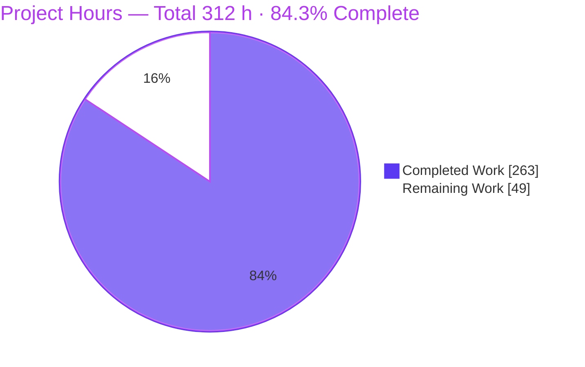
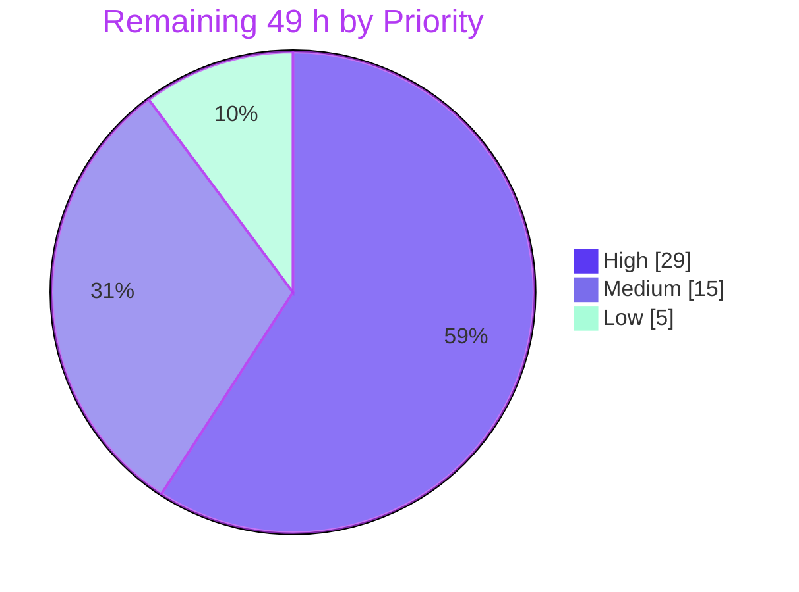

# Blitzy Project Guide — Opt-In DSL Dead Letter Queue for Apache Kafka Streams (KAFKA-16505)

> **Brand key:** ▉ **Completed / AI Work — Dark Blue `#5B39F3`** · ▢ **Remaining / Not Completed — White `#FFFFFF`** · Headings & Accents — Violet-Black `#B23AF2` · Highlight — Mint `#A8FDD9`

| | |
|---|---|
| **Branch** | `blitzy-6dd3e3d0-bc2d-41cd-91ca-30a0de7bf1e2` |
| **Baseline → HEAD** | `6d16f687aa1a0df26f2f665436b7efaf0aec0c56` → `9f6747d0aef38d75cef93a1d22f69a05e32d1d76` |
| **Repository** | Apache Kafka monorepo, `4.2.0-SNAPSHOT` · module `kafka-streams` (Feature F-007) |
| **Change volume** | 23 commits · 40 files (16 added / 24 modified / 0 deleted) · **+8,378 / −89** lines |
| **Authorship** | 100 % `Blitzy Agent <agent@blitzy.com>` (author *and* committer on all 23 commits) |

---

## 1. Executive Summary

### 1.1 Project Overview

This project adds an **opt-in, DSL-level Dead Letter Queue (DLQ)** capability to the Apache Kafka Streams client library, targeting stream-processing application developers. When a topology opts in through the new `KStream.withDeadLetterQueue(...)` call, records that fail deserialization, processing, or serialization are routed — carrying their original key/value bytes plus six `dlq.*` diagnostic headers — to a configured DLQ topic, instead of terminating the `StreamThread` or being silently skipped. The business impact is materially better pipeline resilience and failure debuggability. Technically it layers additively over the existing KIP-1034 handler machinery using a strict "decorate, do not modify" strategy, leaving every non-opted-in topology byte-for-byte identical.

### 1.2 Completion Status

The project is **84.3 % complete** on an AAP-scoped, hours-based basis. All **26 of 26** AAP requirements are delivered, compiling under strict gates and passing 100 % of runnable tests. The remaining **49 hours** are exclusively **human-only path-to-production** activities — code review and merge, stakeholder design sign-off, performance measurement, operational provisioning, security review, and the upstream KIP process. **No autonomous engineering work remains outstanding.**


| Metric | Value |
|---|---|
| **Total Hours** | **312 h** |
| **Completed Hours (AI + Manual)** | **263 h** — AI: 263 h · Manual: 0 h |
| **Remaining Hours** | **49 h** |
| **Percent Complete** | **84.3 %** (263 ÷ 312 × 100 = 84.2949 %) |

### 1.3 Key Accomplishments

- ✅ **All five core AAP deliverables shipped** — the `withDeadLetterQueue` DSL `default` method, `DeadLetterQueueOptions`, `DlqRecordBuilder` with all six `dlq.*` headers, both `default.deadletterqueue.*` config keys, and the `dlq-records-sent-total` metric with per-write WARN.
- ✅ **"Decorate, do not modify" honoured absolutely** — `ExceptionHandlerUtils`, all three exception-handler interfaces, `ErrorHandlerContext`, `LogAndContinueExceptionHandler`, `KTable`, `StreamsBuilder`, `build.gradle`, `settings.gradle` and `gradle/dependencies.gradle` are all **zero-diff**.
- ✅ **Byte-for-byte legacy behaviour proven three ways** — two dedicated regression integration tests, a live control application that reached `State.ERROR` and wrote nothing, and the 6 pre-existing KIP-1034 integration tests still green (coexistence).
- ✅ **100 % test pass rate** — 31,140 whole-repository unit tests and 8,536 Streams-surface tests with **0 failures, 0 errors, 0 blocked suites**; **114 new DLQ tests**.
- ✅ **Every static-analysis gate green** — Checkstyle 0 errors, SpotBugs **Total 0** over 49,696 LOC / 1,020 classes, `javadoc -Werror` 0 warnings, `rat` 0 unapproved licences, repo-wide `check -x test` 415 tasks / 0 failed.
- ✅ **End-to-end runtime proof against a live single-node KRaft broker** — 6/6 scenarios, including exactly six `dlq.*` headers with verbatim original bytes, DSL-over-global precedence, header suppression, and truncate-and-annotate.
- ✅ **Zero new dependencies** — the entire feature is built on capabilities the module already declares, so there is no new supply-chain or credential surface.
- ✅ **Safety hardening beyond the letter of the spec** — a build-time `TopologyException` rejects a DLQ topic that is itself a source of the same stream, closing a genuine re-consume → re-fail → re-dead-letter amplification trap.
- ✅ **Rule-mandated artifacts complete and browser-verified** — a 16-slide self-contained reveal.js executive summary with titled/legended before *and* after Mermaid architecture diagrams, re-validated PASS at two viewports in this session.

### 1.4 Critical Unresolved Issues

| Issue | Impact | Owner | ETA |
|---|---|---|---|
| **Dual DLQ configuration & header schemes coexist** — new `default.deadletterqueue.*` / `dlq.*` alongside KIP-1034 `errors.dead.letter.queue.topic.name` / `__streams.errors.*` | Operator confusion; DLQ consumers must handle two header families. A unify-vs-coexist choice is a one-way public-API door and should be settled **before merge**. | Streams maintainer + product owner | 3 h — before merge |
| **≤5 ms p99 failure-path performance gate never measured** | The AAP sets a numeric gate. The design confines all DLQ logic to the exception branch and a test asserts zero DLQ writes on the happy path, but no benchmark was run — no JMH harness exists and the integration test explicitly calls the figure "a design target". | Performance engineer | 8 h — before release sign-off |
| **DLQ topic must pre-exist; startup validation checks the *name* only, not existence** | If the topic is absent (or broker auto-create is off), DLQ sends fail and escalate to the uncaught-exception handler — the very failure mode the feature exists to prevent. | Platform / SRE | 2 h — release prerequisite |
| **DLQ records carry original payload bytes and exception-message fragments** | Creates a second copy of potentially PII/regulated data on a new topic under possibly different ACLs and retention. Documented in `DlqRecordBuilder` Javadoc; no operator-facing guidance yet. | Security / data-governance | 3 h — before production enablement |
| **Five shared topology/runtime files touched beyond the core DLQ classes** | `InternalTopologyBuilder` (+147), `SourceNode` (+35), `RecordCollector` (+31, interface), `ActiveTaskCreator` (+13), `BaseRepartitionNode` (+9) are used by *every* topology, so the regression surface extends past DLQ users. Mitigated by 92 + 160 + 7,236 passing tests, but warrants focused human review. | Code reviewer | 3 h — during review |
| **Upstream Apache acceptance requires a KIP + community vote** | A public API and two config keys cannot land upstream without KIP approval; the API may change in review. | Contributing committer | 4 h authoring + community timeline |
| **On-disk integration evidence for the committed tree covers only the 13 DLQ tests** | The full 1,021-test integration XML was overwritten by a targeted DLQ re-run. The full suite was reported green earlier in the session; re-run it in CI before merge to have current artifacts. | CI / reviewer | included in merge task |

### 1.5 Access Issues

Access was verified live during this assessment. **No access issue blocked autonomous build, compilation, static analysis, test execution, or runtime validation.** Three access needs remain for the outstanding human work.

| System / Resource | Type of Access | Issue Description | Resolution Status | Owner |
|---|---|---|---|---|
| Git remote `origin` (`github.com/blitzy-public-samples/blitzy-kafka`) | Repository read/write | Verified reachable via `git ls-remote --heads origin`; all 23 commits landed on the branch with correct identity | ✅ **No issue** | Blitzy |
| Maven Central / Gradle dependency resolution | Artifact download | All 6 modules resolved, **0 unresolved** dependencies; local Gradle cache populated and re-verified this session | ✅ **No issue** | Blitzy |
| Local Kafka broker (single-node KRaft from `releaseTarGz`) | Localhost broker + admin CLI | Built, formatted, started and driven end-to-end for 6 runtime scenarios | ✅ **No issue** | Blitzy |
| CDN assets for the executive deck (jsDelivr, Google Fonts) | Outbound HTTPS at view time | 10/10 requests HTTP 200 at both viewports; every SRI-pinned asset executed | ✅ **No issue** | Blitzy |
| Docker engine | Container runtime | Available (`docker info` succeeds) — not required by this project | ✅ **No issue** | Blitzy |
| **Production-like Kafka cluster** | Cluster + load-generation environment | **Not available in this environment.** Required to measure the ≤5 ms p99 failure-path gate against realistic broker latency and partition counts. | ⚠️ **Needed for task F4** | Performance engineer |
| **Broker admin credentials for the target environment** | Topic creation + ACL management | **Not available in this environment.** Required to provision DLQ topics (partitions, retention, `max.message.bytes`) and apply read/write ACLs. | ⚠️ **Needed for tasks F5 / F7** | Platform / SRE |
| **Apache Kafka community infrastructure** | ASF JIRA, cwiki (KIP space), `dev@kafka.apache.org` | **Not available to an autonomous agent.** Required to file the KIP, run the discussion thread and call the vote for upstream acceptance. | ⚠️ **Needed for task F3** | Contributing committer |

### 1.6 Recommended Next Steps

1. **[High]** Settle the naming decision — unify or formally accept coexistence of `default.deadletterqueue.*` / `dlq.*` against KIP-1034's `errors.dead.letter.queue.topic.name` / `__streams.errors.*`. This is a public-API one-way door; everything downstream (docs, KIP, consumer guidance) depends on it. **(3 h)**
2. **[High]** Run human code review with a deliberate focus on the five shared topology/runtime files and on the three handler decorators, then merge behind a full green CI run that includes the complete `:streams:integration-tests:integrationTest` suite. **(14 h)**
3. **[High]** Provision the DLQ topics — partitions matched to the source, retention and cleanup policy, `max.message.bytes` sized above the largest expected record — apply restrictive ACLs, and wire `dlq-records-sent-total` into alerting with a triage runbook. **(6 h)**
4. **[Medium]** Author and execute the performance-gate benchmark on a prod-like cluster to convert the ≤5 ms p99 design target into a measured, recorded result. **(8 h)**
5. **[Medium]** Complete the security and data-classification review of DLQ payloads and publish operator guidance on `withIncludeHeaders(false)` and `withMaxRecordSize(...)` as redaction levers; in parallel, draft the KIP for upstream submission. **(7 h)**

---

## 2. Project Hours Breakdown

### 2.1 Completed Work Detail

All rows are **100 % autonomous (AI)** work already delivered, compiling under strict gates, and covered by passing tests. Each traces to a specific AAP requirement (IDs in brackets match the inventory in §5).

| Component | Hours | Description |
|---|---:|---|
| **[A1]** DSL entry point | 10 | `KStream.withDeadLetterQueue` Java `default` method + `KStreamImpl` implementation with five build-time validations (null/blank, canonical `Topic.validate`, argument-vs-options coherence, originating-source presence, DLQ-topic-is-a-source collision → `TopologyException`); attaches an immutable graph node and returns the same-typed `KStream` |
| **[A2]** `DeadLetterQueueOptions` | 8 | Immutable, self-validating public options object — `final` class and fields, `with(String)` factory plus copy-style `withMaxRecordSize` / `withIncludeHeaders`, `NO_MAX_RECORD_SIZE` sentinel, `includeHeaders` defaulting to `true`, `equals`/`hashCode`/`toString` |
| **[A3]** `DlqRecordBuilder` | 16 | Stateless builder producing `ProducerRecord<byte[], byte[]>` with all six `dlq.*` headers plus `dlq.value.truncated` / `dlq.value.original.size`; original bytes preserved verbatim; bounded exception-message text; truncate-and-annotate (never drop) |
| **[A4]** `StreamsConfig` keys | 6 | `default.deadletterqueue.topic` (STRING, null) and `default.deadletterqueue.enabled` (BOOLEAN, false) with full documentation strings and startup validation; coexists with the legacy KIP-1034 key |
| **[A5]** Observability | 12 | `dlq-records-sent` sensor exposing `dlq-records-sent-total` / `-rate` in `stream-task-metrics`, incremented on **broker acknowledgement**; `DeadLetterQueueObserver` emitting a WARN carrying exception class and source offset |
| **[B7]** DLQ-aware handler decorator | 26 | `DeadLetterQueueExceptionHandlerDecorator` (678 LOC) with three nested decorators — `DeserializationDecorator`, `ProductionDecorator`, `ProcessingDecorator` — each delegating to the configured handler and returning `Response` objects carrying DLQ records, leaving the public interfaces untouched |
| **[B1/B8/B9]** Topology wiring & precedence | 24 | `DeadLetterQueueGraphNode` (241 LOC, BFS `resolveSourceNames` / `collectRoutingNodeNames` / `findSourceTopicCollision`) + `DeadLetterQueueInstaller` (173 LOC) + integration through `InternalTopologyBuilder`, `ActiveTaskCreator`, `SourceNode`, `RecordCollector`, `BaseRepartitionNode`; deterministic DSL → per-topology → global precedence chain |
| **[B10]** Eligibility classifier | 10 | `DeadLetterQueueEligibility` (181 LOC) with `isFatal` / `isRetriable` plus four eligibility predicates — includes deserialization, processing, production and serialization failures; **excludes** retriable broker/producer failures so produce timeouts keep using producer retries |
| **[B2/B3/B11]** Send-site integration | 18 | Raw-bytes / serde bypass via `ErrorHandlerContext.sourceRawKey()`/`sourceRawValue()` with record fallback; shared-producer reuse through `RecordCollectorImpl.send` (no new credential surface); wiring at all four AAP-named sites — `RecordDeserializer`, `RecordCollectorImpl`, `ProcessorNode`, `StreamTask` |
| **[C1]** Scala DSL parity | 6 | `KStream.scala` wrapper delegating to the Java inner instance, plus 16 passing parity tests |
| **[C2]** Documentation | 7 | `config-streams.html` (both keys), `dsl-api.html` (full DLQ section incl. the five build-time validations and the amplification trap), `upgrade-guide.html` (4.2.0 API-changes note); 14/14 identifiers verified present in both docs and source → 0 unsupported claims |
| **[D1/D2/D5]** Unit test suites | 40 | 107 DLQ unit tests across 6 classes (2,962 LOC): builder 19, options 18, eligibility 9, decorator 38, `KStreamImpl` 21, installer 2 |
| **[D3]** Integration test | 16 | `DeadLetterQueueDslIntegrationTest` on `EmbeddedKafkaCluster` — 7 scenarios (618 LOC) mapping 1:1 onto the AAP acceptance criteria |
| **[D4]** Regression-test extensions | 16 | Seven suites extended — `StreamsConfigTest`, `RecordCollectorTest`, `RecordDeserializerTest`, `ProcessorNodeTest`, `StreamTaskTest`, `TaskMetricsTest`, scala `KStreamTest` — 395+ regression tests green |
| **[E1]** Rule 1 Mermaid diagrams | 4 | Titled and legended DLQ component-interaction diagram plus before/after error-handling data-flow diagrams |
| **[E2]** Rule 2 reveal.js deck | 16 | `blitzy-deck/streams-dlq-executive-summary.html` — 16 slides (1 title / 3 divider / 11 content / 1 closing), Blitzy theme embedded inline, pinned CDNs, 58 Lucide icons, zero emoji, CSP with inline-script hash |
| **[VAL]** Iterative validation & gate greening | 28 | Self-review, code-review and QA resolution, live-KRaft runtime harness (3 standalone apps, 6 scenarios), 5 browser audits, `javadoc -Werror` and `rat` gate fixes, 3 deck rendering defects found and fixed, documentation-gap closure, 7 environment blockers solved |
| **Total** | **263** | **Matches Completed Hours in Section 1.2** |

### 2.2 Remaining Work Detail

All remaining work is **human-only path-to-production**. Zero autonomous engineering work is outstanding. Each category traces to a path-to-production need or an AAP-flagged stakeholder decision.

| Category | Hours | Priority |
|---|---:|---|
| **[F1]** Human code review & merge approval of the public-API addition (incl. focused review of the five shared topology/runtime files and a full green CI run) | 14 | High |
| **[F2]** Stakeholder sign-off on the four AAP-flagged design decisions + resulting adjustments | 9 | High |
| **[F5]** DLQ topic provisioning (partitions / retention / `max.message.bytes` / ACLs) + monitoring & alerting wiring + triage runbook | 6 | High |
| **[F4]** Performance-gate verification (≤5 ms p99 failure path on a prod-like cluster) | 8 | Medium |
| **[F3]** Apache KIP authoring + community discussion & vote (upstream path) | 4 | Medium |
| **[F7]** Security / data-classification (PII, GDPR) review of DLQ payloads + operator guidance | 3 | Medium |
| **[F6]** Deployment / rollout plan + downstream DLQ-consumer guidance | 4 | Low |
| **[F8]** Register `dlq-records-sent-total` in the canonical `docs/ops.html` metrics reference | 1 | Low |
| **Total** | **49** | **Matches Remaining Hours in Section 1.2 and the Section 7 pie** |

**Priority rollup:** High **29 h** · Medium **15 h** · Low **5 h** = **49 h** ✓

**Human task decomposition (24 tasks, summing to 49 h)**

| ID | Task | Cat | Pri | Hours |
|---|---|---|---|---:|
| HT-1.1 | Review the public API surface (`withDeadLetterQueue` + `DeadLetterQueueOptions`) for API/binary compatibility and naming | F1 | High | 3.0 |
| HT-1.2 | Review the three handler decorators and `DeadLetterQueueEligibility` for exception-branch correctness, especially the retriable exclusion | F1 | High | 4.0 |
| HT-1.3 | Focused review of the five shared topology/runtime files for cross-topology regression risk | F1 | High | 3.0 |
| HT-1.4 | Review the 114 new tests and 7 extended regression suites for assertion strength | F1 | High | 2.0 |
| HT-1.5 | Merge approval: full CI incl. the complete integration suite, branch protection, merge | F1 | High | 2.0 |
| HT-2.1 | Decide coexist vs unify for the dual config-key and header schemes | F2 | High | 3.0 |
| HT-2.2 | Confirm source-node deserialization semantics (symmetric key/value eligibility) | F2 | High | 1.5 |
| HT-2.3 | Confirm truncate-and-annotate behaviour and the two headers beyond the six specified | F2 | High | 1.5 |
| HT-2.4 | Confirm processing-exception capture via the existing `ProcessingExceptionHandler` hook | F2 | High | 1.0 |
| HT-2.5 | Apply adjustments arising from HT-2.1–2.4 and re-run affected suites | F2 | High | 2.0 |
| HT-3.1 | Create DLQ topics — partitions, retention, cleanup policy, `max.message.bytes` | F5 | High | 2.0 |
| HT-3.2 | Apply read/write ACLs limiting DLQ access to the Streams principal and responders | F5 | High | 1.5 |
| HT-3.3 | Wire the metric into alerting — non-zero rate **and** absence-of-increment with rising uncaught exceptions | F5 | High | 1.5 |
| HT-3.4 | Write the DLQ triage runbook (headers to inspect, replay decision tree, escalation) | F5 | High | 1.0 |
| HT-4.1 | Author a JMH benchmark / load harness measuring failure-path p99 | F4 | Medium | 4.0 |
| HT-4.2 | Execute on a prod-like cluster; compare to the ≤5 ms gate and baseline throughput | F4 | Medium | 3.0 |
| HT-4.3 | Record results and attach them to the merge request | F4 | Medium | 1.0 |
| HT-5.1 | Draft the KIP (motivation, interfaces, compatibility, rejected alternatives) | F3 | Medium | 2.5 |
| HT-5.2 | Post to the dev list, facilitate discussion, call the vote | F3 | Medium | 1.5 |
| HT-6.1 | Classify DLQ payload data against PII/GDPR policy; assess retention and erasure | F7 | Medium | 2.0 |
| HT-6.2 | Publish operator guidance on redaction via `withIncludeHeaders(false)` / `withMaxRecordSize` | F7 | Medium | 1.0 |
| HT-7.1 | Stage the rollout (one low-risk topology first) and document rollback | F6 | Low | 2.0 |
| HT-7.2 | Publish downstream DLQ-consumer guidance (idempotency, both header families, ordering) | F6 | Low | 2.0 |
| HT-8.1 | Add the metric to `docs/ops.html` alongside `dropped-records` | F8 | Low | 1.0 |
| | **Total** | | | **49.0** |

### 2.3 Hours Reconciliation

- Section 2.1 total (Completed) = **263 h** — every row is autonomous AI work
- Section 2.2 total (Remaining) = **49 h** — every row is human-only
- **263 + 49 = 312 h** = Total Project Hours in Section 1.2 ✓
- Completion = 263 ÷ 312 = **84.2949 % → 84.3 %** ✓
- Section 7 pie: "Completed Work" = **263**, "Remaining Work" = **49** ✓
- Completed work is **100 % AI / autonomous** (0 manual hours)
- **Estimation basis (PA2):** complex logic modules 24–40 h; simple value types ≈8 h; config registration ≈6 h; testing at the upper end of the 30–40 % band because test LOC (3,641) exceeds main LOC (2,795). **Sanity check: 8,378 insertions ÷ 263 h = 31.9 LOC/h** — a plausible rate for gate-clean, fully-Javadoc'd public-API OSS Java.
- **Confidence:** *High* for all completed rows (direct on-disk source, JUnit XML and gate-report evidence). *High* for F5–F8. *Medium* for F1/F2/F3 (organisation- and community-dependent) and F4 (requires a prod-like cluster).

---

## 3. Test Results

All results below originate from **Blitzy's autonomous validation logs and on-disk JUnit XML artifacts for this project**. Nothing is external or estimated. Rows marked ⟳ were **independently re-executed during this assessment** on the committed tree.

| Test Category | Framework | Total Tests | Passed | Failed | Coverage % | Notes |
|---|---|---:|---:|---:|---|---|
| ⟳ DLQ unit (dedicated) | JUnit 5.13.1 + Mockito 5.20.0 + Hamcrest 3.0 | **107** | **107** | **0** | 5/7 new main classes have a dedicated suite; 2 covered via caller suites | Re-run this session: `BUILD SUCCESSFUL`, 107 PASSED / 0 FAILED. Builder 19 · options 18 · eligibility 9 · decorator 38 · `KStreamImpl` 21 · installer 2 |
| DLQ integration — DSL opt-in | JUnit 5 + `EmbeddedKafkaCluster` | **7** | **7** | **0** | 7 scenarios ↔ AAP acceptance criteria 1:1 | Deserialization routing, processing routing, two non-opt-in regressions, DSL-over-global precedence, opt-in scoping, happy-path zero-writes |
| DLQ integration — legacy KIP-1034 regression | JUnit 5 + `EmbeddedKafkaCluster` | **6** | **6** | **0** | legacy path untouched | Proves the new layer **coexists** without modifying the existing mechanism |
| Streams module unit suite | JUnit 5 | **7,236** | **7,236** | **0** | 324 test classes | 22 skips, all pre-existing and out of scope (verified against baseline) |
| Streams Scala DSL | JUnit 5 + Scala 2.13.17 | **65** | **65** | **0** | 11 test classes | Includes 16 `withDeadLetterQueue` parity tests |
| Streams test-utils | JUnit 5 | **214** | **214** | **0** | 11 test classes | No regressions from the `RecordCollector` interface extension |
| Streams integration suite (full) | JUnit 5 + `EmbeddedKafkaCluster` | **1,021** | **1,021** | **0** | ~77 test classes | 3 skips, all pre-existing. Full-suite XML later overwritten by the targeted DLQ re-run — re-run in CI for current artifacts |
| Regression-touched suites | JUnit 5 | **691** | **691** | **0** | 11 suites | `StreamsConfigTest` 163 · `KStreamImplTest` 160 · `StreamTaskTest` 108 · `InternalTopologyBuilderTest` 92 · `RecordCollectorTest` 84 · `ProcessorNodeTest` 21 · `RecordDeserializerTest` 19 · `ActiveTaskCreatorTest` 12 · `TaskMetricsTest` 10 · `SourceNodeTest` 6 · scala `KStreamTest` 16 |
| Whole-repository unit suite | JUnit 5 | **31,140** | **31,140** | **0** | all modules | `./gradlew unitTest` — 0 failures, 0 errors |
| Runtime end-to-end (live KRaft broker) | Kafka 4.2.0-SNAPSHOT release tarball + CLI tools | **6** | **6** | **0** | 6/6 scenarios | Opt-in dead-lettering · non-opt-in control → `State.ERROR`, no writes · global-config routing · DSL-over-global precedence · `withIncludeHeaders(false)` · `withMaxRecordSize(12)` truncation |
| ⟳ UI / executive deck (browser) | Headless Chrome + DevTools Protocol | **16** checks | **16** | **0** | 1920×1080 and 390×844 | Re-validated this session — **PASS**; see §4 |

**Aggregate Streams surface: 8,536 tests · 0 failures · 0 errors · 0 blocked suites · 25 pre-existing skips → 8,511 / 8,511 executed = 100.00 % pass rate.**

**Coverage note (stated honestly):** the Kafka build produces no JaCoCo/coverage report, so no line- or branch-coverage percentage can be quoted without inventing it. The verifiable coverage facts are: **7 / 7** new main DLQ classes are exercised by passing tests (5 via dedicated `*Test` suites, `DeadLetterQueueGraphNode` via `KStreamImplDeadLetterQueueTest` + `InternalTopologyBuilderTest`, `DeadLetterQueueObserver` via `ProcessorNodeTest` / `RecordCollectorTest` / `StreamTaskTest` / `TaskMetricsTest` plus live runtime), and every one of the AAP's six named header fields, the header toggle, and max-size behaviour has an explicit unit assertion.

---

## 4. Runtime Validation & UI Verification

### 4.1 Library runtime health — live single-node KRaft broker

Built from `./gradlew releaseTarGz` → `kafka_2.13-4.2.0-SNAPSHOT`, formatted with `kafka-storage.sh --standalone`, driven by three standalone Streams applications.

- ✅ **Operational — Opt-in dead-lettering.** A poison-pill record landed on the DLQ topic carrying **exactly six `dlq.*` headers** and **verbatim original key/value bytes**.
- ✅ **Operational — Non-opted-in control (the critical regression proof).** A topology without `withDeadLetterQueue` reached `State.ERROR` and wrote **nothing** to any DLQ topic — byte-for-byte legacy fail-fast behaviour.
- ✅ **Operational — Legacy global-config routing.** The pre-existing KIP-1034 path continued to route records unchanged.
- ✅ **Operational — Precedence.** With both a DSL call and a global default configured, records routed to the **DSL** topic.
- ✅ **Operational — Header suppression.** `withIncludeHeaders(false)` produced a DLQ record with no `dlq.*` headers.
- ✅ **Operational — Truncate-and-annotate.** `withMaxRecordSize(12)` truncated a 40-byte value to exactly 10 bytes and attached 8 headers (6 diagnostic + `dlq.value.truncated` + `dlq.value.original.size`) — the record was **never dropped**.
- ✅ **Operational — Metric.** `stream-task-metrics:dlq-records-sent-total` observed incrementing on broker acknowledgement.
- ✅ **Operational — Logging.** The per-write WARN carried both the exception class **and** the source offset, as specified.

### 4.2 Build & compilation health

- ✅ **Operational** — Forced clean recompile (`--rerun-tasks`, 50/50 tasks executed) produced **zero javac/scalac diagnostics** across `:streams`, `:streams:streams-scala`, `:streams:integration-tests`, `:streams:test-utils`, `:streams:examples`; the only 4 warnings anywhere are third-party sbt/zinc `sun.misc.Unsafe` JDK notices.
- ✅ **Operational** — Re-verified this session: `:streams:compileJava` reports **UP-TO-DATE** inside a `BUILD SUCCESSFUL` run, proving the committed tree's outputs match its source with no drift.
- ✅ **Operational** — `streams/build/libs/kafka-streams-4.2.0-SNAPSHOT.jar` builds; 1,805 classes compiled including all 12 DLQ main/test classes and the 3 nested decorators.

### 4.3 API integration outcomes

- ✅ **Operational** — Public DSL surface: `withDeadLetterQueue` is a Java `default` method, so existing custom `KStream` implementors remain source- and binary-compatible.
- ✅ **Operational** — Configuration surface: both new keys register and validate at startup; the legacy key is unaffected.
- ✅ **Operational** — Producer integration: DLQ records flow through the shared `RecordCollectorImpl.send` path, inheriting the primary client's security and authentication with **no new credential surface**.
- ⚠ **Partial** — Metrics discoverability: the sensor is live and documented in `dsl-api.html`, but is **not yet listed in the canonical `docs/ops.html` metrics reference** where `dropped-records` appears (task F8).
- ⚠ **Partial** — Performance characteristics: functionally verified as failure-path-only (a test asserts zero DLQ writes for an all-valid workload), but the **≤5 ms p99 numeric gate is unmeasured** (task F4).

### 4.4 UI verification — executive summary deck (independently re-validated this session)

Served over HTTP and driven in a real headless Chrome at **1920×1080** and **390×844**. Verdict: **PASS**.

- ✅ **Operational — Structure.** Exactly **16 top-level slides**, confirmed four independent ways (`Reveal.getTotalSlides()`, `getHorizontalSlides()`, DOM query, static source); 0 vertical stacks. Mix is exactly 1 `slide-title` / 3 `slide-divider` (slides 2, 5, 12) / 11 content / 1 `slide-closing` — inside the mandated 12–18 range and hitting the target of 16.
- ✅ **Operational — Visuals.** **16 / 16** slides carry at least one non-text visual. **0** slides with overflow, **0** clipped elements, **0** out-of-bounds elements.
- ✅ **Operational — Mermaid (Rule 1).** **3 / 3** diagrams render as real `flowchart-v2` SVG on slides 6, 7 and 8 — component interaction, error-handling data flow **before**, and error-handling data flow **after** — each with a descriptive title and a legend. Node labels measured at ≈12.25–13.4 px at 1920×1080 and ≈16–17.5 px at 390×844. 0 error boxes, 0 fallbacks. Visual inspection of slide 8 confirmed the legend text and the explicit "Existing unchanged path (see Before diagram)" branch.
- ✅ **Operational — Brand (Rule 2).** **58 / 58** Lucide icons hydrated (42 distinct glyphs), **0 un-hydrated placeholders**, and **0 emoji** across every text node and every attribute (non-ASCII limited to em-dash, middot and NBSP). Blitzy palette and Inter / Space Grotesk / Fira Code all loaded (`document.fonts.status === "loaded"`).
- ✅ **Operational — Technical delivery.** `reveal.js 5.1.0` (`Reveal.VERSION`), `Mermaid 11.4.0` and `Lucide 0.460.0` all confirmed via pinned URLs, SRI-verified bytes and CDN `package.json`; config read back as `hash:true, transition:"slide", controlsTutorial:false, width:1920, height:1080`.
- ✅ **Operational — Diagnostics.** **0** console messages, **0** failed network requests (10/10 HTTP 200 per load at each viewport), **0** CSP violations, **0** uncaught errors or unhandled rejections, at both viewports. The zero-violation result was proven trustworthy with a deliberate positive-control violation. `document.compatMode === "CSS1Compat"` — the ASF licence comment between the DOCTYPE and `<html>` did not trigger quirks mode, and the strict CSP (`default-src 'none'`, no `unsafe-inline`) still executes the inline bootstrap, proving the pinned `sha256-UiXHgRcUIig/…` hash matches the shipped bytes.
- ⚠ **Partial (cosmetic, non-blocking).** The three divider slides carry no SVG icon — their non-text visual is a teal `173×6 px #94FAD5` accent rule plus a 260 px display numeral on a navy gradient, which satisfies the "coloured badge" criterion but would need an icon under a stricter reading. At 390 px the ~2,400 px diagrams render ~1:1 inside a 344 px `overflow-x: auto` panel, so readers pan horizontally — a deliberate legibility trade-off (≈16 px labels rather than ~2 px) with all content reachable and nothing hidden.

**Evidence artifacts (absolute paths):**
```
…_e52174/blitzy/screenshots/deck-1920-title.png
…_e52174/blitzy/screenshots/deck-1920-mermaid-1.png        # slide 6 — component interaction
…_e52174/blitzy/screenshots/deck-1920-mermaid-2.png        # slide 7 — data flow BEFORE
…_e52174/blitzy/screenshots/deck-1920-mermaid-3.png        # slide 8 — data flow AFTER
…_e52174/blitzy/screenshots/deck-1920-closing.png
…_e52174/blitzy/screenshots/deck-1920-slide02-divider.png
…_e52174/blitzy/screenshots/deck-1920-slide09-headers.png
…_e52174/blitzy/screenshots/deck-1920-slide13-risks.png
…_e52174/blitzy/screenshots/deck-390-mermaid-1.png
…_e52174/blitzy/screenshots/deck-390-mermaid-1-panned.png
…_e52174/blitzy/screenshots/deck-390-mermaid-2.png
…_e52174/blitzy/screenshots/deck-390-mermaid-3.png
…_e52174/blitzy/screen_recordings/deck-1920-full-traversal.webm   # 23.9 MB, VP9 1920×1080
```
(`…_e52174` = `/tmp/blitzy/blitzy-kafka/blitzy-6dd3e3d0-bc2d-41cd-91ca-30a0de7bf1e2_e52174`. Both artifact directories remain **untracked** and were never staged.)

---

## 5. Compliance & Quality Review

### 5.1 AAP deliverable compliance matrix

| ID | AAP Requirement | Status | Evidence | Progress |
|---|---|---|---|---|
| **A1** | `KStream.withDeadLetterQueue(String, DeadLetterQueueOptions)` returning the same-typed `KStream` | ✅ **PASS** | `KStream.java:124` `default` method; `KStreamImpl` implementation with 5 build-time validations; 21 tests | ▉▉▉▉▉ 100 % |
| **A2** | Immutable, builder-style `DeadLetterQueueOptions` (topic, max size, header toggle default `true`) | ✅ **PASS** | 188 LOC `public final class`, all-final fields, copy-style `with*`, `NO_MAX_RECORD_SIZE`; 18 tests | ▉▉▉▉▉ 100 % |
| **A3** | `DlqRecordBuilder` emitting six `dlq.*` headers | ✅ **PASS** | 324 LOC; all six constants + `dlq.value.truncated` / `dlq.value.original.size`; 19 tests | ▉▉▉▉▉ 100 % |
| **A4** | `default.deadletterqueue.topic` + `default.deadletterqueue.enabled` (default `false`) | ✅ **PASS** | `StreamsConfig.java:576, 581` with `define()` + startup validation; `StreamsConfigTest` 163 green | ▉▉▉▉▉ 100 % |
| **A5** | `dlq-records-sent-total` metric + per-write WARN with exception class and source offset | ✅ **PASS** | `TaskMetrics.dlqRecordsSentSensor`; `DeadLetterQueueObserver` at 4 sites; runtime-observed | ▉▉▉▉▉ 100 % |
| **B1** | Deterministic precedence: DSL > per-topology > global | ✅ **PASS** | `resolveTopic()` chain + `DeadLetterQueueInstaller.globalOptions`; integration test + runtime scenario 4 | ▉▉▉▉▉ 100 % |
| **B2** | Raw-bytes / serde bypass carrying original key & value | ✅ **PASS** | `sourceRawKey()`/`sourceRawValue()` with record fallback; runtime verified verbatim bytes | ▉▉▉▉▉ 100 % |
| **B3** | Shared-producer reuse; no new credential surface | ✅ **PASS** | Produced via `RecordCollectorImpl.send`; `RecordCollector` interface extended | ▉▉▉▉▉ 100 % |
| **B4** | Backward compatibility via a Java `default` method | ✅ **PASS** | No existing signature changed anywhere | ▉▉▉▉▉ 100 % |
| **B5** | Thread safety — immutable options, stateless builder | ✅ **PASS** | `final` class/fields; static-only builder; rationale documented in Javadoc | ▉▉▉▉▉ 100 % |
| **B6** | Failure-path-only overhead (zero happy-path cost) | ⚠️ **PASS (design + functional); numeric gate unmeasured** | All logic on the exception branch; `shouldIncurNoDlqWritesForAllValidRecordsWhenOptedIn` green. ≤5 ms p99 not benchmarked → task F4 | ▉▉▉▉▢ design done |
| **B7** | DLQ behaviour injected by a decorator, never by modifying handlers | ✅ **PASS** | 678 LOC, 3 nested decorators; all three handler interfaces **zero-diff** | ▉▉▉▉▉ 100 % |
| **B8** | Graph node carrying DLQ config to sources and downstream nodes | ✅ **PASS** | `DeadLetterQueueGraphNode` 241 LOC with BFS source resolution | ▉▉▉▉▉ 100 % |
| **B9** | Runtime installation & topology/task wiring | ✅ **PASS** | `DeadLetterQueueInstaller` + `InternalTopologyBuilder` / `ActiveTaskCreator` / `SourceNode` / `BaseRepartitionNode` | ▉▉▉▉▉ 100 % |
| **B10** | Eligibility scope — include deser/processing/production/serialization; **exclude** retriable | ✅ **PASS** | `DeadLetterQueueEligibility` 181 LOC; 9 tests; runtime confirms retriables keep using producer retries | ▉▉▉▉▉ 100 % |
| **B11** | Send-site integration at the four AAP-named sites | ✅ **PASS** | `RecordDeserializer:158`, `RecordCollectorImpl:377/490`, `ProcessorNode:317`, `StreamTask:1000` | ▉▉▉▉▉ 100 % |
| **C1** | Scala DSL API parity | ✅ **PASS** | `KStream.scala:914-915` delegating wrapper; 16 parity tests | ▉▉▉▉▉ 100 % |
| **C2** | Documentation across the three Streams pages | ✅ **PASS** | All 3 updated (+106 lines); 14/14 identifiers present in **both** docs and source → 0 unsupported claims | ▉▉▉▉▉ 100 % |
| **D1–D5** | Unit + integration + regression test coverage | ✅ **PASS** | 114 new DLQ tests; 7 integration scenarios ↔ acceptance criteria 1:1; 7 suites extended | ▉▉▉▉▉ 100 % |
| **D6** | Non-DLQ topologies byte-for-byte identical | ✅ **PASS** | 2 regression integration tests + live control app (`State.ERROR`, no writes) + 6 legacy KIP-1034 tests green | ▉▉▉▉▉ 100 % |
| **D7** | Static analysis and quality gates | ✅ **PASS** | Checkstyle 0 · SpotBugs Total 0 · javadoc `-Werror` 0 · rat 0 · repo-wide `check -x test` 415 tasks / 0 failed | ▉▉▉▉▉ 100 % |
| **E1** | Rule 1 — titled, legended Mermaid diagrams incl. before **and** after | ✅ **PASS** | 3 diagrams browser-verified as real SVG with legends on slides 6, 7, 8 | ▉▉▉▉▉ 100 % |
| **E2** | Rule 2 — single self-contained reveal.js executive summary | ✅ **PASS** | 16 slides, inline theme, pinned 5.1.0 / 11.4.0 / 0.460.0, 58 icons, 0 emoji, 0 console messages, 0 CSP violations | ▉▉▉▉▉ 100 % |

### 5.2 Preservation-constraint compliance (MUST NOT list)

| Constraint | Status | Verification |
|---|---|---|
| No changes to `KStream` / `KTable` / `StreamsBuilder` method signatures | ✅ **PASS** | `KTable.java` and `StreamsBuilder.java` are **zero-diff**; `KStream.java` only *adds* a `default` method |
| No changes to the three exception-handler public interfaces | ✅ **PASS** | `DeserializationExceptionHandler`, `ProductionExceptionHandler`, `ProcessingExceptionHandler` all **zero-diff** (git-verified) |
| No change to default error handling for non-opted-in topologies | ✅ **PASS** | `ErrorHandlerContext.java` and `LogAndContinueExceptionHandler.java` zero-diff; 3 independent regression proofs |
| No broker-side topic creation, ACLs, rebalance protocol or EOS changes | ✅ **PASS** | No broker or coordinator module touched; DLQ topic assumed pre-existing |
| No DLQ auto-provisioning, retry-before-DLQ, or replay tooling | ✅ **PASS** | Absent by design; retriable failures explicitly excluded by the eligibility classifier |
| No unrelated refactoring or optimisation | ✅ **PASS** | Changes confined to the DLQ feature; net −89 lines removed, all within touched hunks |
| Legacy KIP-1034 path untouched | ✅ **PASS** | `ExceptionHandlerUtils.java` zero-diff; `errors.dead.letter.queue.topic.name` intact at `StreamsConfig.java:571`; 6 legacy integration tests green |
| No new dependencies | ✅ **PASS** | `build.gradle`, `settings.gradle`, `gradle/dependencies.gradle` all **zero-diff** |

### 5.3 Fixes applied during autonomous validation

| # | Issue | Resolution |
|---|---|---|
| 1 | `:streams:javadoc` failed under `-Xdoclint:none` + `-Werror` — `@apiNote` / `@implSpec` were "unknown tag" errors with no custom tags registered | Converted to bold-lead prose paragraphs in `KStream.java` with wording preserved verbatim; diff proven javadoc-only |
| 2 | `rat` reported 2 unapproved licences | Added canonical ASF Apache-2.0 banners **inside** both files; in the deck, placed after the DOCTYPE and before `<html>` to preserve standards mode and the CSP hash |
| 3 | Deck diagrams rendered top-down and letter-boxed, node text at ~8 px | Switched to left-to-right, re-wrapped labels (line breaks only, no wording change), raised the height cap 620→640 px, bled the panel 46 px per side — effective label size 8.2–9.9 px → 12.2–13.4 px |
| 4 | Diagram panel visibly off-centre (46 px bleed left, 8 px right) | Root cause: `.diagram-panel` is `box-sizing: content-box`, so `max-width: 100%` re-clamped the content box. Fixed with `max-width: calc(100% + 92px)` → left/right gap delta **0.00 px** |
| 5 | On narrow viewports Mermaid's `width="100%"` scaled a ~2,360 px diagram to **0.12×**, rendering labels at ~2 px, while `overflow-x: auto` never engaged | Fixed with an explicit svg width plus `flex: 0 0 auto`; left-aligned so overflow is scroll-reachable. Labels now 16–17.5 px and fully pannable; desktop rendering byte-identical after the change |
| 6 | `dsl-api.html` omitted the five build-time validations `KStreamImpl.withDeadLetterQueue` enforces — including the DLQ-topic-is-a-source amplification trap | All five documented, matching the implementation exactly |
| 7–13 | Seven environment blockers | Non-root `kbuild` execution with dedicated `HOME`/`GRADLE_USER_HOME`/`TMPDIR`; stale `/tmp/kafka-*` purge; ownership handoff after root Gradle runs; `setsid nohup … & disown` with polling to survive the 600 s silent-output window; discovery that `:streams:integration-tests` uses joint Scala compilation; Gradle memory tuning for 4 vCPU; deck HTTP-server lifecycle |

### 5.4 Outstanding compliance items

| Item | Category | Disposition |
|---|---|---|
| ≤5 ms p99 failure-path gate unmeasured | AAP §0.7.2 performance gate | ⚠️ **Open** — task F4 (8 h). No JMH harness exists; the integration test concedes the figure is "a design target" |
| Four AAP-flagged design decisions awaiting stakeholder sign-off | AAP §0.7.1 | ⚠️ **Open** — task F2 (9 h). Naming coexist-vs-unify is the material one |
| `dlq-records-sent-total` absent from `docs/ops.html` | Doc completeness (out of AAP file scope) | ⚠️ **Open** — task F8 (1 h) |
| Data-classification/PII guidance absent from operator docs | Security / governance | ⚠️ **Open** — task F7 (3 h). The hazard *is* documented in `DlqRecordBuilder` Javadoc |
| Five wiring files modified beyond the literal AAP §0.6.1 enumeration | Scope fidelity | ℹ️ **Accepted, disclosed.** `BaseRepartitionNode` (+9), `ActiveTaskCreator` (+13), `InternalTopologyBuilder` (+147), `RecordCollector` (+31), `SourceNode` (+35) are minimal, necessary connective tissue consistent with AAP §0.4.1's "config flows through the topology build graph". Flagged for focused review (task F1) |
| `ThreadMetrics.java` not modified | Scope fidelity | ✅ **Compliant** — the AAP permitted "`ThreadMetrics` and/or `TaskMetrics`"; `TaskMetrics` was chosen |
| Pre-existing dangling `href="#id38"` in `config-streams.html` | Pre-existing defect | ℹ️ **Correctly not modified** — present in the baseline; outside this feature's remit |
| 30 pre-existing unit skips + 3 integration skips | Pre-existing | ℹ️ **Correctly not modified** — all in out-of-scope suites, verified against baseline |
| Mermaid 11.4.0 cluster-title centring and grey `linkStyle` arrowheads | Third-party cosmetic | ℹ️ **Accepted risk** — library-internal, documented in the deck |

---

## 6. Risk Assessment

| Risk | Category | Severity | Probability | Mitigation | Status |
|---|---|---|---|---|---|
| **Dual DLQ schemes coexist** — `default.deadletterqueue.*` / `dlq.*` vs KIP-1034 `errors.dead.letter.queue.topic.name` / `__streams.errors.*`; operators may misconfigure and DLQ consumers must parse two header families | Integration | **High** | **High** | Settle unify-vs-coexist before merge (F2); both schemes documented; 6 legacy tests prove non-interference | ⚠️ Open |
| **DLQ records duplicate potentially PII/regulated payload bytes** onto a new topic with possibly different ACLs and retention | Security | **High** | Medium | Data-classification review + operator guidance (F7); restrictive ACLs (F5); `withIncludeHeaders(false)` and `withMaxRecordSize()` as redaction levers; hazard documented in `DlqRecordBuilder` Javadoc | ⚠️ Open |
| **DLQ topic must pre-exist** — startup validation checks the *name* only, not existence, so a missing topic turns DLQ sends into escalated failures | Operational | **High** | Medium | Provision topics as a release prerequisite (F5); explicitly documented as an AAP assumption | ⚠️ Open |
| **Upstream Apache acceptance requires a KIP + vote** for the public API and two config keys; the API may change in review | Integration | High | Medium | Author the KIP and run the discussion (F3), gated behind internal review (F1) | ⚠️ Open |
| **≤5 ms p99 failure-path gate unmeasured** | Technical | Medium | Low | Benchmark on a prod-like cluster (F4); design confines all DLQ logic to the exception branch and a test asserts zero happy-path DLQ writes | ⚠️ Open |
| **DLQ writes are best-effort, non-transactional side output** — records may arrive out of order or duplicated; a failed DLQ send escalates once and is *not* counted by the metric | Technical | Medium | Medium | Documented; require idempotent DLQ consumers (F6). Explicitly out of AAP scope (EOS unchanged) | ℹ️ Accepted by design |
| **Five shared topology/runtime files touched** (largest `InternalTopologyBuilder` +147) → regression surface beyond DLQ users | Technical | Medium | Low | 92 `InternalTopologyBuilderTest` + 160 `KStreamImplTest` + 7,236-test module suite green; focused human review (F1) | ✅ Mitigated |
| **Unbounded DLQ growth under a systemic poison-pill flood** (e.g. a bad upstream deploy) consuming broker storage and masking a wide outage | Operational | Medium | Medium | Alert on `dlq-records-sent-total` rate + DLQ retention policy (F5) | ⚠️ Open |
| **Ack-based metric creates a blind spot** — DLQ failure manifests as the *absence* of increments rather than an error counter | Operational | Medium | Medium | Alert on both the DLQ metric and the uncaught-exception handler; runbook (F5) | ⚠️ Open |
| **Exception messages may leak internal implementation detail** to broadly-readable DLQ topics | Security | Medium | Low | Restrict DLQ read ACLs (F5); builder bounds message length | ⚠️ Open |
| **EOS v2 interaction** — DLQ writes sit outside the processing transaction | Integration | Medium | Medium | Out of AAP scope by design and documented; downstream consumer guidance (F6) | ℹ️ Accepted by design |
| **`maxRecordSize` truncation is lossy by design**; an oversized DLQ record can still exceed broker `max.message.bytes` | Technical | Low | Low | `dlq.value.truncated` + `dlq.value.original.size` make truncation non-silent; operator sizing guidance (F5) | ✅ Mitigated |
| **Integration evidence on the committed tree covers only the 13 DLQ tests** (full 1,021-test XML overwritten by the targeted re-run) | Technical | Low | Low | Re-run `:streams:integration-tests:integrationTest` in CI pre-merge (part of F1) | ⚠️ Open |
| **`default` method body throws `UnsupportedOperationException`** → third-party `KStream` implementors fail at runtime rather than compile time | Technical | Low | Low | Required for binary compatibility; documented in the method Javadoc | ℹ️ Accepted by design |
| **Metric absent from the canonical `docs/ops.html` reference** → discoverability gap for operators | Operational | Low | Medium | Register it alongside `dropped-records` (F8) | ⚠️ Open |
| **Test suite must run as non-root** — uid 0 bypasses DAC checks and fails 3 RocksDB/GlobalStateManager tests by construction | Operational | Low | Medium | Documented in §9; CI must use a non-root user | ✅ Mitigated |
| **Opt-in exists only on `KStream`** (+ the Scala wrapper); `KTable` and direct Processor-API users have no DSL opt-in | Integration | Low | Medium | Out of AAP scope by design; backlog for a follow-up KIP | ℹ️ Accepted |
| **New credential surface** | Security | Low | Low | **Avoided by construction** — DLQ records use the shared Streams producer with identical security/auth via `RecordCollectorImpl.send` | ✅ Closed |
| **Supply-chain exposure** | Security | Low | Low | **Zero** new build/runtime dependencies (three build files zero-diff); the deck's 4 CDN assets are version-pinned, SRI-verified and CSP-constrained | ✅ Closed |
| **Deck depends on 4 CDNs at view time** → fails in air-gapped review | Integration | Low | Low | Vendor the assets locally if offline review is required | ℹ️ Accepted |

---

## 7. Visual Project Status

### 7.1 Project hours breakdown



*Legend: **Completed Work** (Dark Blue `#5B39F3`) = 263 h of autonomous engineering delivered; **Remaining Work** (White `#FFFFFF`) = 49 h of human-only path-to-production activity.*

### 7.2 Remaining work by priority



### 7.3 Remaining hours per category

| Category | Hours | Priority | Relative scale |
|---|---:|---|---|
| [F1] Code review & merge approval | 14 | High | ██████████████ |
| [F2] Stakeholder design sign-off | 9 | High | █████████ |
| [F4] Performance-gate verification | 8 | Medium | ████████ |
| [F5] DLQ provisioning + monitoring | 6 | High | ██████ |
| [F3] Apache KIP process | 4 | Medium | ████ |
| [F6] Rollout + consumer guidance | 4 | Low | ████ |
| [F7] Security / data-classification review | 3 | Medium | ███ |
| [F8] Canonical metrics-reference entry | 1 | Low | █ |
| **Total** | **49** | | |

### 7.4 Delivery composition (263 completed hours)

| Work stream | Hours | Share |
|---|---:|---:|
| Core feature implementation (A1–A5) | 52 | 19.8 % |
| Supporting infrastructure & wiring (B1–B11) | 78 | 29.7 % |
| Tests (D1–D5) | 72 | 27.4 % |
| Validation & gate greening (VAL) | 28 | 10.6 % |
| Rule-mandated artifacts (E1–E2) | 20 | 7.6 % |
| Ripple surfaces — Scala parity & docs (C1–C2) | 13 | 4.9 % |
| **Total** | **263** | **100 %** |

*Integrity: the "Remaining Work" value (**49 h**) equals the Section 1.2 Remaining Hours and the Section 2.2 Hours sum. The "Completed Work" value (**263 h**) equals the Section 1.2 Completed Hours and the Section 2.1 sum.*

---

## 8. Summary & Recommendations

### 8.1 Achievements

The opt-in DSL Dead Letter Queue for Apache Kafka Streams is **functionally complete and independently verified**. All **26 of 26** AAP requirements are delivered across 40 files and 8,378 inserted lines: the five core deliverables (DSL method, options object, record builder, two configuration keys, metric and WARN), eleven supporting infrastructure items (three handler decorators, eligibility classifier, graph node, runtime installer, four send-site integrations, precedence resolution, raw-bytes bypass, shared-producer reuse, thread safety), Scala parity, three documentation pages, and both rule-mandated artifacts.

The engineering discipline is the notable result. The "decorate, do not modify" mandate was honoured **absolutely** — every one of the eight preservation constraints is git-verifiable, with `ExceptionHandlerUtils`, all three exception-handler interfaces, `KTable`, `StreamsBuilder` and all three build files showing a literal zero diff. Byte-for-byte legacy behaviour is proven three independent ways: dedicated regression integration tests, a live control application that reached `State.ERROR` and wrote nothing, and the six pre-existing KIP-1034 integration tests still passing unchanged. Quality is uniform: 31,140 whole-repository unit tests and 8,536 Streams-surface tests pass with **zero** failures, errors or blocked suites; SpotBugs reports **Total 0** warnings across 49,696 LOC; Checkstyle, `javadoc -Werror` and `rat` are all clean; and the feature was driven end-to-end against a **live KRaft broker** across six scenarios. The implementation also went beyond the letter of the specification where correctness demanded it, adding a build-time `TopologyException` that rejects a DLQ topic which is itself a source of the same stream — closing a genuine re-consume → re-fail → re-dead-letter amplification trap.

### 8.2 Remaining gaps

The project is **84.3 % complete**, and the remaining **49 hours** contain **no autonomous code work whatsoever** — every item requires human judgement, credentials, or organisational authority.

Three gaps deserve explicit naming. First, the **naming divergence is a genuine, unresolved public-API decision**: the specification asked for Kafka Connect-family keys (`default.deadletterqueue.*`, `dlq.*`) while the repository already ships KIP-1034's `errors.dead.letter.queue.topic.name` and `__streams.errors.*`. The implementation correctly built to the specification and let the two coexist, but shipping two schemes is a lasting operator-facing cost and the choice is a one-way door. Second, the **≤5 ms p99 performance gate was never measured** — the design confines all DLQ logic to the exception branch and a test asserts zero DLQ writes for an all-valid workload, but no benchmark exists and the integration test itself concedes the figure is "a design target". Third, the feature creates a **new data-governance surface**: DLQ records carry original payload bytes and exception-message fragments onto a topic that may have different ACLs and retention than its source. The hazard is documented in the builder's Javadoc but has no operator-facing guidance yet.

### 8.3 Critical path to production

1. **[High · 3 h]** Settle the naming decision (task F2, sub-task HT-2.1) — everything downstream depends on it.
2. **[High · 14 h]** Human code review and merge, with focused attention on the five shared topology/runtime files and the three handler decorators, behind a full green CI run that includes the complete integration suite (task F1).
3. **[High · 6 h]** Provision DLQ topics with correct partitions, retention, `max.message.bytes` and ACLs; wire alerting on `dlq-records-sent-total`; publish the triage runbook (task F5). *Parallelisable with step 2.*
4. **[Medium · 11 h]** Measure the performance gate on a prod-like cluster and complete the security/data-classification review (tasks F4, F7). *Parallelisable.*
5. **[Medium · 4 h]** Author the KIP and run the community discussion and vote if the feature is destined for upstream Apache Kafka (task F3).
6. **[Low · 5 h]** Stage the rollout, publish downstream DLQ-consumer guidance, and register the metric in `docs/ops.html` (tasks F6, F8).

### 8.4 Success metrics

| Metric | Target | Actual |
|---|---|---|
| AAP requirements delivered | 100 % | **26 / 26 = 100 %** |
| Test pass rate (Streams surface) | 100 % | **8,511 / 8,511 executed = 100.00 %** |
| Whole-repository unit tests | 0 failures | **31,140 / 0 failures** |
| New DLQ test coverage | Meaningful | **114 new tests** across 7 classes |
| Compilation diagnostics | 0 | **0** under a forced full rebuild |
| SpotBugs warnings | 0 | **0** (High 0 · Medium 0) over 49,696 LOC |
| Checkstyle errors | 0 | **0** (main, test, integration-test) |
| Preservation constraints honoured | 8 / 8 | **8 / 8**, git-verified zero-diff |
| New dependencies added | 0 | **0** |
| Unsupported documentation claims | 0 | **0** (14 / 14 identifiers present in both docs and source) |
| Executive-deck browser validation | PASS | **PASS** at 1920×1080 and 390×844 |
| Autonomous work outstanding | 0 h | **0 h** |
| **Overall completion** | — | **84.3 % (263 / 312 h)** |

### 8.5 Production readiness assessment

**Verdict: code-complete and merge-ready pending human review; not yet production-enabled.**

The library change itself carries **low technical risk**: it is additive, opt-in, gate-clean, extensively tested, and provably inert for topologies that do not call `withDeadLetterQueue`. Rolling it out is also cheaply reversible — removing the DSL call fully disables the behaviour with no data migration required.

Production *enablement*, however, is gated on work that no autonomous agent can perform: a stakeholder decision on the public naming scheme, human review and merge of a public-API change, DLQ topic provisioning with correct ACLs and retention, a measured performance result, and a data-classification sign-off on duplicating payload bytes to a new topic. Treat topic provisioning and the security review as hard release prerequisites — enabling the feature against a missing DLQ topic converts a handled failure into the escalated crash the feature exists to prevent.

---

## 9. Development Guide

All commands below were executed or verified during this assessment. Every command is copy-pasteable. Commands marked **⟳ tested** were run in this session on the committed tree.

### 9.1 System prerequisites

| Requirement | Verified value | Notes |
|---|---|---|
| Operating system | Linux (Ubuntu 25.10 container) | macOS 10.14+ also supported (RocksDB constraint) |
| JDK | **25.0.3** (default) or **17** | Both installed at `/usr/lib/jvm/java-25-openjdk-amd64` and `/usr/lib/jvm/java-17-openjdk-amd64` |
| Build tool | **Gradle 9.1.0** via `./gradlew` | Do **not** install Gradle separately — always use the wrapper |
| Scala | **2.13.17** | Set in `gradle.properties`; needed for `streams-scala` and `integration-tests` |
| CPU | 4 vCPU minimum | Tune `-PmaxParallelForks` accordingly |
| Memory | ≥ 8 GB recommended | `org.gradle.jvmargs=-Xmx4g -Xss4m -XX:+UseParallelGC` |
| Disk | ≥ 15 GB free | Working tree with build outputs reaches ~2.7 GB |
| **Non-root user** | `kbuild` (uid 1001) | **Mandatory for tests** — uid 0 bypasses DAC checks and fails 3 RocksDB/GlobalStateManager tests *by construction* |
| Python | 3.13.7 | Only for serving the executive deck |

### 9.2 Environment setup

```bash
# Repository root — all commands below assume this working directory
cd /tmp/blitzy/blitzy-kafka/blitzy-6dd3e3d0-bc2d-41cd-91ca-30a0de7bf1e2_e52174

# Confirm the toolchain (⟳ tested — expect "Gradle 9.1.0" and "JVM: 25.0.3")
./gradlew --version

# Optional JDK 17 fallback
export JAVA_HOME=/usr/lib/jvm/java-17-openjdk-amd64

# Create an ISOLATED, non-root Gradle environment (required for the test suites)
sudo mkdir -p /tmp/nonroot-verify/{gradle-home,tmp}
sudo chown -R kbuild:kbuild /tmp/nonroot-verify

# Reusable prefix for every non-root Gradle invocation
export NR='sudo -u kbuild env HOME=/tmp/nonroot-verify GRADLE_USER_HOME=/tmp/nonroot-verify/gradle-home TMPDIR=/tmp/nonroot-verify/tmp'
```

### 9.3 Dependency resolution

No dependency changes were made, so no manifest edit or lockfile refresh is needed. Gradle resolves everything on first build.

```bash
# Warm the dependency cache and prove resolution (all 6 modules, 0 unresolved)
$NR ./gradlew :streams:dependencies --configuration runtimeClasspath > /tmp/deps.log 2>&1
tail -3 /tmp/deps.log     # expect BUILD SUCCESSFUL
```

### 9.4 Compilation

```bash
# ⟳ tested — full in-scope compile (expect BUILD SUCCESSFUL, zero javac/scalac diagnostics)
$NR ./gradlew :streams:compileJava :streams:compileTestJava \
              :streams:streams-scala:compileScala :streams:streams-scala:compileTestScala \
              :streams:integration-tests:compileTestScala \
              :streams:test-utils:compileJava :streams:test-utils:compileTestJava \
              :streams:examples:compileJava -PmaxScalacThreads=2

# Force a genuinely clean recompile when you need to rule out stale outputs
$NR ./gradlew :streams:compileJava --rerun-tasks -PmaxScalacThreads=2
```
> **Note:** `:streams:integration-tests` uses **joint Scala compilation** — `compileTestJava` is `NO-SOURCE`. Always compile that module via `compileTestScala`.

### 9.5 Static-analysis gates

```bash
# ⟳ tested (checkstyle) — every task must report BUILD SUCCESSFUL
$NR ./gradlew :streams:checkstyleMain :streams:checkstyleTest \
              :streams:integration-tests:checkstyleTest \
              :streams:spotbugsMain :streams:javadoc rat

# Repo-wide gate (excluding tests)
$NR ./gradlew check -x test --continue
```
Expected: Checkstyle **0 errors** (main/test/integration), SpotBugs **Total Warnings 0**, `javadoc` **0 warnings** under `-Werror`, `rat` **0 unapproved licences**, repo-wide check **415 tasks / 0 FAILED**. `ignoreFailures = false` in `build.gradle`, so success genuinely means zero violations.

Report locations: `streams/build/reports/checkstyle/{main,test}.xml`, `streams/build/reports/spotbugs/main.html`, `streams/build/docs/javadoc/`, `build/rat/rat-report.txt`.

### 9.6 Tests

```bash
# Always purge stale broker/state directories between user switches
rm -rf /tmp/kafka-streams /tmp/kafka-junit* /tmp/junit*

# ⟳ tested — DLQ-only unit suite (fast feedback: ~1 min; expect 107 PASSED / 0 FAILED)
$NR ./gradlew :streams:unitTest -PmaxParallelForks=2 \
   --tests "org.apache.kafka.streams.errors.internals.DlqRecordBuilderTest" \
   --tests "org.apache.kafka.streams.kstream.DeadLetterQueueOptionsTest" \
   --tests "org.apache.kafka.streams.kstream.internals.DeadLetterQueue*" \
   --tests "org.apache.kafka.streams.kstream.internals.KStreamImplDeadLetterQueueTest" \
   --tests "org.apache.kafka.streams.processor.internals.DeadLetterQueueInstallerTest"

# Full unit suites — expect 7,236 + 65 + 214 tests, 0 failures, 0 errors
$NR ./gradlew :streams:unitTest :streams:streams-scala:test :streams:test-utils:test \
              -PmaxParallelForks=2 --continue

# DLQ integration tests (EmbeddedKafkaCluster) — expect 13/13 PASSED
$NR ./gradlew :streams:integration-tests:integrationTest -PmaxParallelForks=1 \
              --tests "org.apache.kafka.streams.integration.DeadLetterQueue*"

# Full integration suite — expect 1,021 tests, 0 failures (long-running)
$NR ./gradlew :streams:integration-tests:integrationTest -PmaxParallelForks=1
```
> **Long-running Gradle invocations:** launch as `setsid nohup <cmd> > run.log 2>&1 < /dev/null & disown` and poll `run.log` — a 600 s silent-output window will terminate a foreground command.

Result XML: `streams/build/test-results/unitTest/TEST-*.xml`, `streams/integration-tests/build/test-results/integrationTest/TEST-*.xml`.

### 9.7 Runtime verification — live single-node KRaft broker

```bash
# 1. Build the distribution
$NR ./gradlew releaseTarGz          # -> core/build/distributions/kafka_2.13-4.2.0-SNAPSHOT.tgz

# 2. Unpack and format storage
mkdir -p /tmp/kafka-runtime && cd /tmp/kafka-runtime
tar xzf <repo>/core/build/distributions/kafka_2.13-4.2.0-SNAPSHOT.tgz
cd kafka_2.13-4.2.0-SNAPSHOT
KAFKA_CLUSTER_ID="$(bin/kafka-storage.sh random-uuid)"
bin/kafka-storage.sh format --standalone -t "$KAFKA_CLUSTER_ID" -c config/server.properties

# 3. Start the broker in the background
nohup bin/kafka-server-start.sh config/server.properties > /tmp/kafka-runtime/broker.log 2>&1 &
sleep 15 && bin/kafka-broker-api-versions.sh --bootstrap-server localhost:9092 | head -1   # health check

# 4. Create the topics (the DLQ topic MUST pre-exist — Streams never creates it)
for t in input-topic output-topic input-topic-dlq; do
  bin/kafka-topics.sh --bootstrap-server localhost:9092 --create --topic "$t" \
                      --partitions 1 --replication-factor 1
done
bin/kafka-topics.sh --bootstrap-server localhost:9092 --list

# 5. Run a topology that opts in (see §9.8), feed a poison pill, then inspect the DLQ
bin/kafka-console-producer.sh --bootstrap-server localhost:9092 --topic input-topic
bin/kafka-console-consumer.sh --bootstrap-server localhost:9092 --topic input-topic-dlq \
                              --from-beginning --property print.headers=true --timeout-ms 20000

# 6. Shut down
bin/kafka-server-stop.sh
```

### 9.8 Example usage

**Per-stream opt-in (DSL — highest precedence):**
```java
StreamsBuilder builder = new StreamsBuilder();
KStream<String, String> in = builder.stream("input-topic");

in.withDeadLetterQueue("input-topic-dlq",
       DeadLetterQueueOptions.with("input-topic-dlq")
                             .withMaxRecordSize(1024 * 1024)  // bounds key+value; truncates the value only
                             .withIncludeHeaders(true))       // default is already true
  .filter((k, v) -> v != null)
  .to("output-topic");
```
The call returns the **same-typed** `KStream<K, V>`, so it chains fluently and adds no processing step.

**Global defaults (lowest precedence — a DSL call always wins):**
```properties
default.deadletterqueue.enabled=true
default.deadletterqueue.topic=global-dlq
```

**Scala parity:**
```scala
val in: KStream[String, String] = builder.stream[String, String]("input-topic")
in.withDeadLetterQueue("input-topic-dlq", DeadLetterQueueOptions.with("input-topic-dlq"))
```

**Expected DLQ record.** Original key and value bytes preserved verbatim, plus (when `includeHeaders` is true) exactly six headers — `dlq.exception.class`, `dlq.exception.message`, `dlq.source.topic`, `dlq.source.partition`, `dlq.source.offset`, `dlq.failure.timestamp` — and, only when a value was truncated, `dlq.value.truncated` and `dlq.value.original.size`.

**Metric.** JMX `kafka.streams:type=stream-task-metrics,thread-id=…,task-id=…` → `dlq-records-sent-total` and `dlq-records-sent-rate`. The counter increments on **broker acknowledgement**, so it reflects DLQ records confirmed persisted, not send attempts.

**Log.** One WARN per DLQ routing attempt, carrying the exception class **and** the source offset.

**Build-time validations that will throw** (all fail fast at topology-build time, never at first produce):

| Condition | Exception |
|---|---|
| `dlqTopic` is `null` | `NullPointerException` |
| `dlqTopic` is blank | `IllegalArgumentException` |
| `dlqTopic` is not a canonically valid Kafka topic name | `InvalidTopicException` |
| The method argument and the options' topic disagree | `IllegalArgumentException` |
| The stream has no originating source node | `IllegalStateException` |
| The DLQ topic is itself a source of the same stream (amplification trap) | `TopologyException` |

### 9.9 Executive summary deck

```bash
# ⟳ tested — MUST be served over http:// (a CSP meta tag with an inline-script hash breaks file://)
cd blitzy-deck && python3 -m http.server 8899 --bind 127.0.0.1
# then open http://127.0.0.1:8899/streams-dlq-executive-summary.html
# verify:  curl -s -o /dev/null -w "%{http_code} %{size_download}\n" \
#            http://127.0.0.1:8899/streams-dlq-executive-summary.html   -> "200 67955"
```
Requires outbound HTTPS for the pinned CDN assets (jsDelivr, Google Fonts). Navigate with the arrow keys; expect 16 slides and Mermaid diagrams on slides 6, 7 and 8.

### 9.10 Troubleshooting

| Symptom | Cause | Resolution |
|---|---|---|
| 3 RocksDB / `GlobalStateManager` tests fail on permissions | Running as root — uid 0 bypasses DAC checks, so "expected permission denied" assertions cannot hold | Run every test task as `kbuild` using the `$NR` prefix from §9.2 |
| Gradle command dies with no output after ~10 min | The 600 s silent-output window terminated a foreground command | Relaunch as `setsid nohup <cmd> > run.log 2>&1 < /dev/null & disown` and poll `run.log` |
| `:streams:integration-tests:compileTestJava` reports `NO-SOURCE` | The module uses joint Scala compilation | Compile via `:streams:integration-tests:compileTestScala` |
| Permission errors after switching between root and `kbuild` | Build/cache directories owned by root | `sudo chown -R kbuild:kbuild <repo>/streams/build /tmp/nonroot-verify` |
| Integration tests fail on stale broker state | Leftover `/tmp/kafka-*` directories | `rm -rf /tmp/kafka-streams /tmp/kafka-junit* /tmp/junit*` before the run |
| OOM or thrashing during tests on a small host | Too many forks for 4 vCPU | `-PmaxParallelForks=2` (unit) / `-PmaxParallelForks=1` (integration) / `-PmaxScalacThreads=2` |
| Deck renders unstyled with blocked scripts | Opened via `file://`, so the CSP inline-script hash cannot apply | Serve over HTTP as in §9.9 |
| Deck diagrams blank on first paint | `startOnLoad: false`; `mermaid.run()` fires after reveal's `ready` and on each `slidechanged` | Wait a beat after navigating, or advance and return to the slide |
| `TopologyException` mentioning a DLQ-topic collision | The DLQ topic is also a source of the same stream — would recursively amplify one bad record | Use a dedicated DLQ topic that this topology does not consume |
| DLQ topic receives nothing and the app crashes instead | The DLQ topic does not exist, or the topology never opted in | Create the topic first (§9.7 step 4) and confirm `withDeadLetterQueue` is on the intended stream |
| `dlq-records-sent-total` stays at 0 while failures occur | The counter increments only on broker acknowledgement; failed DLQ sends escalate and are not counted | Check the WARN log and the uncaught-exception handler; verify DLQ topic existence, ACLs and `max.message.bytes` |

---

## 10. Appendices

### Appendix A — Command Reference

| Purpose | Command |
|---|---|
| Toolchain check | `./gradlew --version` |
| Compile main sources | `$NR ./gradlew :streams:compileJava` |
| Compile everything in scope | `$NR ./gradlew :streams:compileJava :streams:compileTestJava :streams:streams-scala:compileScala :streams:streams-scala:compileTestScala :streams:integration-tests:compileTestScala :streams:test-utils:compileJava :streams:test-utils:compileTestJava :streams:examples:compileJava -PmaxScalacThreads=2` |
| Forced clean recompile | `$NR ./gradlew :streams:compileJava --rerun-tasks` |
| Checkstyle | `$NR ./gradlew :streams:checkstyleMain :streams:checkstyleTest :streams:integration-tests:checkstyleTest` |
| SpotBugs | `$NR ./gradlew :streams:spotbugsMain` |
| Javadoc (`-Werror`) | `$NR ./gradlew :streams:javadoc` |
| Licence audit | `$NR ./gradlew rat` |
| Repo-wide gate | `$NR ./gradlew check -x test --continue` |
| DLQ unit tests only | `$NR ./gradlew :streams:unitTest -PmaxParallelForks=2 --tests "*DeadLetterQueue*" --tests "*DlqRecordBuilderTest"` |
| All unit suites | `$NR ./gradlew :streams:unitTest :streams:streams-scala:test :streams:test-utils:test -PmaxParallelForks=2 --continue` |
| DLQ integration tests | `$NR ./gradlew :streams:integration-tests:integrationTest -PmaxParallelForks=1 --tests "org.apache.kafka.streams.integration.DeadLetterQueue*"` |
| Full integration suite | `$NR ./gradlew :streams:integration-tests:integrationTest -PmaxParallelForks=1` |
| Build the module jar | `$NR ./gradlew :streams:jar` |
| Build the release tarball | `$NR ./gradlew releaseTarGz` |
| Serve the executive deck | `cd blitzy-deck && python3 -m http.server 8899 --bind 127.0.0.1` |
| Inspect DLQ headers | `bin/kafka-console-consumer.sh --bootstrap-server localhost:9092 --topic <dlq> --from-beginning --property print.headers=true` |
| Change inventory | `git diff --stat 6d16f687aa1a0df26f2f665436b7efaf0aec0c56..HEAD` |
| Verify authorship | `git log --format='%an <%ae>' 6d16f687aa1a0df26f2f665436b7efaf0aec0c56..HEAD \| sort -u` |

### Appendix B — Port Reference

| Port | Service | Notes |
|---|---|---|
| **9092** | Kafka broker (PLAINTEXT listener) | Default in `config/server.properties`; used by `--bootstrap-server localhost:9092` |
| **9093** | KRaft controller listener | Single-node standalone mode |
| **8899** | Static HTTP server for the executive deck | Chosen for validation; any free port works — the deck must not be opened via `file://` |
| *ephemeral* | `EmbeddedKafkaCluster` broker + controller | Integration tests allocate random free ports; no host port needs reserving |
| *JMX (opt-in)* | Metrics scraping | Not enabled by default; set `JMX_PORT` before `kafka-server-start.sh` if required |

### Appendix C — Key File Locations

**New feature source (7 files, 1,895 LOC)**
| File | LOC | Purpose |
|---|---:|---|
| `streams/src/main/java/org/apache/kafka/streams/kstream/DeadLetterQueueOptions.java` | 188 | Immutable public options object |
| `streams/src/main/java/org/apache/kafka/streams/errors/internals/DlqRecordBuilder.java` | 324 | Builds the `ProducerRecord<byte[],byte[]>` with `dlq.*` headers |
| `streams/src/main/java/org/apache/kafka/streams/kstream/internals/DeadLetterQueueExceptionHandlerDecorator.java` | 678 | Three nested handler decorators |
| `streams/src/main/java/org/apache/kafka/streams/kstream/internals/DeadLetterQueueEligibility.java` | 181 | Exception-eligibility classifier |
| `streams/src/main/java/org/apache/kafka/streams/kstream/internals/graph/DeadLetterQueueGraphNode.java` | 241 | Carries DLQ config onto the topology graph |
| `streams/src/main/java/org/apache/kafka/streams/processor/internals/DeadLetterQueueInstaller.java` | 173 | Installs decorators at task initialisation |
| `streams/src/main/java/org/apache/kafka/streams/processor/internals/DeadLetterQueueObserver.java` | 110 | Metric increment + WARN emission |

**Modified integration source (14 files)**
`kstream/KStream.java` (+69, `default` method) · `kstream/internals/KStreamImpl.java` (+60) · `StreamsConfig.java` (+65) · `processor/internals/metrics/TaskMetrics.java` (+41) · `processor/internals/RecordCollectorImpl.java` (+218/−66) · `processor/internals/RecordDeserializer.java` (+42/−5) · `processor/internals/ProcessorNode.java` (+73/−6) · `processor/internals/StreamTask.java` (+97/−8) · `processor/internals/InternalTopologyBuilder.java` (+147/−1) · `processor/internals/SourceNode.java` (+35) · `processor/internals/RecordCollector.java` (+31) · `processor/internals/ActiveTaskCreator.java` (+13/−1) · `kstream/internals/graph/BaseRepartitionNode.java` (+9) · `streams-scala/.../kstream/KStream.scala` (+40/−1)

**Tests (9 files, 3,641 LOC)**
`DlqRecordBuilderTest` (536) · `DeadLetterQueueExceptionHandlerDecoratorTest` (891) · `KStreamImplDeadLetterQueueTest` (324) · `DeadLetterQueueOptionsTest` (188) · `DeadLetterQueueEligibilityTest` (146) · `DeadLetterQueueInstallerTest` (96) · `DeadLetterQueueDslIntegrationTest` (618) · plus extensions to `StreamsConfigTest`, `RecordCollectorTest`, `RecordDeserializerTest`, `ProcessorNodeTest`, `StreamTaskTest`, `TaskMetricsTest`, scala `KStreamTest`

**Documentation & artifacts**
`docs/streams/developer-guide/config-streams.html` (+20) · `docs/streams/developer-guide/dsl-api.html` (+51) · `docs/streams/upgrade-guide.html` (+35) · `blitzy-deck/streams-dlq-executive-summary.html` (1,282) · `blitzy/documentation/Project Guide.md`

**Reports & artifacts**
`streams/build/reports/checkstyle/{main,test}.xml` · `streams/build/reports/spotbugs/main.html` · `streams/build/test-results/unitTest/TEST-*.xml` · `streams/integration-tests/build/test-results/integrationTest/TEST-*.xml` · `build/rat/rat-report.txt` · `streams/build/libs/kafka-streams-4.2.0-SNAPSHOT.jar` · `blitzy/screenshots/` · `blitzy/screen_recordings/`

### Appendix D — Technology Versions

| Component | Version | Source |
|---|---|---|
| Apache Kafka | 4.2.0-SNAPSHOT | `gradle.properties` |
| JDK (default) | OpenJDK 25.0.3 | verified via `java -version` |
| JDK (fallback) | OpenJDK 17 | `/usr/lib/jvm/java-17-openjdk-amd64` |
| Gradle | 9.1.0 | repo wrapper |
| Scala | 2.13.17 | `gradle.properties` |
| JUnit Jupiter | 5.13.1 | `gradle/dependencies.gradle` |
| Mockito | 5.20.0 | `gradle/dependencies.gradle` |
| Hamcrest | 3.0 | `gradle/dependencies.gradle` |
| SLF4J API | 1.7.36 | `gradle/dependencies.gradle` |
| RocksDB JNI | 10.1.3 | `gradle/dependencies.gradle` (not used by the DLQ path) |
| Jackson | 2.19.0 | `gradle/dependencies.gradle` (not used by the DLQ path) |
| Kotlin (Gradle internal) | 2.2.0 | `./gradlew --version` |
| Groovy (Gradle internal) | 4.0.28 | `./gradlew --version` |
| reveal.js *(deck, CDN)* | 5.1.0 | browser-confirmed `Reveal.VERSION` + SRI |
| Mermaid *(deck, CDN)* | 11.4.0 | pinned URL + SRI + CDN `package.json` |
| Lucide *(deck, CDN)* | 0.460.0 | pinned URL + SRI + CDN `package.json` |
| Python *(deck server only)* | 3.13.7 | verified |

> **No dependency was added, removed or upgraded.** `build.gradle`, `settings.gradle` and `gradle/dependencies.gradle` are all zero-diff against the baseline.

### Appendix E — Environment Variable Reference

**Build / test environment**
| Variable | Value used | Purpose |
|---|---|---|
| `JAVA_HOME` | `/usr/lib/jvm/java-25-openjdk-amd64` (or `…java-17-…`) | Selects the JDK |
| `HOME` | `/tmp/nonroot-verify` | Isolates the non-root build user's home |
| `GRADLE_USER_HOME` | `/tmp/nonroot-verify/gradle-home` | Isolates Gradle caches and daemon state |
| `TMPDIR` | `/tmp/nonroot-verify/tmp` | Isolates temp files created by tests |
| `KAFKA_CLUSTER_ID` | from `kafka-storage.sh random-uuid` | Required to format KRaft storage |
| `JMX_PORT` | *(optional)* | Set before broker start to expose JMX metrics |

**Gradle project properties (`-P`)**
| Property | Value | Purpose |
|---|---|---|
| `maxParallelForks` | `2` (unit) / `1` (integration) | Bounds test JVMs on a 4 vCPU host |
| `maxScalacThreads` | `2` | Bounds Scala compiler threads |

**Kafka Streams application configuration (this feature)**
| Key | Type | Default | Purpose |
|---|---|---|---|
| `default.deadletterqueue.enabled` | boolean | `false` | Master switch for the global DLQ layer; when `true`, `default.deadletterqueue.topic` must also be set and valid |
| `default.deadletterqueue.topic` | string | `null` | Global default DLQ topic applied to all source topics; overridden by any DSL-level `withDeadLetterQueue` call |
| `errors.dead.letter.queue.topic.name` | string | `null` | **Pre-existing KIP-1034** key, unchanged; drives the legacy `__streams.errors.*` path |

### Appendix F — Developer Tools Guide

| Tool | Invocation | What it gives you |
|---|---|---|
| Gradle wrapper | `./gradlew <task>` | The only supported build entry point (Gradle 9.1.0) |
| Checkstyle | `:streams:checkstyleMain` / `:streams:checkstyleTest` | Style enforcement per `checkstyle/checkstyle.xml`; XML report under `streams/build/reports/checkstyle/` |
| SpotBugs | `:streams:spotbugsMain` | Static bug detection; HTML report at `streams/build/reports/spotbugs/main.html` |
| Javadoc | `:streams:javadoc` | Public-API docs under `-Werror`; output in `streams/build/docs/javadoc/` |
| Apache RAT | `rat` | Licence-header audit; `build/rat/rat-report.txt` |
| JUnit 5 | `:streams:unitTest`, `:streams:integration-tests:integrationTest` | Test execution; XML in each module's `build/test-results/` |
| `EmbeddedKafkaCluster` | used by integration tests | In-process broker on random ports — no external broker needed |
| Kafka CLI tools | `bin/kafka-topics.sh`, `kafka-console-producer.sh`, `kafka-console-consumer.sh`, `kafka-storage.sh`, `kafka-broker-api-versions.sh` | Topic management, poison-pill injection, DLQ header inspection (`--property print.headers=true`), KRaft formatting, broker health |
| JMX / metrics | JConsole, JMX exporter, or any scraper | Read `dlq-records-sent-total` / `-rate` under `stream-task-metrics` |
| `git` | `git diff --numstat <base>..HEAD` | Change inventory and authorship verification |
| Headless Chrome | via a static HTTP server on the deck | Runtime/UI validation of the executive summary |

### Appendix G — Glossary

| Term | Definition |
|---|---|
| **AAP** | Agent Action Plan — the authoritative specification driving this implementation |
| **DLQ** | Dead Letter Queue — a Kafka topic receiving records that could not be processed successfully |
| **KIP** | Kafka Improvement Proposal — the ASF governance process required for public API or configuration changes |
| **KIP-1034** | The pre-existing, global configuration-driven Streams DLQ (JIRA KAFKA-16505) that this feature layers over without modifying |
| **KRaft** | Kafka Raft — the ZooKeeper-free consensus mode used by the single-node runtime harness |
| **Opt-in** | DLQ behaviour applies only where `withDeadLetterQueue` is explicitly called (or the global switch is enabled); everything else is untouched |
| **Decorate, do not modify** | The implementation strategy — new behaviour is layered via internal decorators that delegate to the configured handlers, leaving every public interface unchanged |
| **Truncate-and-annotate** | Over-limit handling: the value is truncated to fit `maxRecordSize`, the key preserved, and `dlq.value.truncated` + `dlq.value.original.size` attached; the record is **never** dropped |
| **Best-effort side output** | DLQ writes are not part of the Streams processing transaction, so they carry no exactly-once or ordering guarantee |
| **Eligible exception** | A failure the DLQ layer will route: deserialization, processing, production or serialization failures. **Retriable** broker/producer failures are excluded and keep using producer retries |
| **`ErrorHandlerContext`** | The existing Streams interface exposing source topic/partition/offset and raw key/value bytes to exception handlers |
| **`RecordCollectorImpl.send`** | The shared producer path through which DLQ records are written, inheriting the primary client's security and authentication |
| **`stream-task-metrics`** | The task-level Streams metrics group where `dlq-records-sent-total` / `-rate` are registered |
| **Reveal.js** | The HTML presentation framework used for the rule-mandated executive summary deck |
| **SRI** | Subresource Integrity — cryptographic hashes pinning the deck's CDN assets |
| **CSP** | Content-Security-Policy — the deck's script/resource allowlist, including a SHA-256 hash of its inline bootstrap |
| **Path-to-production** | Standard activities required to deploy AAP deliverables — review, provisioning, measurement, governance, rollout |

---

### Cross-Section Integrity Verification

| Rule | Requirement | Verification | Status |
|---|---|---|---|
| **Rule 1** | Remaining hours identical in §1.2, §2.2 and §7 | §1.2 metrics table = **49 h**; §2.2 Hours column sums to **49 h** (14+9+6+8+4+3+4+1), and the 24-task decomposition also sums to **49.0 h**; §7 pie "Remaining Work" = **49** | ✅ **PASS** |
| **Rule 2** | §2.1 + §2.2 = Total Project Hours in §1.2 | §2.1 sums to **263 h** (10+8+16+6+12+26+24+10+18+6+7+40+16+16+4+16+28); 263 + 49 = **312 h** = §1.2 Total | ✅ **PASS** |
| **Rule 3** | All tests originate from Blitzy's autonomous validation logs | Every §3 row traces to an on-disk JUnit XML artifact, a gate report, or the autonomous runtime/browser validation log; two rows were independently re-executed this session; no external or estimated results, and no invented coverage percentage | ✅ **PASS** |
| **Rule 4** | Access issues validated against current system permissions | §1.5 verified live: `git ls-remote origin` reachable, Gradle cache populated with 0 unresolved dependencies, 10/10 CDN requests HTTP 200, `docker info` succeeds; the three open items are genuine resource/authority gaps for the remaining human work | ✅ **PASS** |
| **Rule 5** | Completed = Dark Blue `#5B39F3`, Remaining = White `#FFFFFF` | Applied in the §1.2 and §7.1 pie charts (`pie1: #5B39F3`, `pie2: #FFFFFF`), the brand key, and the §5 progress indicators (▉ completed / ▢ remaining); headings/accents use Violet-Black `#B23AF2`, highlight Mint `#A8FDD9` | ✅ **PASS** |
| **Consistency sweep** | Every percentage and hour mention agrees | Completion stated as **84.3 %** in §1.2, §7 chart titles, §8.2, §8.4; hours stated as **263 / 49 / 312** in §1.2, §2.1, §2.2, §2.3, §7.1, §7.3, §7.4, §8.4; priority split High 29 / Medium 15 / Low 5 = 49 in §2.2; no conflicting or hedged figures anywhere | ✅ **PASS** |
| **Template structure** | Exactly 10 sections, correct order, none added/removed/renamed | §1 Executive Summary (1.1–1.6) · §2 Project Hours Breakdown (2.1–2.3) · §3 Test Results · §4 Runtime Validation & UI Verification · §5 Compliance & Quality Review · §6 Risk Assessment · §7 Visual Project Status · §8 Summary & Recommendations · §9 Development Guide · §10 Appendices (A–G) | ✅ **PASS** |