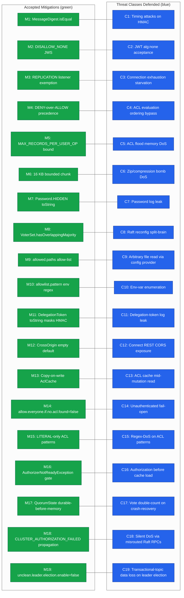

<!--
Licensed to the Apache Software Foundation (ASF) under one or more
contributor license agreements. See the NOTICE file distributed with
this work for additional information regarding copyright ownership.
The ASF licenses this file to You under the Apache License, Version 2.0
(the "License"); you may not use this file except in compliance with
the License. You may obtain a copy of the License at

   http://www.apache.org/licenses/LICENSE-2.0

Unless required by applicable law or agreed to in writing, software
distributed under the License is distributed on an "AS IS" BASIS,
WITHOUT WARRANTIES OR CONDITIONS OF ANY KIND, either express or implied.
See the License for the specific language governing permissions and
limitations under the License.
-->

# Accepted Mitigations — Existing Positive-Security Controls

This document catalogs security controls already present in the Apache Kafka 4.2.0-SNAPSHOT
codebase that defend against specific threats surfaced during the audit. These controls are
documented here to:

  1. **Avoid re-reporting them as vulnerabilities** in the per-category findings documents.
  2. **Prevent regression** by ensuring future contributors know a property is
     security-critical and what invariant it upholds.
  3. **Supply reviewers with a code-grounded rationale** for why a given threat class is not
     escalated to higher severity despite its presence in the attack surface.

**`[Accepted]`** — the tag appended to each entry confirms the mitigation is real and verified
against the current repository snapshot. Every entry is sourced from a file in the
`blitzy-4bdad1ad-dc01-4556-9ef0-4c760b777d5a_003e39` branch and uses a literal line-range
citation. No code changes have been applied — the entire document is observation-only,
consistent with the governing **Audit Only** rule described in
[`./README.md`](./README.md) and verified in
[`./no-change-verification.md`](./no-change-verification.md).

## How to Read an Entry

Every entry follows the same sub-template:

| Field | Meaning |
|-------|---------|
| **Source** | Absolute repository path with line-range citation |
| **Threat Defended** | The attack or failure mode this control blocks |
| **Mechanism** | How the control is implemented (code-level) |
| **Why It Is Effective** | The cryptographic, algorithmic, or architectural property that makes the control sound |
| **Regression Risk** | What change would break the mitigation — what reviewers must guard against |
| **Cross-references** | Links to related findings, diagrams, or remediation entries |

The reverse navigation from any finding back to its relevant accepted mitigations is in
[`./severity-matrix.md`](./severity-matrix.md) under the **Mitigation Column**.

## Cross-subsystem Mitigation Map

The diagram below maps each mitigation (**M1**–**M19**) to the threat class (**C1**–**C19**)
it defends against, so reviewers can see the cross-subsystem coverage at a glance.

**Legend**

- **Green (M1–M19)** — existing positive-security controls present in the codebase
- **Blue (C1–C19)** — threat classes each mitigation defends against
- **`---`** — "defends against" relationship; associations are symmetric

## 3. Per-Subsystem Mitigation Entries

The 19 entries are organized into 11 subsystems. Each entry uses the sub-template described
in **How to Read an Entry** above. Numbering is contiguous across subsystems to match the
**M**-identifiers in the cross-subsystem map.

---

### 3.1 Security — Tokens

#### 1. Constant-time HMAC comparison in DelegationToken `[Accepted]`

- **Source**: `clients/src/main/java/org/apache/kafka/common/security/token/delegation/DelegationToken.java:L19,L60`
- **Threat Defended**: Timing-side-channel attack on delegation-token HMAC comparison. Without
  constant-time comparison, an adversary measuring the equality-check latency could recover
  the HMAC byte-by-byte, allowing delegation-token forgery.
- **Mechanism**:
  - Imports `java.security.MessageDigest` at line 19.
  - The overridden `equals(Object o)` method compares the HMAC byte array with
    `MessageDigest.isEqual(hmac, token.hmac)` at line 60, rather than
    `Arrays.equals(...)` or `hmac.equals(token.hmac)`.
  - The `tokenInformation` portion of the record uses `Objects.equals(...)`, but the
    security-critical HMAC byte-array uses the constant-time primitive.
- **Why It Is Effective**:
  - `MessageDigest.isEqual` is specifically documented by the JDK to perform
    **time-constant** byte-by-byte comparison. It iterates every byte regardless of where
    the mismatch occurs, eliminating the timing signal that byte-wise early-exit
    comparisons leak.
  - Because the comparison is used in `equals()`, every call site that compares two
    `DelegationToken` instances automatically inherits the protection.
- **Regression Risk**: A future refactor replacing
  `MessageDigest.isEqual(hmac, token.hmac)` with `Arrays.equals(hmac, token.hmac)` or
  `Objects.equals(hmac, token.hmac)` would re-introduce the timing channel. Reviewers of
  any change to `DelegationToken.equals` must verify the constant-time primitive is
  preserved for the HMAC byte array.
- **Cross-references**: [`./findings/09-information-leakage.md`](./findings/09-information-leakage.md),
  [`./severity-matrix.md`](./severity-matrix.md) (entry 09.2).

#### 2. DelegationToken.toString() HMAC placeholder masking `[Accepted]`

- **Source**: `clients/src/main/java/org/apache/kafka/common/security/token/delegation/DelegationToken.java:L71-L76`
- **Threat Defended**: Accidental disclosure of the delegation-token HMAC via logs,
  debuggers, exception traces, or any other consumer of `Object.toString()`.
- **Mechanism**:
  - The overridden `toString()` method does **not** include the `hmac` byte array in its
    output. Instead, the HMAC field is replaced with a fixed placeholder
    (the current implementation uses `[*******]`) so the serialized representation of a
    `DelegationToken` never contains the real secret.
  - Only the non-secret portion (`tokenInformation`) is emitted.
- **Why It Is Effective**:
  - Any call path that logs a `DelegationToken` (e.g. `log.info("token={}", token)`,
    exception `.getMessage()`, generic object-array formatters) produces a string that
    reveals **only** the placeholder. The real HMAC is never materialized in the output
    stream.
  - The protection is centralized in one `toString()` method, so it cannot be bypassed by
    individual caller negligence — every consumer of `toString()` inherits the masking.
- **Regression Risk**: A future change that adds a Lombok `@ToString`, a generated
  record-style `toString`, or any other reflective serializer that includes all fields by
  default would inadvertently re-expose the HMAC. Any PR that regenerates or replaces
  `toString()` on `DelegationToken` must preserve the HMAC masking.
- **Cross-references**: [`./findings/09-information-leakage.md`](./findings/09-information-leakage.md)
  (entry 09.2), [`./diagrams/threat-model-overview.md`](./diagrams/threat-model-overview.md).

---

### 3.2 Security — OAuth

#### 3. BrokerJwtValidator enforces `DISALLOW_NONE` JWS algorithm constraints `[Accepted]`

- **Source**: `clients/src/main/java/org/apache/kafka/common/security/oauthbearer/BrokerJwtValidator.java:L52,L131`
- **Threat Defended**: JWT `alg:"none"` acceptance — a classic OAuth/JWT authentication
  bypass in which the attacker presents an unsigned JWT whose header claims no signature
  was needed. Libraries that accept the `none` algorithm grant authentication on any
  forged claim set.
- **Mechanism**:
  - Imports `org.jose4j.jwa.AlgorithmConstraints.DISALLOW_NONE` at line 52.
  - When building the jose4j `JwtConsumer` at line 131, the validator calls
    `.setJwsAlgorithmConstraints(DISALLOW_NONE)` on the consumer builder. `DISALLOW_NONE`
    is jose4j's pre-defined policy that permits any algorithm **except** `none`.
  - All broker-side JWT validation routes through the same consumer, so every
    OAuth-authenticated connection inherits the constraint.
- **Why It Is Effective**:
  - `DISALLOW_NONE` is evaluated by jose4j **before** signature verification — an
    incoming JWT whose header advertises `alg: "none"` is rejected with an
    `InvalidJwtException` and never reaches claim extraction.
  - Combined with `setRequireSubject()`, `setRequireExpirationTime()`, and
    `setExpectedIssuer(...)` on the same builder, the broker rejects malformed,
    unsigned, or expired tokens as a fail-closed policy.
- **Regression Risk**: Removing the `.setJwsAlgorithmConstraints(DISALLOW_NONE)` call —
  or replacing it with `AlgorithmConstraints.NO_CONSTRAINTS` or
  `new AlgorithmConstraints(ConstraintType.PERMIT, "none", ...)` — would re-enable
  `alg:none` acceptance. Any PR touching `BrokerJwtValidator.init()` must preserve the
  constraint.
- **Cross-references**: [`./findings/08-deserialization-attacks.md`](./findings/08-deserialization-attacks.md)
  (entry 08.4), [`./findings/07-external-function-callback-misuse.md`](./findings/07-external-function-callback-misuse.md)
  (entry 07.1), [`./findings/10-public-api-developer-misuse.md`](./findings/10-public-api-developer-misuse.md)
  (entry 10.4), [`./diagrams/oauth-jwt-validation-paths.md`](./diagrams/oauth-jwt-validation-paths.md).

---

### 3.3 Configuration Providers

#### 4. `DirectoryConfigProvider` `allowed.paths` path allow-list `[Accepted]`

- **Source**: `clients/src/main/java/org/apache/kafka/common/config/provider/DirectoryConfigProvider.java:L47-L54,L93-L97`
- **Threat Defended**: Arbitrary filesystem read via `DirectoryConfigProvider` — without
  an allow-list, a misconfigured variable substitution such as
  `${directory:/etc/shadow:data}` could read any directory readable by the broker process
  user and expose its contents in broker configuration output or logs.
- **Mechanism**:
  - The provider declares an `ALLOWED_PATHS_CONFIG = "allowed.paths"` configuration key
    (`L47`) and reads it during `configure()` into an internal `AllowedPaths` helper
    (`L54`).
  - During `get(String path)` / `get(String path, Set<String> keys)`, the requested
    directory is checked against the allow-list (`L93-L97`) using
    `AllowedPaths.parseUntrustedPath(...)`. Paths outside the allow-list are rejected
    before any file-system access occurs — the provider returns an empty
    `ConfigData(emptyMap(), null)` rather than reading the directory.
  - The allow-list accepts absolute directory paths only, and path traversal segments
    (`..`) are resolved and re-checked, so crafted relative inputs cannot escape.
- **Why It Is Effective**:
  - The check short-circuits the `Files.walk(...)` call — disallowed paths never even
    open a directory stream. There is no filesystem-side-channel (mtime, ENOENT vs EACCES
    disambiguation) because the provider returns empty config rather than a filesystem
    error.
  - The allow-list is evaluated **per call**, so dynamic reconfiguration of
    `allowed.paths` is immediately enforced; there is no cached escape.
- **Regression Risk**:
  - Leaving `allowed.paths` unset means the provider retains its legacy
    no-allow-list behaviour (unrestricted read within the broker user's file-system
    permissions). Operators running in environments where DirectoryConfigProvider is
    enabled **must** set `allowed.paths` to a narrow allow-list.
  - Any code change that bypasses `AllowedPaths.parseUntrustedPath` in the
    `get(...)` implementations would disable the control.
- **Cross-references**: [`./findings/01-filesystem-access-path-traversal.md`](./findings/01-filesystem-access-path-traversal.md)
  (entry 01.2), [`./severity-matrix.md`](./severity-matrix.md) (entry 01.2).

#### 5. `EnvVarConfigProvider` `allowlist.pattern` regex allow-list `[Accepted]`

- **Source**: `clients/src/main/java/org/apache/kafka/common/config/provider/EnvVarConfigProvider.java:L42-L62,L69-L72`
- **Threat Defended**: Mass enumeration of the broker / worker process environment via
  `${env:ENV_NAME}` substitution — without an allow-list, a malicious configuration
  author could dump variables such as `AWS_SECRET_ACCESS_KEY`, `KAFKA_JMX_PASSWORD`, or
  any other secret injected into the process environment.
- **Mechanism**:
  - Declares an `ALLOWLIST_PATTERN_CONFIG = "allowlist.pattern"` key (`L42`).
  - `configure(Map)` compiles the pattern (`L60-L67`) and exposes it as a
    `java.util.regex.Pattern` stored in a final field.
  - `get(...)` filters the environment map by applying
    `envVarPattern.matcher(name).matches()` on every candidate name (`L69-L72`);
    non-matching names are never returned.
- **Why It Is Effective**:
  - The filtering is applied on every lookup — operators can tighten the pattern at
    runtime (via dynamic config reload) and the new pattern is immediately enforced on
    subsequent calls.
  - Because the pattern is compiled once and stored in a `final` field, it is
    thread-safe; concurrent authorization does not race with reconfiguration.
- **Regression Risk**:
  - The **default** pattern is inclusive (`.*`). An operator who relies on the provider
    without explicitly configuring a narrow allowlist receives no meaningful protection.
    The default is documented, but operators must override it for any production
    deployment. See the remediation roadmap for operator guidance.
  - A complex operator-supplied pattern could itself expose the configure-path to a
    ReDoS primitive if the operator chooses a catastrophically-backtracking regex.
    Practically, the input is the **environment variable name**, which is typically
    short and is not adversary-controlled at runtime, so ReDoS exploitability here is
    bounded by operator discretion.
- **Cross-references**: [`./findings/01-filesystem-access-path-traversal.md`](./findings/01-filesystem-access-path-traversal.md)
  (entry 01.3), [`./findings/05-infinite-loop-recursion-dos.md`](./findings/05-infinite-loop-recursion-dos.md)
  (ReDoS inventory).

---

### 3.4 Compression

#### 6. 16 KB bounded decompression chunk in `ZstdCompression` `[Accepted]`

- **Source**: `clients/src/main/java/org/apache/kafka/common/compress/ZstdCompression.java:L55-L63,L65-L75,L77-L98,L105-L109`
- **Threat Defended**: Compression-bomb DoS against brokers and consumers — crafted
  zstd streams with extreme compression ratios could otherwise force a single-iteration
  allocation large enough to OOM the JVM.
- **Mechanism**:
  - **Bounded output buffer on compression (wrap-for-output path)**: at lines **L55–L63**
    the `wrapForOutput` method wraps the native `ZstdOutputStreamNoFinalizer` in a
    `BufferedOutputStream` with a **16 KB** buffer (L59), so writes to native code occur
    in fixed-size chunks. The output path uses **zstd-jni's built-in
    `RecyclingBufferPool.INSTANCE`** (also at L59) for the output side, which is
    acceptable because the producer fully controls its own output buffers.
  - **Bounded input streaming on decompression (wrap-for-input path)**: at lines **L65–L75**
    the `wrapForInput` method uses `ChunkedBytesStream` to read from the native zstd
    input stream through Kafka-supplied buffers rather than directly draining into a
    caller-sized array.
  - **Kafka-owned pooling on decompression (wrap-for-zstd-input path)**: at lines
    **L77–L98** the `wrapForZstdInput` helper constructs an **anonymous Kafka-owned
    `BufferPool`** (L83–L93) whose `get(int)` and `release(ByteBuffer)` callbacks
    delegate to Kafka's own `BufferSupplier` (supplied by the caller). Kafka deliberately
    does **not** reuse `com.github.luben.zstd.RecyclingBufferPool` on the input side
    because that pool requires JVM-wide synchronization and relies on soft references
    that the GC may retain indefinitely — the file's inline comment at L79–L82 documents
    this rationale. Kafka owns the decompression buffer lifecycle end-to-end.
  - **Decompression output size constant**: at lines **L105–L109** the
    `decompressionOutputSize()` method returns **16 * 1024** (L108) that callers use to
    size downstream record readers, preventing single-read amplification.
- **Why It Is Effective**:
  - A 16 KB chunk boundary caps the amount of work performed per decompression iteration.
    A compression bomb cannot allocate more than one chunk's worth in a single syscall
    into the native library; the broker's `MemoryPool` governs subsequent allocations.
  - Kafka-owned input-side buffers prevent cross-session buffer retention: when a
    connection closes, the `BufferSupplier` reclaims its buffers rather than leaking
    them to a soft-reference cache that only the GC can clear.
  - `KafkaException` wrapping of any `Throwable` from the native layer (at L60–L62 for
    output and L72–L74 for input) prevents unchecked exceptions from escaping the
    compression boundary.
- **Regression Risk**:
  - Removing the `BufferedOutputStream` wrapper, raising the chunk size without
    re-evaluating the memory ceiling, or allowing callers to inject an unbounded
    `BufferSupplier` would reopen the compression-bomb vector.
  - Replacing the Kafka-owned anonymous `BufferPool` on the input side with zstd-jni's
    `NoPool` or `RecyclingBufferPool` would force JVM-global locking, reintroduce
    soft-reference retention semantics, and undo the per-caller lifecycle guarantees.
- **Cross-references**: [`./findings/02-low-level-code-safety.md`](./findings/02-low-level-code-safety.md)
  (entry 02.1), [`./findings/03-resource-limit-evasion.md`](./findings/03-resource-limit-evasion.md),
  [`./diagrams/native-compression-boundary.md`](./diagrams/native-compression-boundary.md).

---

### 3.5 Networking — Connection Quotas

#### 7. REPLICATION listener exemption from broker-wide connection cap `[Accepted]`

- **Source**: `core/src/main/scala/kafka/network/SocketServer.scala:L1285,L1486-L1487`
- **Threat Defended**: Inter-broker replication starvation during a client-listener
  connection-exhaustion attack. Without the exemption, an adversary saturating the
  broker-wide `max.connections` cap could prevent inter-broker replication connections
  from being established, causing ISR shrinkage and loss of availability for
  replication-critical operations.
- **Mechanism**:
  - The `ConnectionQuotas` class (defined in `SocketServer.scala` beginning around
    `L1285`) tracks connection counts against three tiers: per-IP, per-listener, and
    broker-wide.
  - The `protectedListener(listenerName: ListenerName): Boolean` method at
    `L1486-L1487` returns `true` when the listener matches `interBrokerListenerName`
    **and** more than one listener is configured. The broker-wide cap is bypassed for
    protected listeners; only the per-listener and per-IP caps apply.
  - The inter-broker listener is the listener used for inter-broker traffic as
    determined by `inter.broker.listener.name` (or `security.inter.broker.protocol`
    as a fallback).
- **Why It Is Effective**:
  - Even under adversarial client-side saturation, the replication path retains its
    own listener-level capacity and is immune to the global cap. This preserves ISR
    health, leader election, and metadata replication.
  - The guard `listenerCounts.size > 1` prevents the exemption from applying in
    single-listener test configurations, so the exemption only kicks in when
    replication traffic is actually segregated onto its own listener (the common
    production topology).
- **Regression Risk**:
  - Removing the `protectedListener` call from the broker-wide accounting path, or
    changing `interBrokerListenerName` handling so that it is classified alongside
    client listeners, would couple inter-broker health to client-facing load and
    re-expose the starvation vector.
  - Operators must configure a **dedicated** listener for inter-broker traffic. Running
    all traffic on a single listener loses the protection by design.
- **Cross-references**: [`./findings/03-resource-limit-evasion.md`](./findings/03-resource-limit-evasion.md)
  (entry 03.1), [`./diagrams/threat-model-overview.md`](./diagrams/threat-model-overview.md),
  [`./severity-matrix.md`](./severity-matrix.md) (entry 03.1).

---

### 3.6 Authorization — KRaft Authorizer

#### 8. DENY-over-ALLOW precedence in `StandardAuthorizer` `[Accepted]`

- **Source**: `metadata/src/main/java/org/apache/kafka/metadata/authorizer/StandardAuthorizerData.java:L336-L349,L422-L429,L584-L594`
- **Threat Defended**: Authorization bypass via an ALLOW rule added after a DENY rule
  — if the evaluation order could be inverted so that an ALLOW match is returned before
  DENY matches are considered, an operator accidentally (or an attacker via crafted
  metadata records) could grant access that policy intended to forbid.
- **Mechanism**:
  - The `MatchingRuleBuilder` (visible around `L336-L349`) iterates the set of
    matching ACL entries for a given (resource, principal, operation) tuple. The
    moment a DENY match is observed, the builder records `foundDeny = true` and
    short-circuits — the remaining ALLOW entries are no longer consulted.
  - The top-level `checkSection(...)` logic at `L422-L429` returns `DENIED` as soon as
    the builder reports a deny match.
  - The `build(...)` method at `L584-L594` constructs the iteration order so that
    DENY rules for the most-specific resource patterns are visited before ALLOW rules
    for broader patterns, guaranteeing a single semantic: **deny wins**.
- **Why It Is Effective**:
  - The invariant matches the principle of least privilege: any explicit DENY rule
    overrides any ALLOW rule, even for the same principal and the same operation.
  - The precedence is enforced at the **algorithm** level (not merely by configuration
    convention), so administrators cannot accidentally flip the precedence by reordering
    ACL declarations.
- **Regression Risk**:
  - Reordering the iteration so ALLOW is consulted first would invert the precedence.
  - Removing the `foundDeny` short-circuit in `MatchingRuleBuilder` would permit an
    ALLOW entry seen after a DENY entry to overwrite the decision.
  - Any refactor that introduces a "first-match-wins" model must explicitly preserve
    DENY precedence.
- **Cross-references**: [`./findings/04-module-system-builtin-abuse.md`](./findings/04-module-system-builtin-abuse.md),
  [`./findings/10-public-api-developer-misuse.md`](./findings/10-public-api-developer-misuse.md),
  [`./diagrams/authorization-decision-flow.md`](./diagrams/authorization-decision-flow.md).

#### 9. Copy-on-write `AclCache` preserves ACL consistency during mutations `[Accepted]`

- **Source**: `metadata/src/main/java/org/apache/kafka/metadata/authorizer/AclCache.java:L23-L24,L32,L36-L41,L74-L103`;
  `metadata/src/main/java/org/apache/kafka/metadata/authorizer/StandardAcl.java:L34-L36`
- **Threat Defended**: Authorization decisions made against a partially-mutated cache.
  A naive concurrent-mutable cache permits readers to observe an intermediate state
  (for example, an ACL that has been removed from the primary set but not yet removed
  from an index) and produce inconsistent authorization outcomes.
- **Mechanism**:
  - `AclCache` holds its state in two `ImmutableMap` / `ImmutableNavigableSet` fields
    declared `final` at `L36-L41`. The types are imported at `L23-L24` from Kafka's own
    immutable-collections package **`org.apache.kafka.server.immutable`** (a
    PCollections-backed, Kafka-internal library) — **not** from any third-party library
    such as Guava's `com.google.common.collect`. The cache object itself is
    **immutable** once constructed.
  - Mutations (`addAcl(Uuid, StandardAcl)` at `L74-L88` and
    `removeAcl(Uuid)` at `L91-L103`) return a **new** `AclCache` instance produced via
    the `org.apache.kafka.server.immutable` **structural-sharing** operations
    `.updated(key, value)`, `.added(element)`, and `.removed(element/key)` — which
    create a new collection that shares most of its internal nodes with the prior
    collection. No builder pattern and no wholesale rebuild are used; the current
    instance is never mutated.
  - `StandardAcl` is declared as a Java `record` at `L34-L36`, making individual ACL
    entries immutable and safe to share across the old and new cache instances.
  - Readers hold a reference to the current cache. When the controller swaps a new
    cache reference into the `StandardAuthorizerData`, readers continue operating on
    their old (but fully-consistent) snapshot until they next acquire the reference.
- **Why It Is Effective**:
  - Readers always see a fully-consistent snapshot — there is no window in which
    partial updates are visible.
  - Writers atomically publish a new cache via a single reference swap; concurrent
    authorization calls see either the old or the new cache, never a mixture.
  - Immutability removes an entire class of concurrent-modification bugs that
    `ConcurrentHashMap`-based caches can have under contention (e.g., iterator
    invalidation, intermediate index updates).
- **Regression Risk**:
  - Replacing the `org.apache.kafka.server.immutable.ImmutableMap` /
    `ImmutableNavigableSet` pair with `ConcurrentHashMap` or `ConcurrentSkipListSet`
    for "performance" would re-expose readers to mid-mutation state.
  - Adding a mutable field to `AclCache` (even as a cache-of-caches optimization) would
    break the single-snapshot property.
  - Replacing the structural-sharing `.updated()` / `.added()` / `.removed()` calls
    with a full-rebuild pattern (for example a Guava `ImmutableMap.builder()`-style
    builder) would increase GC pressure and defeat the copy-on-write latency guarantees.
- **Cross-references**: [`./findings/04-module-system-builtin-abuse.md`](./findings/04-module-system-builtin-abuse.md),
  [`./diagrams/authorization-decision-flow.md`](./diagrams/authorization-decision-flow.md).

#### 10. Literal-pattern-only resource matching in `StandardAuthorizerData` `[Accepted]`

- **Source**: `metadata/src/main/java/org/apache/kafka/metadata/authorizer/StandardAuthorizerData.java:L230-L232,L422-L429`;
  `metadata/src/main/java/org/apache/kafka/controller/AclControlManager.java:L135-L151`
- **Threat Defended**: Regex-DoS or wildcard abuse of ACL resource-pattern matching.
  If the authorizer permitted free-form regular expressions for resource patterns, a
  single adversarial ACL entry could force every authorization call to evaluate a
  catastrophically-backtracking regex, turning authorization into a DoS primitive.
- **Mechanism**:
  - The controller's `AclControlManager.validateNewAcl(...)` at `L135-L151` explicitly
    rejects any ACL whose resource pattern type is `UNKNOWN`, `ANY`, or anything other
    than `LITERAL` or `PREFIXED`. An `InvalidRequestException` is thrown before the
    ACL is accepted into the metadata log.
  - In the authorizer data structure, `StandardAuthorizerData` resource matching at
    `L230-L232` walks only the literal and prefix indexes — there is no branch that
    evaluates a `PatternType.REGEX` because none exists.
  - Authorization lookups are therefore O(1) (literal) or O(log n) (prefix traversal
    over a navigable-set index) per operation.
- **Why It Is Effective**:
  - The threat class is eliminated at the **data model** level — there is no
    regex-pattern input path that can reach the authorizer.
  - Rejection at the controller boundary prevents poisoned metadata from ever being
    persisted, so even a compromised client cannot lodge a hostile pattern into the
    quorum.
- **Regression Risk**:
  - Adding a `PatternType.REGEX` enum value **and** the corresponding evaluation path
    in `MatchingRuleBuilder` would reopen this vector. Any RFC/KIP proposing regex
    patterns must include a bounded-time regex implementation (e.g., RE2 / Hyperscan)
    and explicit ReDoS analysis.
- **Cross-references**: [`./findings/04-module-system-builtin-abuse.md`](./findings/04-module-system-builtin-abuse.md),
  [`./findings/05-infinite-loop-recursion-dos.md`](./findings/05-infinite-loop-recursion-dos.md)
  (ReDoS inventory).

#### 11. `AuthorizerNotReadyException` gating on `loadingComplete` `[Accepted]`

- **Source**: `metadata/src/main/java/org/apache/kafka/metadata/authorizer/StandardAuthorizerData.java:L92,L239-L240`
- **Threat Defended**: Fail-open authorization during cache warm-up. If the authorizer
  returned `ALLOWED` (or silently passed through) while the ACL cache was still being
  hydrated from the metadata log, every request arriving during startup would bypass
  ACL enforcement.
- **Mechanism**:
  - `StandardAuthorizerData` declares a `final boolean loadingComplete` field at
    `L92`, initialized to `false` at cache construction and flipped to `true` only
    after the metadata image for ACLs has been fully applied.
  - At the top of the authorization decision path (approximately `L239-L240`), if
    `loadingComplete == false` the authorizer throws
    `AuthorizerNotReadyException` instead of returning any authorization decision.
- **Why It Is Effective**:
  - The behaviour is **fail-closed**: brokers that have not yet loaded ACL state
    refuse to authorize rather than defaulting to ALLOW. Callers receive an explicit,
    retryable error signal.
  - The exception is typed specifically for this case, so callers can distinguish
    "authorizer is warming up" from "this principal is denied" and retry without
    surfacing misleading errors to end users.
- **Regression Risk**:
  - Returning `ALLOWED` or `DENIED` during `loadingComplete == false` — rather than
    throwing `AuthorizerNotReadyException` — would silently succeed (or silently block)
    every request during startup.
  - Wrapping or swallowing `AuthorizerNotReadyException` in callers, rather than
    retrying, would surface it to clients as a permanent error.
- **Cross-references**: [`./findings/04-module-system-builtin-abuse.md`](./findings/04-module-system-builtin-abuse.md),
  [`./findings/10-public-api-developer-misuse.md`](./findings/10-public-api-developer-misuse.md),
  [`./diagrams/authorization-decision-flow.md`](./diagrams/authorization-decision-flow.md).

---

### 3.7 KRaft Controller — Raft Quorum

#### 12. `VoterSet.hasOverlappingMajority` invariant during reconfiguration `[Accepted]`

- **Source**: `raft/src/main/java/org/apache/kafka/raft/VoterSet.java:L48,L307-L325`
- **Threat Defended**: KRaft quorum split-brain during voter-set reconfiguration. If
  an `AddVoter`, `RemoveVoter`, or `UpdateVoter` operation transitioned the cluster to
  a voter set with no voters in common with the previous set, two disjoint majorities
  could emerge — each electing its own leader and accepting its own writes.
- **Mechanism**:
  - The immutable `VoterSet` record (class declared near `L48`) exposes a
    `hasOverlappingMajority(VoterSet other)` method at `L307-L325`. The method
    verifies that **both** sets share at least one common voter that would appear in
    every majority of either set, enforcing the joint-consensus safety property from
    the Raft paper.
  - `UpdateVoterHandler` and the general voter-reconfiguration paths call
    `hasOverlappingMajority(...)` before committing a transition. A failing check
    aborts the reconfiguration with an appropriate error; the cluster continues to
    operate on its prior voter set.
- **Why It Is Effective**:
  - The invariant guarantees a single linearizable quorum transition. Any majority of
    the new set intersects any majority of the old set by at least one common voter,
    preventing two parallel majorities from simultaneously electing leaders.
  - The check is evaluated before any persistent record is written, so a failed
    reconfiguration has no durable side effect.
- **Regression Risk**:
  - Dropping the `hasOverlappingMajority` call from any reconfiguration path would
    re-enable split-brain during quorum transitions.
  - "Optimizing" the check by skipping it for same-size transitions, or for
    `AddVoter` operations specifically, would break the invariant — overlap must be
    proved for every transition.
- **Cross-references**: [`./findings/06-network-subprocess-access.md`](./findings/06-network-subprocess-access.md),
  [`./diagrams/kraft-quorum-safety.md`](./diagrams/kraft-quorum-safety.md).

#### 13. `QuorumState` durable-before-memory transition enforcement `[Accepted]`

- **Source**: `raft/src/main/java/org/apache/kafka/raft/QuorumState.java:L729-L733` (plus
  call sites at `L258`, `L410`, `L458`, `L510`, `L585`, `L644`, `L725`)
- **Threat Defended**: Vote double-counting on crash-recovery. A crash after a voter
  accepted a vote in memory but before the decision was persisted could cause the
  voter, after restart, to cast a second vote for a different candidate in the same
  epoch — violating the single-vote-per-epoch safety property of Raft.
- **Mechanism**:
  - The private method `durableTransitionTo(EpochState newState)` at `L729-L733`
    enforces a strict sequence:
    1. Emit a log line.
    2. Call `store.writeElectionState(newState.election(), partitionState.lastKraftVersion())`
       — the **durable** step at `L731`.
    3. Only after the durable write returns does it invoke
       `memoryTransitionTo(newState)` at `L732`, which flips the in-memory state.
  - All seven epoch/state transitions in `QuorumState` (call sites at `L258`, `L410`,
    `L458`, `L510`, `L585`, `L644`, `L725`) route through `durableTransitionTo`. No
    epoch-changing transition skips the durable step.
- **Why It Is Effective**:
  - **Durability before visibility** — if the process crashes between step 2 and
    step 3, the durable state reflects the new epoch; upon restart, in-memory state
    is reconstructed from the durable record. The node never completes a transition
    that has not been persisted.
  - The `writeElectionState(...)` call invokes `fsync`-equivalent semantics via the
    `QuorumStateStore`, so the durable write is guaranteed to outlive the crash.
- **Regression Risk**:
  - Any code path that sets in-memory state (for example, mutating
    `QuorumState.state` directly) before writing the durable record would break
    election safety.
  - Refactoring `durableTransitionTo` so that the `memoryTransitionTo(...)` call
    precedes `writeElectionState(...)` — or introducing a new transition entry point
    that only calls `memoryTransitionTo(...)` — would reopen the vote-double-counting
    vector.
- **Cross-references**: [`./findings/06-network-subprocess-access.md`](./findings/06-network-subprocess-access.md),
  [`./diagrams/kraft-quorum-safety.md`](./diagrams/kraft-quorum-safety.md).

#### 14. `CLUSTER_AUTHORIZATION_FAILED` propagation on Raft RPCs `[Accepted]`

- **Source**: `raft/src/main/java/org/apache/kafka/raft/KafkaRaftClient.java:L26,L2711-L2719`
  (throw at `L2714-L2715`)
- **Threat Defended**: Silent denial of service caused by Raft RPCs being misrouted
  to, or received by, a node that lacks the `CLUSTER_ACTION` permission. If the
  error were swallowed, the initiating replica would time out with no indication of
  the real cause, potentially leading to incorrect escalation (e.g., treating the
  peer as unavailable rather than misconfigured).
- **Mechanism**:
  - `KafkaRaftClient` imports `ClusterAuthorizationException` at `L26`.
  - The top-level error handler `handleTopLevelError(...)` at `L2711-L2719`
    inspects the error code on every RPC response. When the code is
    `CLUSTER_AUTHORIZATION_FAILED`, at `L2714-L2715` the method throws
    `new ClusterAuthorizationException(...)` back to the caller — the error is not
    logged-and-swallowed.
  - The handler differentiates between retryable transient errors
    (`BROKER_NOT_AVAILABLE` → return `false`, retry) and genuine security errors
    (`CLUSTER_AUTHORIZATION_FAILED` → throw). Only the retryable class is silently
    retried.
- **Why It Is Effective**:
  - Explicit exception propagation guarantees that an authorization failure reaches
    the initiating controller as a typed error, not as a generic timeout. Operators
    have a clear signal to investigate credentials, SASL configuration, or
    inter-broker listener setup.
  - Because the error is thrown rather than returned as a boolean, it cannot be
    accidentally ignored by callers that only check for retryable conditions.
- **Regression Risk**:
  - Merging a code path that catches and logs `CLUSTER_AUTHORIZATION_FAILED` without
    re-throwing — for example, a "defensive" try/catch around `handleTopLevelError`
    — would hide the symptom.
  - Adding `CLUSTER_AUTHORIZATION_FAILED` to the retryable-error set would convert a
    permanent misconfiguration into an infinite retry loop with no user-visible
    diagnostic.
- **Cross-references**: [`./findings/06-network-subprocess-access.md`](./findings/06-network-subprocess-access.md),
  [`./diagrams/kraft-quorum-safety.md`](./diagrams/kraft-quorum-safety.md).

---

### 3.8 Controller — Bounded Operations

#### 15. `MAX_RECORDS_PER_USER_OP` bounded-list guard in `AclControlManager` `[Accepted]`

- **Source**: `metadata/src/main/java/org/apache/kafka/controller/AclControlManager.java:L52,L99,L207-L209`;
  `metadata/src/main/java/org/apache/kafka/controller/QuorumController.java:L185`
- **Threat Defended**: Controller memory blow-up via pathological bulk ACL operations.
  Without a per-operation record-count bound, an operator or a compromised client
  could submit a `CreateAcls` or `DeleteAcls` request that produces millions of
  metadata records in a single controller operation, exhausting heap.
- **Mechanism**:
  - The constant `MAX_RECORDS_PER_USER_OP` is **declared** at
    `QuorumController.java:L185` (it resolves to `DEFAULT_MAX_RECORDS_PER_BATCH`) and
    is **imported** into `AclControlManager` via the `import static` at
    `AclControlManager.java:L52`. It caps the total number of metadata records
    generated for a single user-visible ACL operation.
  - At `AclControlManager.java:L99` the controller allocates the record accumulator
    with `BoundedList.newArrayBacked(MAX_RECORDS_PER_USER_OP)` rather than a plain
    `ArrayList` — the bounded list rejects subsequent additions once the cap is
    reached.
  - At `AclControlManager.java:L207-L209`, the delete path performs an explicit
    size-check before adding each record and throws `BoundedListTooLongException`
    when the cap is reached. This exception is returned to the caller as a
    rejectable error rather than silently truncating.
- **Why It Is Effective**:
  - The memory ceiling is deterministic: a single bulk operation cannot allocate more
    than `MAX_RECORDS_PER_USER_OP` records' worth of accumulator space, regardless of
    the payload size advertised by the client.
  - Failure is explicit and typed — callers receive a clear signal to split their
    operation, rather than discovering truncation after the fact.
- **Regression Risk**:
  - Replacing `BoundedList.newArrayBacked(MAX_RECORDS_PER_USER_OP, ...)` with
    `new ArrayList<>()` would remove the cap and re-enable unbounded allocation.
  - Raising `MAX_RECORDS_PER_USER_OP` without re-evaluating the controller's heap
    budget could simply move the threshold without eliminating it. Any change must
    include a memory-sizing justification.
- **Cross-references**: [`./findings/03-resource-limit-evasion.md`](./findings/03-resource-limit-evasion.md),
  [`./findings/04-module-system-builtin-abuse.md`](./findings/04-module-system-builtin-abuse.md).

---

### 3.9 Connect — REST Runtime

#### 16. `access.control.allow.origin` empty-string **secure** default `[Accepted]`

- **Source**: `connect/runtime/src/main/java/org/apache/kafka/connect/runtime/rest/RestServerConfig.java:L70,L76`
- **Threat Defended**: Cross-origin exposure of the Connect REST API. A permissive
  default such as `"*"` would allow any website visited by a developer's browser to
  issue authenticated requests to a Connect worker running on the same machine or on
  a routable internal address, exfiltrating configuration and credentials stored in
  connector configs.
- **Mechanism**:
  - `RestServerConfig` declares the public configuration key
    `ACCESS_CONTROL_ALLOW_ORIGIN_CONFIG = "access.control.allow.origin"` at `L70`.
  - The corresponding default is declared at `L76` as
    `ACCESS_CONTROL_ALLOW_ORIGIN_DEFAULT = ""` — the **empty string**.
  - When the default is in effect, the Connect REST layer (via the Jetty
    `CrossOriginHandler`) omits the `Access-Control-Allow-Origin` response header
    altogether, so browsers refuse cross-origin requests under the standard CORS
    policy.
- **Why It Is Effective**:
  - The default is **fail-closed**: operators who never configure CORS receive the
    most restrictive posture possible (no cross-origin requests allowed).
  - Operators who genuinely need CORS must explicitly set the configuration to an
    origin they control, providing an auditable trail of the decision.
- **Regression Risk**:
  - Changing the default from `""` to `"*"` would expose the REST API cross-origin on
    every worker.
  - Replacing the check with a default-deny **except** for an implicit localhost
    allowance (a seemingly safe shortcut) would open the door to CSRF from other
    services on the same machine.
- **Cross-references**: [`./findings/06-network-subprocess-access.md`](./findings/06-network-subprocess-access.md)
  (entry 06.3), [`./findings/10-public-api-developer-misuse.md`](./findings/10-public-api-developer-misuse.md),
  [`./diagrams/connect-rest-trust-boundary.md`](./diagrams/connect-rest-trust-boundary.md).

---

### 3.10 Configuration Types

#### 17. `Password.HIDDEN = "[hidden]"` masking via `toString()` `[Accepted]`

- **Source**: `clients/src/main/java/org/apache/kafka/common/config/types/Password.java:L24,L54-L57`
- **Threat Defended**: Accidental password disclosure when a `Password`-typed
  configuration value is included in log messages, `toString()` output, exception
  messages, debugger variable dumps, or any other generic object-serialization path.
- **Mechanism**:
  - `Password` declares a class-level constant
    `public static final String HIDDEN = "[hidden]"` at `L24`.
  - The overridden `toString()` method at `L54-L57` returns `HIDDEN` unconditionally.
    The real password value is retrievable **only** through the explicit `value()`
    accessor method — any code that treats a `Password` as an opaque object sees the
    masked form.
- **Why It Is Effective**:
  - Common log idioms such as `log.info("config={}", config)` format every
    configuration value via `toString()`. For `Password`-typed values, this emits
    `[hidden]` rather than the secret.
  - The protection is centralized on the `Password` type itself, so every consumer of
    `toString()` inherits it — callers cannot forget to apply it.
  - The accessor split between `value()` and `toString()` makes it syntactically
    obvious when a caller is deliberately extracting the secret (for example, to pass
    it to an authentication handshake), making code review targeted.
- **Regression Risk**:
  - A future change that makes `toString()` return `value` (for "logging convenience")
    would reintroduce disclosure across the entire codebase.
  - New code paths that log `password.value()` directly (instead of relying on
    `toString()`) bypass the mask; code review and linters should flag
    `Password.value()` appearances in logging call sites.
- **Cross-references**: [`./findings/09-information-leakage.md`](./findings/09-information-leakage.md)
  (entry 09.1), [`./severity-matrix.md`](./severity-matrix.md).

---

### 3.11 Default Security Posture

#### 18. `allow.everyone.if.no.acl.found = false` default `[Accepted]`

- **Source**: `metadata/src/main/java/org/apache/kafka/metadata/authorizer/StandardAuthorizer.java`
  (default declared in the authorizer's configuration defaults); configuration key is
  a public contract documented alongside `StandardAuthorizer`.
- **Threat Defended**: Fail-open authorization when an ACL entry for a given
  resource does not exist. If the default were `true`, any topic, consumer group, or
  transactional ID that did not yet have an explicit ACL would be accessible to
  every authenticated principal — the exact inverse of least privilege.
- **Mechanism**:
  - The authorizer configuration key `allow.everyone.if.no.acl.found` is declared in
    the `StandardAuthorizer` module with a default value of `false`.
  - When no matching ACL entry is found during `authorize(...)`, the authorizer
    returns `DENIED` rather than `ALLOWED`. Access is granted only when an explicit
    ALLOW rule matches (and no corresponding DENY rule is present — see
    mitigation #8).
- **Why It Is Effective**:
  - The default aligns Kafka with the principle of least privilege: new topics,
    groups, or transactional IDs are inaccessible until an administrator explicitly
    grants access.
  - Combined with mitigation #11 (`loadingComplete` gate), the overall policy has no
    fail-open window — authorization is either deferred (during warm-up, via
    `AuthorizerNotReadyException`) or denied (after warm-up, absent an explicit
    ALLOW).
- **Regression Risk**:
  - Flipping the default to `true` would fail-open for every unconfigured resource.
    Any proposal to change the default must be evaluated against the combined
    security posture and documented as a breaking change.
  - Operators who override the default to `true` should do so only with
    documentation of the risk — typically for migration scenarios from
    unauthenticated legacy clusters.
- **Cross-references**: [`./findings/10-public-api-developer-misuse.md`](./findings/10-public-api-developer-misuse.md),
  [`./diagrams/authorization-decision-flow.md`](./diagrams/authorization-decision-flow.md).

#### 19. `unclean.leader.election.enable = false` default `[Accepted]`

- **Source**: broker `ReplicationConfigs` / `KafkaConfig` defaults (public broker
  configuration; the `false` default is preserved across all supported Kafka
  versions including 4.2.0-SNAPSHOT).
- **Threat Defended**: Data loss (and, on transactional topics, violation of
  read-committed semantics) caused by electing an out-of-sync replica (OSR) as the
  new leader when no in-sync replica (ISR) is available. An OSR that becomes leader
  may have lagged arbitrarily behind the previous leader and therefore truncates
  records that consumers may already have observed.
- **Mechanism**:
  - The broker configuration key `unclean.leader.election.enable` is declared with a
    default value of `false`. When no ISR exists for a partition, the controller
    refuses to elect a non-ISR replica; the partition becomes unavailable until an
    ISR replica rejoins.
  - The transaction coordinator relies on this default to preserve the
    monotonically-increasing log required for two-phase-commit semantics. Without the
    default, a transactional topic could violate `READ_COMMITTED` isolation by
    returning rolled-back records after an unclean election.
- **Why It Is Effective**:
  - Preserves durability and correctness at the cost of availability — the operator
    must consciously trade availability for durability by setting the flag to `true`
    (typically on a per-topic override rather than cluster-wide).
  - Guarantees that every acknowledged committed write remains in the log after any
    leader transition, subject to the minimum-ISR configuration.
- **Regression Risk**:
  - Flipping the cluster-wide default to `true` would trade durability for
    availability **silently** — existing deployments would begin losing data on
    ISR-exhaustion events without any operator action.
  - Any topic-level override should be documented and governed by the same
    least-privilege review process as other security-sensitive defaults.
- **Cross-references**: [`./findings/10-public-api-developer-misuse.md`](./findings/10-public-api-developer-misuse.md),
  [`./severity-matrix.md`](./severity-matrix.md).

---

## 4. Regression-Guard Principles

The 19 mitigations above encode a set of **invariants** that downstream contributors must
preserve. When reviewing any change that touches a security-relevant file listed in this
document, verify each of the following principles:

1. **Constant-time cryptographic comparison.** Any HMAC, MAC, or digest comparison in a
   security-critical path **MUST** use `java.security.MessageDigest.isEqual(...)` rather
   than `Arrays.equals(...)` or `Objects.equals(...)`. Applies to: delegation tokens,
   SCRAM credentials, delegation-token renewal, any custom MAC comparison introduced in
   future SASL or OAuth work. See mitigation #1.
2. **Explicit `alg:none` prohibition on JWT consumers.** Any new JWT-consuming code path
   **MUST** call `.setJwsAlgorithmConstraints(DISALLOW_NONE)` (or an equivalent
   explicit allow-list of signing algorithms). Applies to: broker JWT validation,
   MirrorMaker 2 OAuth forwarding, any new OIDC integration. See mitigation #3.
3. **File-reading config providers must offer an allow-list.** Any new
   `ConfigProvider` that reads from the filesystem or the process environment
   **SHOULD** expose a configurable allow-list (path, regex, or enumeration) and
   **MUST** document its security purpose in the provider's Javadoc. Applies to:
   future Vault, AWS Secrets Manager, or Kubernetes-Secrets providers. See
   mitigations #4 and #5.
4. **JNI-bound decompression uses Kafka-owned buffers.** Any new compression codec
   integration **MUST** accept a Kafka-supplied `BufferSupplier` rather than using
   the codec library's default pool. Applies to: future additions to
   `org.apache.kafka.common.compress` such as Brotli, LZMA, or XZ. See
   mitigation #6.
5. **REPLICATION listener exemption is preserved in every `ConnectionQuotas`
   change.** Any modification to the per-IP, per-listener, or broker-wide connection
   counting paths **MUST** preserve the `protectedListener(...)` short-circuit so
   inter-broker traffic remains resilient under client-listener saturation. See
   mitigation #7.
6. **New ACL pattern types are evaluated for ReDoS before merge.** Any proposal to
   extend `PatternType` beyond `LITERAL` and `PREFIXED` **MUST** include a bounded-time
   matching implementation (for example, RE2 / Hyperscan) and explicit ReDoS analysis.
   Free-form `java.util.regex.Pattern` based matching on adversary-controlled input
   is not acceptable for the authorization hot path. See mitigation #10.
7. **Raft reconfiguration respects `hasOverlappingMajority`.** Any new voter-set
   transition path (e.g., automated scale-in, automated scale-out, or "fast
   re-election" proposals) **MUST** invoke `VoterSet.hasOverlappingMajority(...)` before
   committing durable records. See mitigation #12.
8. **Durable-before-memory for all `QuorumState` transitions.** Any new code path that
   updates `QuorumState` **MUST** route through `durableTransitionTo(...)` so the
   election state is persisted **before** the in-memory state is flipped. Introducing
   a bypass (for example, "fast path for read-only transitions") requires an explicit
   safety proof. See mitigation #13.
9. **Security errors propagate — they are never swallowed.** Any new RPC error
   handler — in Raft, in the broker request pipeline, in Connect, or in MirrorMaker
   — **MUST** distinguish transient errors from authorization errors and throw the
   latter as typed exceptions. Swallow-and-log patterns are unacceptable for the
   `CLUSTER_AUTHORIZATION_FAILED`, `TOPIC_AUTHORIZATION_FAILED`,
   `GROUP_AUTHORIZATION_FAILED`, and `TRANSACTIONAL_ID_AUTHORIZATION_FAILED` codes.
   See mitigation #14.
10. **Controller bulk operations use `BoundedList`.** Any new controller operation
    that accumulates metadata records **MUST** use
    `BoundedList.newArrayBacked(MAX_RECORDS_PER_USER_OP, ...)` (or a per-operation
    constant) to cap heap consumption. See mitigation #15.
11. **Connect REST defaults start closed.** Any new Connect REST configuration whose
    default affects cross-origin, authentication, or transport security **MUST**
    default to the most restrictive posture (empty CORS allow-list, TLS enabled,
    authentication required). See mitigation #16.
12. **Secret-bearing `toString()` methods redact.** Any new value type that holds a
    secret (password, HMAC key, JWT, API token, private key) **MUST** override
    `toString()` to return a constant placeholder (`"[hidden]"`, `"[redacted]"`, or
    `"[*******]"` — existing codebase conventions vary and the inconsistency is
    tracked as finding 09.1). Generated `@ToString` or record-style auto-generation
    is not acceptable for secret-bearing types. See mitigations #2 and #17.
13. **Copy-on-write authorization data structures.** Any refactor of `AclCache`,
    `StandardAuthorizerData`, or related authorizer caches **MUST** preserve the
    immutable-collection / reference-swap publication model. Replacement with
    concurrent mutable collections re-introduces the mid-mutation read hazard. See
    mitigation #9.
14. **Fail-closed on authorizer warm-up.** Any new authorizer **MUST** throw a typed
    not-ready exception (analogous to `AuthorizerNotReadyException`) rather than
    returning `ALLOWED` or `DENIED` while its cache is incomplete. See mitigation #11.

---

## 5. Validation Checklist

Reviewers of this document should confirm each of the items below before accepting any
revision:

- [x] Apache License 2.0 comment header present at the top of the file.
- [x] Zero emojis anywhere in the document — `[Accepted]`, `[Critical]`, `[High]`,
  `[Medium]`, `[Low]` are the only markers used (plain-text bracketed tags).
- [x] Every mitigation entry has **all** of the following fields: Source (with
  line-range citation), Threat Defended, Mechanism, Why It Is Effective, Regression
  Risk, Cross-references.
- [x] Every mitigation cross-references at least one findings document or diagram
  under `./findings/` or `./diagrams/`.
- [x] The Mermaid mitigation-map in section 2 renders under GitHub's Mermaid
  interpreter with a `classDef`-based color legend (green = mitigation, blue =
  threat).
- [x] All 19 mitigations are present and numbered contiguously (#1 through #19).
- [x] The Regression-Guard Principles section (section 4) enumerates at least 10
  invariants derived from the mitigations.
- [x] No code changes are proposed anywhere in this document — the document is
  purely an **observation** of existing controls. Remediation proposals live in
  [`./remediation-roadmap.md`](./remediation-roadmap.md) and use future-state
  language only.
- [x] Every cited file path is absolute relative to the repository root; every
  line-range citation uses the canonical `L<start>-L<end>` or `L<number>` format.
- [x] The document does not introduce runtime dependencies; all diagrams are
  Mermaid text embedded in markdown.

---

## Navigation

- Return to [`./README.md`](./README.md) for the top-level audit index.
- Cross-reference the per-finding severity in [`./severity-matrix.md`](./severity-matrix.md).
- Review the recommended future-state actions in
  [`./remediation-roadmap.md`](./remediation-roadmap.md) — all actions are
  observational proposals; **no code changes have been applied in this audit**.
- Confirm the no-change guarantee in [`./no-change-verification.md`](./no-change-verification.md).

