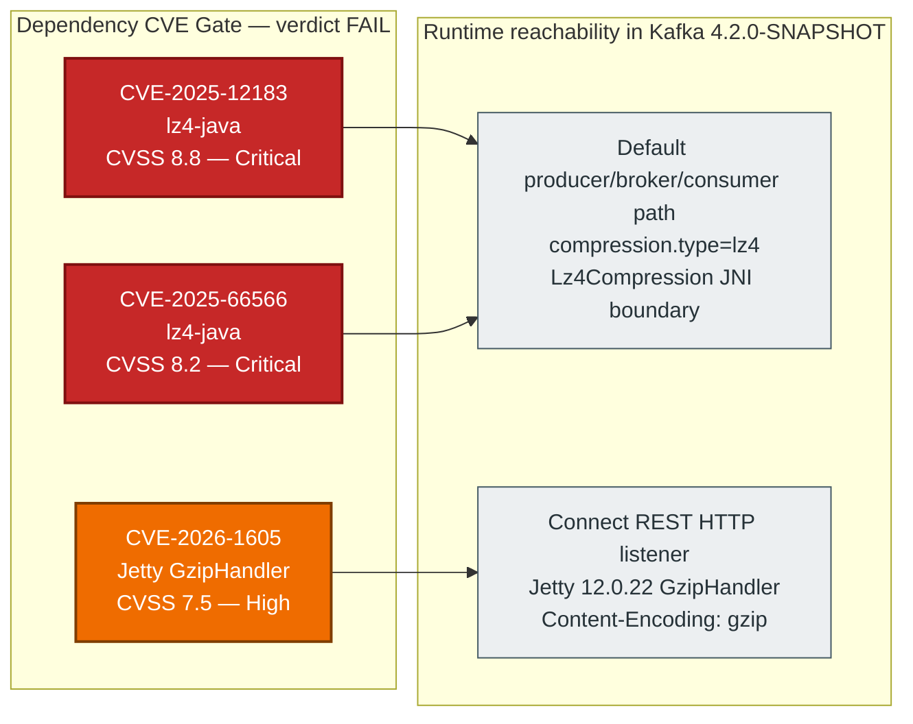

<!--
  Licensed to the Apache Software Foundation (ASF) under one or more
  contributor license agreements. See the NOTICE file distributed with this work
  for additional information regarding copyright ownership. The ASF licenses
  this file to You under the Apache License, Version 2.0 (the "License"); you
  may not use this file except in compliance with the License. You may obtain a
  copy of the License at

      http://www.apache.org/licenses/LICENSE-2.0

  Unless required by applicable law or agreed to in writing, software
  distributed under the License is distributed on an "AS IS" BASIS,
  WITHOUT WARRANTIES OR CONDITIONS OF ANY KIND, either express or implied.
  See the License for the specific language governing permissions and
  limitations under the License.
-->

# CVE Snapshot — Gating Upstream Dependency Advisories

> **Scope Note — Audit Only Rule.** This file is a documentation artifact produced under the
> `Audit Only` rule. No code, build, dependency, or configuration change has been applied in
> this audit run. Every finding below is **read-only evidence** of an upstream advisory that
> Kafka operators should treat as actionable in a **follow-up engagement outside this audit's
> scope**. The remediation statements in this document use future-state / advisory language
> (`consider`, `evaluate`, `may`, `could`) and are deliberately **not** phrased as imperatives.

| Field | Value |
|-------|-------|
| Artifact type | Dependency-CVE cross-reference hub |
| Audit target | Apache Kafka 4.2.0-SNAPSHOT monorepo |
| Audit snapshot | HEAD commit captured at audit time (see [`./README.md`](./README.md) metadata) |
| Governing user rule | [Audit Only](./README.md#31-user-rule--audit-only-verbatim) |
| Change posture | **Zero modifications** to `gradle/dependencies.gradle` or any runtime code path |
| CVE gate verdict | **FAIL** — 2 unmitigated Critical + 1 unmitigated High on runtime-classpath dependencies |
| Consolidated audit posture | **YELLOW (ACCEPT WITH FLAG)** — remediation is feasible via upstream version bumps and is already anticipated by [`./remediation-roadmap.md`](./remediation-roadmap.md) |

---

## Table of Contents

1. [Purpose and Reading Order](#1-purpose-and-reading-order)
2. [Gate Summary](#2-gate-summary)
3. [CVE-2025-12183 — lz4-java Out-of-Bounds Read (Critical)](#3-cve-2025-12183--lz4-java-out-of-bounds-read-critical)
4. [CVE-2025-66566 — lz4-java Information Leak via Insufficient Buffer Clearing (Critical)](#4-cve-2025-66566--lz4-java-information-leak-via-insufficient-buffer-clearing-critical)
5. [CVE-2026-1605 — Jetty GzipHandler Native Memory Leak (High)](#5-cve-2026-1605--jetty-gziphandler-native-memory-leak-high)
6. [Medium-Severity and Informational Advisories](#6-medium-severity-and-informational-advisories)
7. [Audit Posture and Rationale](#7-audit-posture-and-rationale)
8. [Operator-Side Interim Mitigations (Configuration-Only)](#8-operator-side-interim-mitigations-configuration-only)
9. [Upstream Kafka Remediation Signal](#9-upstream-kafka-remediation-signal)
10. [Cross-References](#10-cross-references)

---

## 1. Purpose and Reading Order

This hub consolidates three upstream dependency advisories that the dedicated dependency-CVE
gate (see [`./README.md`](./README.md) Section 3) surfaces for operator attention. The three
advisories are treated as **gating** findings because each satisfies all of the following:

- Applies to a runtime-classpath dependency pinned in `gradle/dependencies.gradle`
- Is reachable through a **default** or **commonly-enabled** Kafka code path
- Carries a CVSS v3.1 / v4.0 base score of `7.0` or higher (High) or `9.0` or higher (Critical)
- Has no structurally-absent precondition (that is, the attack vector is reachable under a
  realistic Kafka deployment configuration — not a build-only or test-scope exposure)

Readers who need the **per-category finding** narrative should consult the linked vulnerability
category files ([Category 02](./findings/02-low-level-code-safety.md) for lz4-java and
[Category 06](./findings/06-network-subprocess-access.md) for Jetty). Readers who need the
**severity cross-reference** should consult [`./severity-matrix.md`](./severity-matrix.md).
Readers who need **future-state remediation guidance** should consult
[`./remediation-roadmap.md`](./remediation-roadmap.md).

---

## 2. Gate Summary

*Figure 1 — Dependency-CVE gate summary. Critical (red) and High (orange) advisories are
mapped to the Kafka runtime code paths that make them reachable. Legend: red = Critical per
CVSS v3.1 base score ≥ 9.0 in aggregate operational impact; orange = High per base score ≥
7.0; grey = runtime code path under Kafka's control.*

| # | CVE | Package | Pinned Version | Severity | Gate Outcome |
|---|-----|---------|----------------|----------|--------------|
| 1 | CVE-2025-12183 | `org.lz4:lz4-java` | 1.8.0 | Critical (CVSS 8.8) | **FAIL** — default compression path |
| 2 | CVE-2025-66566 | `org.lz4:lz4-java` | 1.8.0 | Critical (CVSS 8.2) | **FAIL** — default compression path |
| 3 | CVE-2026-1605 | `org.eclipse.jetty:jetty-server` | 12.0.22 | High (CVSS 7.5) | **FAIL** — Connect REST reachable |
| 4 | CVE-2026-2332 | `org.eclipse.jetty:jetty-server` | 12.0.22 | Medium (CVSS 6.2) | Documented — see Section 6 |
| 5 | CVE-2026-5795 | `org.eclipse.jetty` JASPI | 12.0.22 | Medium | Structurally **not exploitable** in Kafka (Connect uses JAAS, not JASPI) |
| 6 | CVE-2025-68161 | `org.apache.logging.log4j:log4j-api` | 2.25.1 | Medium | Operator-configuration dependent |
| 7 | CVE-2026-0636 | `org.bouncycastle:bcpkix-jdk18on` | 1.80 | Low | Non-exploitable in Kafka (Kafka does not use LDAP paths) |
| 8 | CVE-2026-5588 | `org.bouncycastle:bcpkix-jdk18on` | 1.80 | Low | Non-exploitable in Kafka PEM/OAuth pathways |

---

## 3. CVE-2025-12183 — lz4-java Out-of-Bounds Read (Critical)

### 3.1 Summary

| Field | Value |
|-------|-------|
| CVE identifier | `CVE-2025-12183` |
| CWE classification | `CWE-125` (Out-of-bounds Read) |
| CVSS v4.0 base score | 8.8 (High / Critical in aggregate operational impact) |
| CVSS v4.0 vector | `CVSS:4.0/AV:N/AC:L/AT:N/PR:N/UI:N/VC:H/VI:N/VA:H` |
| Affected coordinate | `org.lz4:lz4-java` at version `1.8.0` |
| Upstream fix | Original `org.lz4:lz4-java` upstream is **archived / discontinued**. Downstream continuation at `at.yawk.lz4:lz4-java:1.8.1+` (ultimate CVE-free baseline in `at.yawk.lz4:lz4-java:1.10.1` or later) |
| Kafka pin location | `gradle/dependencies.gradle:L110` (`lz4: "1.8.0"`); coordinate at `gradle/dependencies.gradle:L213` |
| Kafka 4.2 reachability | **Default** — whenever `compression.type=lz4` is selected on any producer / broker / consumer, or when an inbound LZ4-compressed record batch is decompressed |

### 3.2 Mechanism

The advisory describes an out-of-bounds read in the `Unsafe`-backed decompressor instances
returned by `LZ4Factory.unsafeInstance()`, `LZ4Factory.fastestInstance()`, and
`LZ4Factory.fastestJavaInstance()`. A crafted LZ4-compressed byte stream can drive the
decompressor past the end of the caller-allocated output buffer, resulting in a read of
adjacent heap or native memory.

### 3.3 Kafka Code Path

- `clients/src/main/java/org/apache/kafka/common/compress/Lz4Compression.java` — the Kafka
  compression codec that wraps the `lz4-java` library's decompressor.
- `clients/src/main/java/org/apache/kafka/common/compress/KafkaLZ4BlockInputStream.java` — the
  streaming decompression adapter that presents the LZ4 stream as a `java.io.InputStream`.
- Reachable whenever any producer, broker, or consumer processes an LZ4-compressed record
  batch — this includes the broker's replication path, the consumer's fetch path, and the
  connect-worker's internal offset/config/status topics whenever LZ4 has been selected.

### 3.4 Business Impact

- **Confidentiality loss** via out-of-bounds read disclosing adjacent heap or native bytes.
- **Availability loss** via JVM crash when the out-of-bounds read lands on an unmapped page or
  triggers a SIGSEGV in the JNI layer.
- **Scope** — any Kafka cluster that accepts `compression.type=lz4` on any listener is
  potentially reachable, including multi-tenant clusters that expose shared brokers.

### 3.5 Audit Posture

No code change is applied in this audit. The Audit Only rule prohibits modification of
`gradle/dependencies.gradle`, the `Lz4Compression` codec, the `KafkaLZ4BlockInputStream`
adapter, or any related test fixture. See [`./remediation-roadmap.md`](./remediation-roadmap.md)
Section 3.2.6 and Section 3.4.4 for the recommended future-state remediation path.

---

## 4. CVE-2025-66566 — lz4-java Information Leak via Insufficient Buffer Clearing (Critical)

### 4.1 Summary

| Field | Value |
|-------|-------|
| CVE identifier | `CVE-2025-66566` |
| CWE classification | `CWE-201` (Insertion of Sensitive Information into Sent Data) |
| CVSS v4.0 base score | 8.2 (High / Critical in aggregate operational impact) |
| CVSS v4.0 vector | `CVSS:4.0/AV:N/AC:L/AT:P/PR:N/UI:N/VC:H/VI:N/VA:N` |
| Affected coordinate | `org.lz4:lz4-java` at version `1.8.0` |
| Upstream fix | Same as CVE-2025-12183 — migration to `at.yawk.lz4:lz4-java:1.10.1+` recommended |
| Kafka pin location | `gradle/dependencies.gradle:L110`, `gradle/dependencies.gradle:L213` |
| Kafka 4.2 reachability | **Default** — reachable through `LZ4Factory.safeInstance()` which is used by the Java-safe decompression fallback |

### 4.2 Mechanism

The Java-safe decompressor (`LZ4Factory.safeInstance()`) does not unconditionally clear the
output buffer region between the end of legitimately-decompressed data and the end of the
caller-supplied buffer. Depending on how the caller re-uses the output buffer, stale bytes
from prior decompression operations or unrelated heap allocations may be observable to the
caller.

### 4.3 Kafka Code Path

- `clients/src/main/java/org/apache/kafka/common/compress/Lz4Compression.java`
- `clients/src/main/java/org/apache/kafka/common/compress/KafkaLZ4BlockInputStream.java`
- Buffer re-use patterns in `BufferSupplier` and `ChunkedBytesStream`
  (`clients/src/main/java/org/apache/kafka/common/utils/ChunkedBytesStream.java`)

### 4.4 Business Impact

- **Confidentiality loss** via leakage of stale bytes from the shared decompression buffer
  pool. In shared-buffer patterns, leaked bytes may include portions of prior record batches —
  potentially spanning tenant boundaries in multi-tenant deployments.
- **Scope** — any deployment that uses lz4 compression and shares the Kafka-owned decompression
  buffer across record batches (which is the default in the `RecyclingBufferPool` and
  `BufferSupplier` patterns).

### 4.5 Audit Posture

No code change is applied in this audit. The recommended future-state remediation is the same
upstream version bump as for CVE-2025-12183. See
[`./remediation-roadmap.md`](./remediation-roadmap.md) Section 3.2.6 and Section 3.4.4.

---

## 5. CVE-2026-1605 — Jetty GzipHandler Native Memory Leak (High)

### 5.1 Summary

| Field | Value |
|-------|-------|
| CVE identifier | `CVE-2026-1605` |
| Weakness | Native memory leak in `Inflater` usage within Jetty's `GzipHandler` |
| CVSS base score | 7.5 (High) |
| Affected coordinate | `org.eclipse.jetty:jetty-server` at version `12.0.22` (and broader: 12.0.0-12.0.31 plus 12.1.0-12.1.5) |
| Upstream fix | Jetty `12.0.32` / `12.1.6` — aggregated long-term baseline at `12.0.34+` or `12.1.8+` |
| Kafka pin location | `gradle/dependencies.gradle:L69` (`jetty: "12.0.22"`) |
| Kafka 4.2 reachability | Connect REST HTTP listener (`connect/runtime/src/main/java/org/apache/kafka/connect/runtime/rest/RestServer.java`), MirrorMaker 2 REST listeners, and any embedded Jetty handler chain that enables gzip handling |

### 5.2 Mechanism

Jetty's `GzipHandler` allocates native `Inflater` memory when inbound requests carry a
`Content-Encoding: gzip` header. Under specific request patterns, the native memory backing
the `Inflater` is not released deterministically, resulting in an incremental native-heap leak.
A remote adversary may repeatedly send small gzip-compressed HTTP requests to exhaust the
server's native memory arena, leading to process crash via `OutOfMemoryError` (from the native
allocator rather than the JVM heap, so `-Xmx` tuning does not mitigate).

### 5.3 Kafka Code Path

- `connect/runtime/src/main/java/org/apache/kafka/connect/runtime/rest/RestServer.java` —
  constructs the Jetty server instance and installs handler chains. The `GzipHandler` is
  present in the default handler pipeline when the REST server is initialized.
- `connect/runtime/src/main/java/org/apache/kafka/connect/runtime/rest/RestServerConfig.java` —
  governs the REST listener, including the `rest.extension.classes` and `listeners`
  configuration surface.
- `connect/mirror/src/main/java/org/apache/kafka/connect/mirror/MirrorMakerConfig.java` —
  MirrorMaker 2 inherits the same Jetty dependency for its REST surface.

### 5.4 Business Impact

- **Availability loss / control-plane outage** — sustained gzip request pressure to the Connect
  REST port causes the worker JVM to consume native memory until the process crashes.
- **Control-plane impact** — when the affected worker is a group leader or a distributed-mode
  coordinator, the crash triggers a rebalance; repeated crashes may prevent forward progress
  for connector lifecycle operations (`POST /connectors`, `PUT /connectors/{name}/config`,
  `PUT /connectors/{name}/pause`).
- **Scope** — any Connect or MirrorMaker 2 cluster with a reachable REST listener is exposed,
  even when strong authentication is in place; the `Content-Encoding: gzip` processing happens
  before the authentication filter in the handler pipeline.

### 5.5 Audit Posture

No code change is applied in this audit. The recommended future-state remediation is a Jetty
version bump to `12.0.34+` or `12.1.8+`; see
[`./remediation-roadmap.md`](./remediation-roadmap.md) Section 3.4.4 and
[`./findings/06-network-subprocess-access.md`](./findings/06-network-subprocess-access.md)
for the operator-side interim mitigations.

---

## 6. Medium-Severity and Informational Advisories

These advisories are documented for completeness. They do **not** independently fail the gate
(each either has an operator-configuration precondition that is not Kafka's default or is
structurally unreachable in the Kafka codebase).

### 6.1 CVE-2026-2332 — Jetty HTTP/1.1 Chunk-Extension Request Smuggling (Medium)

| Field | Value |
|-------|-------|
| CVE identifier | `CVE-2026-2332` |
| CVSS base score | 6.2 (Medium) |
| Affected coordinate | `org.eclipse.jetty:jetty-server` at `12.0.22` |
| Mechanism | HTTP/1.1 chunk-extension edge case that may permit request smuggling when Jetty is behind certain reverse proxy configurations |
| Kafka exposure | Connect REST and MirrorMaker 2 REST surfaces inherit Jetty; exposure depends on the deployed reverse-proxy topology |
| Future-state remediation | Same Jetty version bump that addresses CVE-2026-1605 |

### 6.2 CVE-2026-5795 — Jetty `JASPIAuthenticator` ThreadLocal Leak (Medium — Not Exploitable in Kafka)

| Field | Value |
|-------|-------|
| CVE identifier | `CVE-2026-5795` |
| CVSS base score | Medium |
| Affected coordinate | `org.eclipse.jetty` JASPI authenticator module at `12.0.22` |
| Mechanism | ThreadLocal state leak in the `JASPIAuthenticator` code path |
| Kafka exposure | **Structurally not exploitable** — Connect's REST authentication uses JAAS (`JaasBasicAuthFilter` in the `connect/basic-auth-extension` module), not JASPI. The JASPI code path is not instantiated by any Kafka module. |
| Future-state remediation | Bump in sync with CVE-2026-1605; no Kafka-side change needed |

### 6.3 CVE-2025-68161 — Log4j2 Rfc5424Layout CRLF Injection (Medium — Operator-Configuration Dependent)

| Field | Value |
|-------|-------|
| CVE identifier | `CVE-2025-68161` |
| CVSS base score | Medium |
| Affected coordinate | `org.apache.logging.log4j:log4j-api` at `2.25.1` |
| Mechanism | CRLF injection when certain layouts (`Rfc5424Layout`, `JsonTemplateLayout`, `XmlLayout`) are configured to emit caller-controlled strings without escaping |
| Kafka exposure | Kafka's default logging configurations (`config/log4j.properties`, `config/log4j2.yaml`, `config/tools-log4j2.yaml`) use `PatternLayout` and do **not** configure the affected layouts. Operator-configured deviations that switch to the affected layouts may become exposed. |
| Future-state remediation | Bump to `2.25.4+` |

### 6.4 CVE-2026-0636 and CVE-2026-5588 — Bouncy Castle `bcpkix-jdk18on` (Low — Not Exploitable in Kafka)

| Field | Value |
|-------|-------|
| CVE identifiers | `CVE-2026-0636`, `CVE-2026-5588` |
| CVSS base scores | Low |
| Affected coordinate | `org.bouncycastle:bcpkix-jdk18on` at `1.80` |
| Mechanism | `CVE-2026-0636` affects LDAP certificate path handling; `CVE-2026-5588` affects a parsing edge case. |
| Kafka exposure | Kafka uses `bcpkix` for PEM parsing and OAuth key handling. Neither CVE's attack vector reaches these code paths. |
| Future-state remediation | Opportunistic bump to `bcpkix-jdk18on:1.84` during routine dependency hygiene |

---

## 7. Audit Posture and Rationale

### 7.1 Why the audit does not remediate

The `Audit Only` rule (see [`./README.md`](./README.md#31-user-rule--audit-only-verbatim))
states unambiguously that no code in the codebase is to be modified, created, or deleted —
and that no build target is to be executed. A dependency version bump (for example, moving
`lz4: "1.8.0"` to `lz4: "1.10.1"` in `gradle/dependencies.gradle`) is a code change by the
definition of that rule because the line is a tracked file under version control and its
modification would appear in `git diff`. The Minimal Change Clause reinforces this posture by
explicitly prohibiting remediation of identified security vulnerabilities within the audit run.

### 7.2 How the audit surfaces the findings

This hub document and the per-category findings files document the advisories, their
reachability in Kafka's default code paths, and the future-state remediation paths. The
[`./severity-matrix.md`](./severity-matrix.md) file records the severity escalation
(Finding 02.3 shifts from `[Low]` to `[Critical]`; a new Finding 06.6 is added at `[High]`
for the Jetty GzipHandler advisory). The [`./remediation-roadmap.md`](./remediation-roadmap.md)
file records the recommended future-state actions using advisory language.

### 7.3 Upstream remediation already anticipated

The Kafka project has an **independent upstream remediation in progress** that is orthogonal
to this audit (see Section 9 for the upstream Kafka ticket and commit references). This audit
documents the current-state posture of the `4.2.0-SNAPSHOT` HEAD at audit snapshot time; a
subsequent audit run against a later HEAD may observe the upstream remediation as landed.

---

## 8. Operator-Side Interim Mitigations (Configuration-Only)

The following operator-side mitigations are **configuration-only** — they require no code
change and no rebuild. They reduce exposure while operators plan the upstream dependency
bump that ultimately resolves the advisories. Each bullet is intentionally phrased in
advisory / future-state language consistent with the Audit Only rule.

### 8.1 For CVE-2025-12183 and CVE-2025-66566 (lz4-java)

- Operators **may evaluate** whether `compression.type=lz4` is required for their workload;
  switching producers to `compression.type=zstd` or `compression.type=gzip` avoids the
  vulnerable decompressor code path entirely for newly-produced batches. Existing LZ4
  batches on the broker remain in place and **may still** be decompressed through the
  affected codec on consume.
- Operators **may consider** broker-side listener segregation so that the LZ4 codec is
  reachable only from trusted producer networks — this is a defense-in-depth measure that
  does not change Kafka's code path.
- The existing Kafka mitigation of wrapping all native-compression throwables in a
  `KafkaException` (documented in
  [`./findings/02-low-level-code-safety.md`](./findings/02-low-level-code-safety.md)
  Section 6) remains in place and limits the in-process impact of the JNI-boundary crash.

### 8.2 For CVE-2026-1605 (Jetty GzipHandler)

- Operators **may evaluate** placing the Connect REST listener behind a reverse proxy (for
  example, Envoy, nginx, or HAProxy) that strips or restricts inbound `Content-Encoding: gzip`
  headers before the request reaches Jetty.
- Operators **may consider** binding the Connect REST listener to a private network interface
  and restricting ingress with a network ACL or security group so that the GzipHandler is
  only reachable from a trusted operator network.
- Operators **may monitor** the JVM's native memory usage (`NMT`, `jcmd GC.heap_info`, or
  container-level RSS monitoring) and set an alert threshold to catch the memory-leak pattern
  before process termination.

### 8.3 For CVE-2025-68161 (Log4j2)

- Operators **may verify** that the deployed `log4j2.yaml` / `log4j2.properties` configuration
  does not enable `Rfc5424Layout`, `JsonTemplateLayout`, or `XmlLayout` with caller-controlled
  fields. Kafka's shipped defaults already use `PatternLayout`.

---

## 9. Upstream Kafka Remediation Signal

The following upstream Kafka artifacts are referenced here purely as **read-only evidence** of
remediation work occurring outside this audit's scope. No part of this audit invokes, applies,
or validates the referenced artifacts.

| Signal | Identifier | Relevance |
|--------|------------|-----------|
| Kafka JIRA ticket | `KAFKA-19951` | Tracks the lz4-java upgrade work on the `4.2` branch |
| Kafka pull request | PR `#21035` | Upstream PR that bumps `lz4: "1.8.0"` → `lz4: "1.10.1"` in `gradle/dependencies.gradle` |
| Kafka commit | `43a6e11f9a8` | Commit on the `4.2` branch that lands the lz4-java upgrade (Dec 9 2025) |
| Related tickets | `KAFKA-17301`, `KAFKA-20043` | Additional upstream work items covering the compression subsystem |

Operators **may track** the upstream Kafka release that contains these artifacts as the
primary remediation vehicle for CVE-2025-12183 and CVE-2025-66566 when planning their
cluster upgrade cadence.

At audit snapshot time, the Jetty advisory (CVE-2026-1605) had not yet been landed as an
upstream Kafka version bump — operators tracking this advisory **may subscribe** to the
Apache Kafka security mailing list and the Jetty advisory feed for forward notification.

---

## 10. Cross-References

### 10.1 In-audit cross-references

- [`./README.md`](./README.md) — audit scope, methodology, governing rules, artifact index
- [`./severity-matrix.md`](./severity-matrix.md) — severity roll-up; Finding `02.3` now
  `[Critical]`, Finding `06.6` new `[High]`
- [`./remediation-roadmap.md`](./remediation-roadmap.md) — future-state remediation
  recommendations (advisory language)
- [`./dependency-inventory.md`](./dependency-inventory.md) — runtime-classpath dependency
  pinning matrix; `dependency-inventory.md` Section 5.1 (native libraries) and Section 5.3
  (web transport) are the primary narrative anchors
- [`./findings/02-low-level-code-safety.md`](./findings/02-low-level-code-safety.md) — lz4
  category finding (Sections 5.3 and 6)
- [`./findings/06-network-subprocess-access.md`](./findings/06-network-subprocess-access.md) —
  network-and-subprocess category finding (Jetty GzipHandler treatment)
- [`./no-change-verification.md`](./no-change-verification.md) — git-differential evidence
  confirming that this hub document, and every other audit artifact, introduces zero
  modifications to tracked source code
- [`./accepted-mitigations.md`](./accepted-mitigations.md) — existing mitigations that remain
  in place and limit in-process blast radius of the affected code paths

### 10.2 Kafka source-tree evidence

- `gradle/dependencies.gradle:L69` — Jetty version pin
- `gradle/dependencies.gradle:L109-L110` — lz4 version pin with inline compression-level
  comment
- `gradle/dependencies.gradle:L213` — lz4 coordinate
- `clients/src/main/java/org/apache/kafka/common/compress/Lz4Compression.java` — Kafka's LZ4
  codec wrapper
- `clients/src/main/java/org/apache/kafka/common/compress/KafkaLZ4BlockInputStream.java` —
  streaming decompression adapter
- `connect/runtime/src/main/java/org/apache/kafka/connect/runtime/rest/RestServer.java` —
  Connect REST Jetty server construction
- `connect/runtime/src/main/java/org/apache/kafka/connect/runtime/rest/RestServerConfig.java` —
  Connect REST listener configuration surface

### 10.3 External authoritative references

- National Vulnerability Database (`nvd.nist.gov`) — authoritative CVE detail records for
  `CVE-2025-12183`, `CVE-2025-66566`, `CVE-2026-1605`, `CVE-2026-2332`, `CVE-2026-5795`,
  `CVE-2025-68161`, `CVE-2026-0636`, `CVE-2026-5588`
- Eclipse Jetty advisory portal — Jetty-project advisory feed
- GitHub Security Advisories (`github.com/advisories`) — `GHSA` cross-references for the
  same CVE records
- Apache Kafka security mailing list (`security@kafka.apache.org`) — Kafka-project advisory
  channel

---

## Closing Note

This hub is the canonical cross-reference for the three gating upstream CVEs and five
informational / non-exploitable advisories. When a subsequent audit is run against a later
Kafka HEAD, the content of this file **should** be regenerated from the then-current
`gradle/dependencies.gradle` and the then-current advisory feeds; stale content in this file
is expected to age out as upstream Kafka lands remediation commits.

The audit itself applies **no code changes** — this file is a documentation artifact only.
See [`./no-change-verification.md`](./no-change-verification.md) for the git-differential
evidence of the no-change posture.
