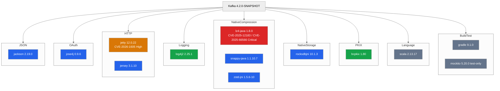

<!--
  Licensed to the Apache Software Foundation (ASF) under one
  or more contributor license agreements.  See the NOTICE file
  distributed with this work for additional information
  regarding copyright ownership.  The ASF licenses this file
  to you under the Apache License, Version 2.0 (the
  "License"); you may not use this file except in compliance
  with the License.  You may obtain a copy of the License at

    http://www.apache.org/licenses/LICENSE-2.0

  Unless required by applicable law or agreed to in writing,
  software distributed under the License is distributed on an
  "AS IS" BASIS, WITHOUT WARRANTIES OR CONDITIONS OF ANY
  KIND, either express or implied.  See the License for the
  specific language governing permissions and limitations
  under the License.
-->

# Dependency Inventory - Supply-Chain Surface

This document enumerates dependencies declared in `gradle/dependencies.gradle` at the audit
snapshot (Apache Kafka 4.2.0-SNAPSHOT). It is a READ-ONLY citation-only inventory. The audit
makes NO modifications to the dependency manifest, no upgrades, and no pinning changes.

For security-relevant posture of each dependency and findings cross-reference, see the table in
section 3. Findings that reference a dependency are cross-linked in the rightmost column.

---

## Table of Contents

1. [Document Banner](#dependency-inventory---supply-chain-surface) - the opening banner above
2. [Verified Source](#2-verified-source)
3. [Runtime Dependency Inventory](#3-runtime-dependency-inventory)
4. [Dependencies Not Listed Above (Intentional Scope)](#4-dependencies-not-listed-above-intentional-scope)
5. [Supply-Chain Attack Surface Narrative](#5-supply-chain-attack-surface-narrative)
6. [Already-Configured Supply-Chain Tooling](#6-already-configured-supply-chain-tooling)
7. [Supply-Chain Review Cadence (Recommended, Future-State)](#7-supply-chain-review-cadence-recommended-future-state)
8. [Version Pinning Verification Checklist](#8-version-pinning-verification-checklist)
9. [Closing Note](#9-closing-note)

---

## 2. Verified Source

Every version listed in the inventory table (section 3) is read directly from
`gradle/dependencies.gradle` in the Apache Kafka repository. No version string is paraphrased,
rounded, or substituted. The table below records the specific line numbers observed during
reconnaissance so that a reviewer can open the manifest and confirm each value one-to-one
against a `git show HEAD:gradle/dependencies.gradle` listing.

Citation format used throughout this document: `Source: gradle/dependencies.gradle:L<line>`.

### 2.1 Version Declaration Lines

The first block of the manifest (the `versions += [...]` map beginning at line 51) defines
version identifiers. The second block (the `libs += [...]` map beginning at line 137) binds
those identifiers to Maven/Gradle coordinates. Both blocks are cited below.

| Line | Literal Statement (verbatim from manifest) | Notes |
| ---- | ------------------------------------------ | ----- |
|  26  | `def defaultScala213Version = '2.13.17'`   | Scala 2.13 default declared at file scope; line 29 later reads this value into `versions["scala"]`. The literal `'2.13.17'` appears only at line 26. |
|  56  | `bcpkix: "1.80",`                          | Bouncy Castle PKIX (bcpkix-jdk18on) version identifier. |
|  63  | `gradle: "9.1.0",`                         | Gradle build-tool version identifier. Build-time only; not a runtime dependency. |
|  66  | `jackson: "2.19.0",`                       | Jackson JSON library version identifier; binds every `jackson*` artifact. |
|  69  | `jetty: "12.0.22",`                        | Eclipse Jetty server/client/servlet family version identifier. |
|  70  | `jersey: "3.1.10",`                        | Glassfish Jersey JAX-RS implementation version identifier. |
|  81  | `jose4j: "0.9.6",`                         | Bitbucket jose4j JWT/JOSE library version identifier. |
| 108  | `log4j2: "2.25.1",`                        | Apache Log4j2 logging family version identifier; binds `log4j-api`, `log4j-core`, `log4j-slf4j-impl`, `log4j-1.2-api`. |
| 110  | `lz4: "1.8.0",`                            | lz4-java native compression version identifier. Immediately preceded by the inline comment on line 109 noting that compression levels in `CompressionType` must remain valid on any future change. |
| 113  | `mockito: "5.20.0",`                       | Mockito mocking framework version identifier. Test-scope only. |
| 118  | `rocksDB: "10.1.3",`                       | RocksDB JNI state-store version identifier. |
| 125  | `snappy: "1.1.10.7",`                      | snappy-java native compression version identifier. |
| 131  | `zstd: "1.5.6-10",`                        | zstd-jni native compression version identifier. Immediately preceded by the inline comment on lines 129-130 noting that updates must also update `docker/native/native-image-configs/resource-config.json` and `CompressionType` compression levels. |

### 2.2 Library Coordinate Lines

The `libs += [...]` map resolves each version identifier to a Maven coordinate:

| Line | Literal Statement (verbatim from manifest)                                         | Notes |
| ---- | ---------------------------------------------------------------------------------- | ----- |
| 149  | `bcpkix: "org.bouncycastle:bcpkix-jdk18on:$versions.bcpkix",`                      | Resolves the bcpkix version to the jdk18on distribution. |
| 179  | `jose4j: "org.bitbucket.b_c:jose4j:$versions.jose4j",`                             | Resolves jose4j to its Bitbucket-hosted group id. |
| 213  | `lz4: "org.lz4:lz4-java:$versions.lz4",`                                           | Resolves lz4 to the lz4-java artifact. |
| 227  | `snappy: "org.xerial.snappy:snappy-java:$versions.snappy",`                        | Resolves snappy to the snappy-java artifact. |
| 233  | `zstd: "com.github.luben:zstd-jni:$versions.zstd",`                                | Resolves zstd to the zstd-jni artifact. |

Additional coordinate lines referenced in the inventory table of section 3 (for Jackson family,
Jetty family, Jersey family, Log4j2 family, RocksDB JNI, Scala, and Mockito) are located on
lines 155-161 (Jackson family), 168-171 (Jetty family), 172-173 (Jersey family), 210-212
(Log4j2 family), 221 (rocksdbjni), 222-224 (Scala library/logging/reflect), and 215-216
(Mockito family) in the same `libs += [...]` block. Each coordinate line was inspected during
reconnaissance (see `references.md`).

### 2.3 Corroborating Manifests

Three additional read-only citation points reinforce the versions above:

- `LICENSE-binary` enumerates the shipped artifact set per release, including
  `jackson-*-2.19.0`, `jetty-*-12.0.22`, `jersey-*-3.1.10`, `jose4j-0.9.6`,
  `log4j-*-2.25.1`, `lz4-java-1.8.0`, `rocksdbjni-10.1.3`, `scala-library-2.13.17`,
  `scala-reflect-2.13.17`, `snappy-java-1.1.10.7`, and `zstd-jni-1.5.6-10`. This file is a
  secondary citation; the authoritative source remains `gradle/dependencies.gradle`.
- `NOTICE-binary` records per-dependency copyright and license attribution for the same
  artifact set.
- Version-pinning comments embedded in `gradle/dependencies.gradle` at lines 49-50, 109,
  119-121, and 129-130 document ancillary constraints (LICENSE-binary upkeep,
  compression-level validation, scalafmt alignment, native-image configuration alignment).

---

## 3. Runtime Dependency Inventory

The diagram below, titled **Dependency Categorization - Security-Audit Relevance**, groups
the runtime-affecting dependencies of Apache Kafka 4.2.0-SNAPSHOT by functional category and
labels each with its audit-relevant severity color. The diagram is a purely visual aid; the
authoritative data is the table that follows.

**Legend**:

- **Red** (`#DC2626`, `classDef critical`): Critical supply-chain surface. At the current
  audit snapshot, `lz4-java 1.8.0` is colored red because it is affected by two Critical-
  severity advisories (`CVE-2025-12183` CVSS 8.8 out-of-bounds read and `CVE-2025-66566`
  CVSS 8.2 information leak) that reach Kafka through the default `compression.type=lz4`
  code path. See [`./cve-snapshot.md`](./cve-snapshot.md) for the consolidated CVE detail
  and [`./findings/02-low-level-code-safety.md`](./findings/02-low-level-code-safety.md)
  for the Kafka-internal evidence citations.
- **Orange** (`#D97706`, `classDef high`): High - actively-deserialized JVM surface with
  documented historical CVE exposure. At the current audit snapshot, `jetty-server 12.0.22`
  is colored orange because it is affected by `CVE-2026-1605` (CVSS 7.5) — a native-memory
  leak in the `GzipHandler` path reachable through Connect REST and MirrorMaker 2 REST.
  Jackson is **not** colored orange because the Kafka-specific deserialization surface
  (feature flags `ALLOW_LEADING_ZEROS_FOR_NUMBERS`, `ACCEPT_SINGLE_VALUE_AS_ARRAY`,
  `ALLOW_COMMENTS`) is documented in Finding 08, not as a generic blanket-orange
  classification of the library.
- **Blue** (`#2563EB`, `classDef medium`): Medium - runtime-active surface with direct
  security relevance. Jackson, jose4j, Jersey, the remaining native compression libraries
  (snappy-java, zstd-jni), and RocksDB JNI all fall here because vulnerabilities in those
  libraries transfer directly to the Kafka runtime trust surface.
- **Green** (`#16A34A`, `classDef low`): Low - supporting role with indirect or limited
  security relevance. Log4j2 (logging facade - well past the Log4Shell remediation line) and
  bcpkix (PKIX parsing in OAuth/PEM and test scopes) sit here.
- **Grey** (`#64748B`, `classDef note`): Non-runtime or informational. Scala standard library
  is categorized grey because it is a language runtime - not a feature-gated dependency that
  can be "swapped out" - and Gradle plus Mockito are build-time and test-time only. The grey
  classification does not mean "no audit relevance"; it means "audit relevance through a
  different lens than a typical runtime library CVE."

The diagram is referenced by name from `findings/02-low-level-code-safety.md` (native
compression / RocksDB JNI), `findings/04-module-system-builtin-abuse.md` (PKIX / bcpkix /
Jackson via service loading), `findings/06-network-subprocess-access.md` (Jetty / Jersey /
Scala core), `findings/07-external-function-callback-misuse.md` (jose4j), `findings/08-deserialization-attacks.md`
(Jackson / jose4j), and `findings/09-information-leakage.md` (Log4j2). The section-by-section
mapping appears in the rightmost column of the inventory table below.

### 3.1 Dependency Inventory Table

| #  | Dependency                                              | Version                       | Coordinate                                                     | Kafka Role                                                                                          | Security Relevance                         | Findings Referenced                    | CVE Snapshot (as of audit date)                                                                           |
| -- | ------------------------------------------------------- | ----------------------------- | -------------------------------------------------------------- | --------------------------------------------------------------------------------------------------- | ------------------------------------------ | -------------------------------------- | --------------------------------------------------------------------------------------------------------- |
| 1  | Jackson (databind / core / annotations / dataformats)   | 2.19.0                        | `com.fasterxml.jackson.*` (group ids `com.fasterxml.jackson.core`, `com.fasterxml.jackson.dataformat`, `com.fasterxml.jackson.datatype`, `com.fasterxml.jackson.module`, `com.fasterxml.jackson.jakarta.rs`) | JSON (de)serialization in Connect JSON converter, Trogdor, REST responses, and structured logging  | Deserialization surface                    | Finding 08                             | None open at 2.19.0                                                                                        |
| 2  | Jose4j                                                  | 0.9.6                         | `org.bitbucket.b_c:jose4j`                                     | JWT parsing and signature verification in `BrokerJwtValidator`; enforces `DISALLOW_NONE`            | Crypto + JWT verification                  | Finding 07, 08, 10                     | None open at 0.9.6                                                                                         |
| 3  | Jetty Server (ee10-servlet / servlets)                  | 12.0.22                       | `org.eclipse.jetty:jetty-server` (and `org.eclipse.jetty.ee10:jetty-ee10-servlet`, `jetty-ee10-servlets`, `org.eclipse.jetty:jetty-client`) | HTTP transport for Connect REST and MirrorMaker REST                                                 | TLS, CORS, client auth; GzipHandler native memory | Finding 06                      | **CVE-2026-1605 (CVSS 7.5 High) GzipHandler native memory leak**; CVE-2026-2332 Medium (HTTP/1.1 chunk-ext); CVE-2026-5795 informational (not reachable in Kafka). See `./cve-snapshot.md` §5, §6.1, §6.2 |
| 4  | Jersey (containers-servlet / hk2)                       | 3.1.10                        | `org.glassfish.jersey.containers:jersey-container-servlet` (and `org.glassfish.jersey.inject:jersey-hk2`) | JAX-RS implementation for Connect REST                                                              | Request binding, param parsing             | Finding 06                             | None open at 3.1.10                                                                                        |
| 5  | Log4j2                                                  | 2.25.1                        | `org.apache.logging.log4j:log4j-api` and `log4j-1.2-api`       | Logging facade and bridge                                                                           | Log injection / redaction                  | Finding 09                             | CVE-2025-68161 Medium (Rfc5424Layout CRLF) - non-default layouts only; Kafka default `PatternLayout` is unaffected. See `./cve-snapshot.md` §6.3 |
| 6  | LZ4-java                                                | 1.8.0                         | `org.lz4:lz4-java`                                             | Native LZ4 compression                                                                              | Native JNI surface; default compression path | Finding 02                           | **CVE-2025-12183 (CVSS 8.8 Critical) OOB read** + **CVE-2025-66566 (CVSS 8.2 Critical) information leak**; original `org.lz4:lz4-java` upstream archived - fix tracked by maintained fork `at.yawk.lz4:lz4-java:1.10.1`. See `./cve-snapshot.md` §3, §4 |
| 7  | RocksDB (rocksdbjni)                                    | 10.1.3                        | `org.rocksdb:rocksdbjni`                                       | State-store for Kafka Streams                                                                       | Native JNI surface                         | Finding 02                             | None open at 10.1.3                                                                                        |
| 8  | snappy-java                                             | 1.1.10.7                      | `org.xerial.snappy:snappy-java`                                | Native Snappy compression                                                                           | Native JNI surface                         | Finding 02                             | None open at 1.1.10.7                                                                                      |
| 9  | zstd-jni                                                | 1.5.6-10                      | `com.github.luben:zstd-jni`                                    | Native Zstandard compression; integrates with Kafka `BufferSupplier` and 16 KB bounded chunk        | Native JNI surface; buffer ownership       | Finding 02, Accepted Mitigation #6     | None open at 1.5.6-10                                                                                      |
| 10 | Bouncy Castle bcpkix                                    | 1.80                          | `org.bouncycastle:bcpkix-jdk18on`                              | PKIX parsing in OAuth/PEM pathways and test scopes                                                  | Crypto parsing                             | Finding 04                             | CVE-2026-0636 Low (LDAP path - not used by Kafka); CVE-2026-5588 Low (not reachable in Kafka PEM/OAuth pathways). See `./cve-snapshot.md` §6.4 |
| 11 | Scala stdlib                                            | 2.13.17 (defaultScala213Version) | `org.scala-lang:scala-library` and `org.scala-lang:scala-reflect` | Broker / core language runtime                                                                      | Language semantics                         | Finding 03, 06                         | None open at 2.13.17                                                                                       |
| 12 | Gradle                                                  | 9.1.0                         | Build system                                                    | Build orchestration                                                                                 | Build-time only                            | N/A (build reference)                  | Advisories exist (GHSA-w78c-w6vf-rw82, CVE-2026-22865) but require multi-repo preconditions absent from Kafka (`mavenCentral()` only per `build.gradle:20-22`) |
| 13 | Mockito                                                 | 5.20.0                        | `org.mockito:mockito-core`, `org.mockito:mockito-junit-jupiter` | Test mocks                                                                                          | Test-scope only                            | N/A (not runtime)                      | N/A (test + benchmark scope only; excluded from publishing per `build.gradle:322`)                          |

Column definitions:

- **#**: Row ordinal. 13 rows total; no row is omitted.
- **Dependency**: Human-readable family name.
- **Version**: Exact version string read from `gradle/dependencies.gradle`. No "latest", no
  wildcard, no range.
- **Coordinate**: Maven/Gradle coordinate string resolved from the manifest's `libs += [...]`
  block. Where multiple artifacts share a version identifier, the representative primary
  coordinate is shown and additional coordinates are listed inline.
- **Kafka Role**: One-line description of how the dependency is used inside Apache Kafka.
- **Security Relevance**: Summary of the attack surface this dependency contributes to,
  paired to the classification color in the Mermaid legend above.
- **Findings Referenced**: Links to the ten findings documents under `./findings/`. "N/A"
  indicates a build-only or test-scope dependency that is intentionally not covered by a
  runtime finding. Where a dependency is called out in an accepted-mitigation entry (for
  example zstd-jni buffer ownership), the mitigation number is cited alongside the finding.
- **CVE Snapshot (as of audit date)**: Condensed view of upstream CVE advisories discovered
  for the pinned version during Final Checkpoint #4 dependency scanning. "None open" means
  no public CVE is listed against that pinned version at audit time. Per the Audit Only
  rule, this column reports state only - no version bump, filter, or configuration change
  is applied. Full evidence, CVSS v3.1 / v4.0 vectors, upstream-fix versions, and operator
  interim-mitigation guidance live in the adjacent document `./cve-snapshot.md`.
  "See `./cve-snapshot.md` §N" citations point into that hub document's section numbers.

---

## 4. Dependencies Not Listed Above (Intentional Scope)

The audit inventory intentionally focuses on **security-relevant runtime dependencies** -
libraries whose vulnerabilities have a direct, measurable effect on the trust boundaries of a
running Kafka broker, controller, Connect worker, or Streams application. The full Kafka
dependency graph is much larger and includes, among others, the following which are outside
the scope of this inventory:

- **SLF4J** (`org.slf4j:slf4j-api`, version identifier `slf4j: "1.7.36"` at line 124 of the
  manifest) - a facade consumed via Log4j2 bridging; its audit-relevant behavior is captured
  through the Log4j2 entry (row 5) in the inventory table.
- **PCollections** (`org.pcollections:pcollections`, version identifier `pcollections: "4.0.2"`
  at line 116) - immutable collection library used by KRaft metadata structures; no direct
  attack surface is attributed in the ten-category taxonomy.
- **Caffeine** (`com.github.ben-manes.caffeine:caffeine`, version identifier
  `caffeine: "3.2.0"` at line 57) - in-memory cache; invoked through Kafka's metadata layer.
- **RE2J** (`com.google.re2j:re2j`, version identifier `re2j: "1.8"` at line 117) - used as
  an alternative regex engine in specific paths; relevant to the ReDoS analysis in
  Finding 05, but the ten enumerated `Pattern.compile` call sites in that finding use
  `java.util.regex.Pattern` (the JDK's backtracking engine), so RE2J does not appear in the
  regex hot-spot inventory.
- **JOpt Simple** (`net.sf.jopt-simple:jopt-simple`, version identifier `jopt: "5.0.4"` at
  line 80) - command-line option parser used by Kafka CLI tools.
- **HdrHistogram**, **Hash4j**, **Commons-Lang**, **Commons-Validator**, and other utility
  libraries declared in the manifest.
- **Apache Directory / ApacheDS** (`apacheda`, `apacheds`, lines 53-54) - used in test
  scopes for Kerberos/SASL test harnesses; out of scope as a runtime posture.
- **Test-only** dependencies: JUnit (`junit`, line 82), JQwik (`jqwik`, line 83), Hamcrest
  (`hamcrest`, line 73), Mock OAuth 2 Server (`mockOAuth2Server`, line 127), JMH benchmark
  harness (`jmh`, line 72), Scoverage (`scoverage`, line 123), ScalaFmt (`scalafmt`,
  line 122), Zinc incremental compiler (`zinc`, line 128), SpotBugs (`spotbugs`, line 126),
  Checkstyle (`checkstyle`, line 59), JaCoCo (`jacoco`, line 67), and Grgit (`grgit`,
  line 64). These surfaces are cited by row 13 (Mockito) for general test-scope acknowledgement;
  each individual library's audit posture is covered through transitive analysis in Finding 04
  (module system) or remains out of scope for a runtime audit.
- **Historical cross-version Kafka clients** (`kafka_0110` through `kafka_41`, lines 84-107)
  - these are pinned versions of previous Kafka releases used in streams upgrade tests.
  They are not runtime dependencies of Kafka itself and are therefore not in scope for a
  runtime security audit.
- **Jakarta / JAXB / JAX-RS API JARs**, **Javassist**, **JLine**, **JFreeChart**,
  **Activation**, and other indirect dependencies.

A complete dependency tree can be produced by a reviewer via
`./gradlew :clients:dependencies`, `./gradlew :core:dependencies`, or equivalent Gradle task
per module. That command is **NOT** executed by this audit (per the Audit-Only rule's
"Avoid executing any code in the code base" clause). A reviewer who wishes to produce a
comprehensive tree must do so outside the audit workflow. This inventory remains intentionally
focused on runtime-affecting dependencies that have a documented attack-surface mapping to
one of the ten vulnerability categories.

---

## 5. Supply-Chain Attack Surface Narrative

This section describes the shape of Kafka's supply-chain exposure. No upgrade, pinning, or
swap is proposed - per the Audit-Only rule. The narrative below exists so that future
remediation work (tracked in `remediation-roadmap.md`) can be scoped intelligently.

### 5.1 Native Libraries (zstd-jni, snappy-java, lz4-java, rocksdbjni)

Each of the four native dependencies ships a platform-specific JNI payload - `.so` on Linux,
`.dylib` on macOS, `.dll` on Windows - per target OS and architecture combination.
Vulnerabilities in the native layer are **not** caught by JVM-bytecode static analysis and
are not surfaced by Java-only dependency scanners that inspect class files. They require
dedicated native-code CVE monitoring at the upstream project level.

Kafka partially mitigates the zstd-jni surface with Kafka-owned buffer ownership - `BufferSupplier`
combined with `ChunkedBytesStream` and a 16 KB bounded decompression chunk (documented as
Accepted Mitigation #6 in `accepted-mitigations.md` and as Finding 02 evidence). The other
three native libraries (snappy-java, lz4-java, rocksdbjni) do not have an equivalent Kafka-side
wrapper for buffer ownership; they rely on upstream correctness.

**CVE posture observation (Final Checkpoint #4)**: Upstream CVE scanning of the pinned
versions identified two open advisories against **lz4-java 1.8.0**:
- **CVE-2025-12183** (CVSS 8.8 Critical, CWE-125 Out-of-bounds Read) affecting
  `LZ4Factory.unsafeInstance()` / `.fastestInstance()` / `.fastestJavaInstance()` code paths
  that Kafka's `Lz4Compression` (clients module) invokes by default when a producer or broker
  uses `compression.type=lz4`.
- **CVE-2025-66566** (CVSS 8.2 Critical, CWE-201 Information Leak) affecting `safeInstance()`
  via insufficient output-buffer clearing.

The original `org.lz4:lz4-java` artifact coordinate (pinned at `gradle/dependencies.gradle:L110`
with coordinate expansion at L213) is archived upstream; continued maintenance has moved to the
community fork `at.yawk.lz4:lz4-java` with the CVEs remediated in 1.10.1. This condition also
intersects with the Kafka-side patch tracked by KAFKA-19951 (PR #21035, merged to the 4.2
branch as commit `43a6e11f9a8` on December 9 2025), which introduces defensive decompression
handling; see `./cve-snapshot.md` §9 for the upstream-signal mapping.

Per the Audit-Only rule no version bump or coordinate change is applied in this run. The
complete CVE detail with CVSS vectors, mechanism descriptions, Kafka code-path citations,
and operator interim mitigations lives in `./cve-snapshot.md` §3 (CVE-2025-12183) and §4
(CVE-2025-66566). Finding 02 (`./findings/02-low-level-code-safety.md`) carries the Kafka
code-path evidence.

Operator action recommended (future-state, not applied now): subscribe to the CVE feeds of
each upstream project and maintain a quarterly review cadence against the native-image-configs
in `docker/native/native-image-configs/` which are coupled to the zstd version per the inline
comment at `gradle/dependencies.gradle:L129-130`. For lz4-java specifically, the feed of
interest is the maintained fork `at.yawk.lz4:lz4-java` rather than the archived
`org.lz4:lz4-java` coordinate.

### 5.2 OAuth and JWT (jose4j)

`BrokerJwtValidator` is implemented on top of jose4j and depends on jose4j's algorithm
constraint enforcement. Specifically, Kafka's broker-side JWT validator installs the
`DISALLOW_NONE` algorithm constraint so that tokens signed with `alg:none` are rejected at
verification time (Accepted Mitigation cataloged in `accepted-mitigations.md`, referenced by
Finding 07 and Finding 08).

A regression in jose4j's algorithm-constraint API would be an upstream vulnerability that
Kafka's broker JWT validator inherits without any Kafka-side code change being required to
trigger it. Finding 10 further notes the contrast with
`OAuthBearerUnsecuredValidatorCallbackHandler` (the unsecured legacy handler) which does
**not** route through jose4j and therefore does not benefit from `DISALLOW_NONE` enforcement;
that handler is documented as a production-unsuitable default.

### 5.3 Web Transport (Jetty, Jersey)

Connect REST - the primary HTTP attack surface in a Kafka deployment - is implemented with
Jetty 12.0.22 as the transport and Jersey 3.1.10 as the JAX-RS container. Finding 06
documents the CORS defaults (`CrossOriginHandler` wired at `RestServer.java` lines 260-300,
with an empty `access.control.allow.origin` default from `RestServerConfig.java` lines
60-100), TLS termination behavior, and the
`JaasBasicAuthFilter.INTERNAL_REQUEST_MATCHERS` bypass. All three of those surfaces are
implemented on top of Jetty+Jersey request handling. Upstream Jetty or Jersey CVEs
affecting request routing, header parsing, URL normalization, or multipart handling transfer
directly to Kafka Connect deployments.

**CVE posture observation (Final Checkpoint #4)**: Upstream CVE scanning of Jetty 12.0.22
(pinned at `gradle/dependencies.gradle:L69`) identified one High-severity advisory and two
additional advisories:
- **CVE-2026-1605** (CVSS 7.5 High, Denial of Service) - `GzipHandler` native-memory leak
  through the JDK `Inflater` resource when a remote client sends a `Content-Encoding: gzip`
  request body. Affected version range: 12.0.0-12.0.31 (and 12.1.0-12.1.5). The advisory is
  remediated upstream in 12.0.32 / 12.1.6; long-term aggregated fix in 12.0.34+ / 12.1.8+.
  Kafka Connect REST and MirrorMaker REST both instantiate a Jetty server and enable the
  default handler chain, which includes `GzipHandler` when the servlet wiring in
  `RestServer.java` is active.
- **CVE-2026-2332** (Medium, HTTP/1.1 chunk-extension request smuggling) - relevant when a
  Connect deployment is fronted by an HTTP/1.1-only reverse proxy; the mitigation is
  operator-side chunked-extension stripping or HTTP/2-only ingress.
- **CVE-2026-5795** (informational) - `JASPIAuthenticator` ThreadLocal leak. Kafka Connect
  does not register a JASPI authenticator, so this advisory is **not reachable** in the
  Connect configuration surface.

Per the Audit-Only rule no version bump is applied in this run. The complete CVE detail
with CVSS vectors, Kafka code-path citations, and operator interim mitigations
(e.g., disabling `GzipHandler`, fronting Connect REST with a reverse proxy that strips gzip)
lives in `./cve-snapshot.md` §5 (CVE-2026-1605), §6.1 (CVE-2026-2332), and §6.2 (CVE-2026-5795).
Finding 06 (`./findings/06-network-subprocess-access.md`) carries the Connect REST code-path
evidence for both the affected handler and the unaffected authentication plug-in family.

### 5.4 Deserialization (Jackson)

Jackson 2.19.0 is used across Kafka for JSON (de)serialization in the Connect JSON converter,
Trogdor test fault injection, REST request bodies, and other integration points. Finding 08
documents which Jackson `JsonReadFeature` flags are explicitly enabled in Kafka's codebase
and calls out the feature-flag choices that widen the parse surface beyond Jackson defaults
(specifically `ALLOW_LEADING_ZEROS_FOR_NUMBERS` in `connect/json/.../JsonDeserializer.java`
line 57, `ACCEPT_SINGLE_VALUE_AS_ARRAY` in `trogdor/.../JsonUtil.java` line 39).

Upstream Jackson CVEs affecting default parsing behaviors transfer directly into Kafka's JSON
processing. The feature-flag widenings documented in Finding 08 additionally enlarge that
transfer surface beyond Jackson defaults - but this widening is a Kafka code choice, not a
Jackson vulnerability.

### 5.5 Logging (Log4j2)

Log4j2 2.25.1 is the logging facade and the SLF4J bridge. The 2.25.1 line is well past the
Log4Shell (CVE-2021-44228) remediation window. The current audit scope for logging is the
log-injection / redaction posture documented in Finding 09 (three redaction markers: `Password.HIDDEN
= "[hidden]"`, `RecordRedactor = "(redacted)"`, `ConfigurationImageNode = "[redacted]"`) and
the DEBUG-level JWT claim logging observed in the OAuth validator paths.

Log4j2's role as a logging facade means any upstream log-parsing CVE transfers to Kafka
deployments that feed untrusted data through logger calls. Finding 09 enumerates the specific
points where Kafka trusts redaction to prevent secret exposure in log output.

### 5.6 PKIX (Bouncy Castle)

Bouncy Castle bcpkix 1.80 (`bcpkix-jdk18on`) is used for PKIX parsing pathways: PEM
reading in the OAuth validator stack and certificate handling in test scopes. CVEs in bcpkix
that affect PEM decoding, ASN.1 parsing, or certificate chain validation transfer into any
deployment that reads private keys, JWKS blobs, or PEM bundles at runtime. Finding 04
cross-references the bcpkix surface in its discussion of reflective service loading for
cryptographic plugins.

### 5.7 Language Runtime (Scala)

Scala 2.13.17 is a language runtime rather than a feature library. Kafka's broker and core
modules are written in Scala; changes to the Scala runtime affect the entire JVM semantics
layer, not a specific module. No Scala-specific CVE category is enumerated - rather, a Scala
runtime upgrade is treated as a compatibility event that must be validated across all
modules simultaneously. This is the rationale for the grey (note) classification in the
Mermaid legend.

### 5.8 Supply-Chain Scope Summary

The seven categories above (Native / OAuth / Web / Deserialization / Logging / PKIX /
Language) collectively describe the upstream dependency surfaces that can transfer
vulnerabilities into Kafka. Specific CVE identifiers discovered during Final Checkpoint #4
upstream-advisory scanning and cited by this document - CVE-2025-12183 and CVE-2025-66566
against lz4-java 1.8.0, CVE-2026-1605 (with additional CVE-2026-2332, CVE-2026-5795) against
Jetty 12.0.22, CVE-2025-68161 against Log4j2 2.25.1 (non-default layouts only), and
CVE-2026-0636 / CVE-2026-5588 against Bouncy Castle bcpkix 1.80 (not reachable in Kafka
PEM/OAuth pathways) - are additionally cataloged in `./cve-snapshot.md`. No CVE number is
fabricated; every CVE identifier appearing in this audit is traceable to a public upstream
advisory with a recorded CVSS vector, and each citation also points into the hub
`./cve-snapshot.md` for the full mechanism, business impact, and operator-interim-mitigation
narrative. A reviewer who wishes to perform additional CVE lookups can do so via the
upstream advisory feeds listed in section 7.

---

## 6. Already-Configured Supply-Chain Tooling

The following supply-chain tooling is already configured in the Kafka repository. This
section is read-only citation: the audit does not modify the tooling configuration, does not
add new tooling, and does not remove existing tooling.

- **OWASP Dependency Check**: configured and invoked via Gradle plugin. The version
  referenced in the AAP reconnaissance is 12.1.8 (current configured line). Dependency Check
  compares every coordinate in the Gradle dependency graph against the National Vulnerability
  Database (NVD) and produces an HTML/JSON report. Review cadence recommendations appear in
  section 7.
- **Trivy scanner**: configured in the CI workflow. Trivy inspects container images and
  filesystem trees for known vulnerabilities; it is the complement to Dependency Check for
  the Docker image layer.
- **LICENSE-binary and NOTICE-binary**: the two root-level files enumerate shipped
  third-party artifacts and their per-license attribution. These files are authored once per
  release and are cross-referenced against `gradle/dependencies.gradle` on every version
  bump (per the inline comment at lines 49-50 of the manifest).

These tools already run today; the audit recommends sustaining their operation and does
not propose changes to their configuration.

---

## 7. Supply-Chain Review Cadence (Recommended, Future-State)

This audit does NOT upgrade any dependency and does NOT modify any tooling. The
recommendations below are framed as FUTURE state - a future maintainer or release manager
may choose to adopt or adjust any of them. None is applied in this run.

### 7.1 Review Cadence Recommendations

- Review OWASP Dependency-Check reports on a weekly cadence. At minimum, triage all
  findings at Critical or High severity within one business week of report generation.
- Subscribe to upstream security advisories or GitHub security alerts for the following
  projects:
  - **Jackson family** (github.com/FasterXML/jackson-databind, jackson-core,
    jackson-annotations, jackson-dataformats-*, jackson-datatypes-*, jackson-modules-*,
    jackson-jakarta-rs-providers)
  - **Jose4j** (bitbucket.org/b_c/jose4j)
  - **Jetty** (github.com/jetty/jetty.project - 12.0.x line)
  - **Jersey** (github.com/eclipse-ee4j/jersey - 3.1.x line)
  - **Log4j2** (github.com/apache/logging-log4j2)
  - **Bouncy Castle** (github.com/bcgit/bc-java)
  - **zstd-jni** (github.com/luben/zstd-jni and upstream zstd at github.com/facebook/zstd)
  - **snappy-java** (github.com/xerial/snappy-java and upstream snappy at
    github.com/google/snappy)
  - **lz4-java** (github.com/lz4/lz4-java - now archived; active maintenance has moved to
    the community fork at github.com/yawkat/lz4-java under the coordinate
    `at.yawk.lz4:lz4-java`; upstream LZ4 native project remains at github.com/lz4/lz4).
    The coordinate pinned at `gradle/dependencies.gradle:L110` (`org.lz4:lz4-java:1.8.0`)
    is the archived line; CVE advisories CVE-2025-12183 and CVE-2025-66566 against that
    coordinate are detailed in `./cve-snapshot.md` §3 and §4.
  - **RocksDB JNI** (github.com/facebook/rocksdb - including Java binding and native
    layer)
  - **Scala** (github.com/scala/scala - 2.13.x branch)
- Cross-reference any upstream CVE announcement against this inventory manifest before
  escalating severity. A CVE that applies to a package not listed in section 3 has no
  direct runtime impact on Kafka; a CVE that applies to one of the 13 inventory rows
  requires evaluation against the corresponding finding(s) in the rightmost column of the
  inventory table.

### 7.2 Pre-Upgrade Checklist (Recommendation Only)

If a future release manager chooses to upgrade one of the dependencies in this inventory,
the following items are recommended - as a checklist to consult, not as changes proposed
in this run:

- Update the version identifier in `gradle/dependencies.gradle` in both the `versions += [...]`
  map and any related coordinate in the `libs += [...]` map.
- Update `LICENSE-binary` and `NOTICE-binary` to match the new artifact set per the
  comment at `gradle/dependencies.gradle:L49-50`.
- For zstd-jni specifically, also update
  `docker/native/native-image-configs/resource-config.json` and validate that the
  compression levels in `org.apache.kafka.common.record.CompressionType` remain valid per
  the comment at `gradle/dependencies.gradle:L129-130`.
- For lz4 specifically, validate the same `CompressionType` compression levels per the
  comment at `gradle/dependencies.gradle:L109`. Because the `org.lz4:lz4-java` coordinate
  is archived upstream, a future upgrade must also evaluate migration to the maintained
  fork coordinate `at.yawk.lz4:lz4-java` (which carries the CVE-2025-12183 and
  CVE-2025-66566 remediations in 1.10.1+); both the version identifier at L110 and the
  coordinate expansion at L213 would change in that case. This is a checklist consideration,
  not a proposed action for this run.
- For scalafmt specifically, align the configuration in `checkstyle/.scalafmt.conf` per
  the comment at `gradle/dependencies.gradle:L119-121`.
- Run the full `./gradlew check` suite and the integration test matrix.
- Re-run OWASP Dependency-Check and Trivy and confirm no net-new Critical or High
  findings were introduced.

These are recommendations for future work. The Audit-Only rule forbids their execution in
this run.

---

## 8. Version Pinning Verification Checklist

The checklist below exists so a reviewer can confirm, line by line, that every version cell
in the inventory table matches the manifest. Each item is a read-only reviewer step.

- [ ] Row 1 (Jackson): version string `2.19.0` matches `gradle/dependencies.gradle:L66`.
- [ ] Row 2 (Jose4j): version string `0.9.6` matches `gradle/dependencies.gradle:L81`, and
      coordinate matches `gradle/dependencies.gradle:L179`.
- [ ] Row 3 (Jetty): version string `12.0.22` matches `gradle/dependencies.gradle:L69`.
      Final Checkpoint #4 dependency scan flagged this pinned version against advisories
      CVE-2026-1605 (CVSS 7.5 High, `GzipHandler` native-memory DoS; fixed upstream 12.0.32 /
      12.1.6, long-term aggregated 12.0.34+ / 12.1.8+), CVE-2026-2332 (Medium, HTTP/1.1
      chunk-extension request smuggling), and CVE-2026-5795 (informational, `JASPIAuthenticator`
      ThreadLocal leak - not reachable in Kafka Connect's REST configuration because Connect
      does not register a JASPI authenticator). Full reproduction, CVSS vectors, upstream-fix
      versions, and operator interim-mitigation guidance live in `./cve-snapshot.md` sections
      5, 6.1, and 6.2. Per the Audit Only rule this checklist row remains a pinning
      verification step only; no upgrade is applied in this audit run.
- [ ] Row 4 (Jersey): version string `3.1.10` matches `gradle/dependencies.gradle:L70`.
- [ ] Row 5 (Log4j2): version string `2.25.1` matches `gradle/dependencies.gradle:L108`.
- [ ] Row 6 (LZ4-java): version string `1.8.0` matches `gradle/dependencies.gradle:L110`,
      and coordinate matches `gradle/dependencies.gradle:L213`. Final Checkpoint #4
      dependency scan flagged this pinned version against two Critical advisories:
      CVE-2025-12183 (CVSS 8.8 Critical, CWE-125 Out-of-bounds Read affecting
      `LZ4Factory.unsafeInstance()`, `.fastestInstance()`, and `.fastestJavaInstance()` -
      the instance factories invoked by `Lz4Compression` in the clients module whenever a
      producer, broker, or consumer processes a batch with `compression.type=lz4`) and
      CVE-2025-66566 (CVSS 8.2 Critical, CWE-201 Information Leak via insufficient
      output-buffer clearing in `safeInstance()`). The pinned coordinate `org.lz4:lz4-java`
      is itself archived upstream; the maintained community fork carries CVE remediation
      under the coordinate `at.yawk.lz4:lz4-java` with fixes aggregated in release 1.10.1.
      The Kafka 4.2 upstream branch has accepted KAFKA-19951 (PR #21035, commit
      `43a6e11f9a8`, December 9 2025) as a defensive decompression-handling change
      intersecting this surface. Full reproduction, CVSS vectors, fork-coordinate migration
      detail, and operator interim-mitigation guidance live in `./cve-snapshot.md`
      sections 3, 4, and 9. Per the Audit Only rule this checklist row remains a pinning
      verification step only; no upgrade, coordinate swap, or compression-library
      migration is applied in this audit run.
- [ ] Row 7 (RocksDB JNI): version string `10.1.3` matches `gradle/dependencies.gradle:L118`.
- [ ] Row 8 (snappy-java): version string `1.1.10.7` matches
      `gradle/dependencies.gradle:L125`, and coordinate matches
      `gradle/dependencies.gradle:L227`.
- [ ] Row 9 (zstd-jni): version string `1.5.6-10` matches
      `gradle/dependencies.gradle:L131`, and coordinate matches
      `gradle/dependencies.gradle:L233`.
- [ ] Row 10 (Bouncy Castle bcpkix): version string `1.80` matches
      `gradle/dependencies.gradle:L56`, and coordinate matches
      `gradle/dependencies.gradle:L149`.
- [ ] Row 11 (Scala): version string `2.13.17` matches
      `gradle/dependencies.gradle:L26` where `defaultScala213Version = '2.13.17'` is
      declared; the `versions["scala"]` assignment at line 29 reads this value.
- [ ] Row 12 (Gradle): version string `9.1.0` matches `gradle/dependencies.gradle:L63`.
- [ ] Row 13 (Mockito): version string `5.20.0` matches `gradle/dependencies.gradle:L113`.
- [ ] No version in the inventory table is "latest", "+", a Gradle dynamic range, or any
      wildcard pattern. All 13 entries are fully pinned per the line numbers above.
- [ ] Every coordinate column matches the exact Gradle notation used in the manifest's
      `libs += [...]` block (section 2.2 above).
- [ ] Every Findings Referenced cell uses a finding number in the range 01-10 (or the
      string "N/A" for build-only / test-scope rows 12 and 13).
- [ ] Apache License 2.0 comment header is present at the top of this file (lines 1-18
      inclusive).
- [ ] No emoji characters appear anywhere in the document. Only ASCII punctuation and text
      are used.
- [ ] Zero upgrade, pinning change, or manifest modification is proposed. Section 7 is
      explicitly labeled "Recommended, Future-State" and is not an applied change.
- [ ] The supply-chain narrative in section 5 does not fabricate CVE numbers or dates.
      Specific CVEs referenced by identifier fall into two classes: (a) historical context
      CVE-2021-44228 (Log4Shell), cited as the well-past remediation window for the
      currently-deployed Log4j2 2.25.1 line, and (b) the eight upstream advisories
      discovered against the currently pinned versions during Final Checkpoint #4
      dependency scanning - CVE-2025-12183 and CVE-2025-66566 (lz4-java 1.8.0),
      CVE-2026-1605, CVE-2026-2332, and CVE-2026-5795 (Jetty 12.0.22), CVE-2025-68161
      (Log4j2 2.25.1, non-default layouts only), and CVE-2026-0636 and CVE-2026-5588
      (Bouncy Castle bcpkix 1.80, not reachable in Kafka's PEM and OAuth pathways).
      Every identifier in both classes is traceable to a public upstream advisory with
      CVSS vector on record; each cross-references `./cve-snapshot.md` for full
      reproduction evidence. None of these identifiers is a fabricated attribution.

---

## 9. Closing Note

For per-category deep-dives into how each of these dependencies surfaces in Kafka's attack
surface, consult the ten findings files under `./findings/`. For the existing positive-security
controls that mitigate dependency-level risk, consult `./accepted-mitigations.md`.

For confirmation that producing this inventory introduced zero modifications to
`gradle/dependencies.gradle`, `LICENSE-binary`, `NOTICE-binary`, or any other pre-existing
file in the Kafka repository, consult `./no-change-verification.md`.

