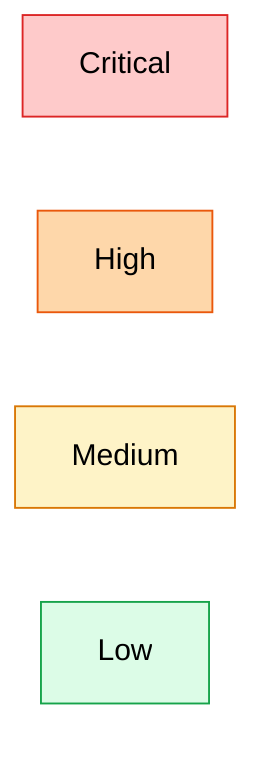

<!--
  Licensed to the Apache Software Foundation (ASF) under one or more
  contributor license agreements. See the NOTICE file distributed with
  this work for additional information regarding copyright ownership.
  The ASF licenses this file to You under the Apache License, Version 2.0
  (the "License"); you may not use this file except in compliance with
  the License. You may obtain a copy of the License at

     http://www.apache.org/licenses/LICENSE-2.0

  Unless required by applicable law or agreed to in writing, software
  distributed under the License is distributed on an "AS IS" BASIS,
  WITHOUT WARRANTIES OR CONDITIONS OF ANY KIND, either express or implied.
  See the License for the specific language governing permissions and
  limitations under the License.
-->

# Attack Surface Map — Ten Vulnerability Categories × Kafka Modules

This document is the cross-cutting visual companion to [`../severity-matrix.md`](../severity-matrix.md); it overlays the ten user-specified vulnerability categories onto the Apache Kafka 4.2.0-SNAPSHOT module inventory so that a reviewer can locate which modules host attack surface for each category in a single glance. The category taxonomy is reproduced verbatim from the user directive (01 filesystem access / path traversal; 02 low-level code safety; 03 resource-limit evasion; 04 module system / built-in abuse; 05 infinite loop / recursion DoS; 06 network / subprocess access; 07 external function / callback misuse; 08 deserialization attacks; 09 information leakage; 10 public API developer misuse). The module inventory enumerates the twelve top-level Gradle submodules examined during Phase 3 reconnaissance: `clients`, `core`, `connect`, `raft`, `metadata`, `storage`, `streams`, `coordinator-*` (transaction + group), `server-common`, `tools`, `trogdor`, and `release`.

**Diagram: Attack Surface Map** — ten categories mapped onto Kafka modules with severity heatmap (Critical / High / Medium / Low). Every edge is an evidence-grounded link between one vulnerability category and one Kafka module; every edge carries an explicit severity label in its edge text. No finding is rated Critical in this audit, and the `[Critical]` tier is retained in the legend for completeness only. See [Finding 01](../findings/01-filesystem-access-path-traversal.md) through [Finding 10](../findings/10-public-api-developer-misuse.md) for the code-grounded write-up backing each edge, and [`./threat-model-overview.md`](./threat-model-overview.md) for the complementary trust-zone view.

## Primary Diagram — Attack Surface Matrix

```mermaid
%%{init: {'theme':'neutral'}}%%
%% Title: Attack Surface Map — Ten Vulnerability Categories × Kafka Modules
flowchart LR
    subgraph Categories["Vulnerability Categories"]
        C1[01 Filesystem access<br/>path traversal]
        C2[02 Low-level code safety]
        C3[03 Resource-limit evasion]
        C4[04 Module system<br/>built-in abuse]
        C5[05 Infinite loop<br/>recursion DoS]
        C6[06 Network<br/>subprocess access]
        C7[07 External function<br/>callback misuse]
        C8[08 Deserialization attacks]
        C9[09 Information leakage]
        C10[10 Public API developer misuse]
    end

    subgraph Modules["Kafka Modules"]
        Clients[clients/<br/>SSL, SASL, OAuth,<br/>compression, config]
        Core[core/<br/>Broker, Log, Quotas,<br/>CSVMetricsReporter]
        Connect[connect/<br/>Runtime, Basic-auth, JSON,<br/>MirrorMaker 2]
        Raft[raft/<br/>KafkaRaftClient,<br/>QuorumState, VoterSet]
        Metadata[metadata/<br/>StandardAuthorizer,<br/>AclControlManager]
        Storage[storage/<br/>Tiered Storage RSM/RLMM,<br/>LogDirFailureChannel]
        Streams[streams/<br/>Checkpoint,<br/>RocksDBStore]
        Coordinator[coordinator-*/<br/>Transaction + Group<br/>coordinators]
        ServerCommon[server-common/<br/>BrokerSecurityConfigs]
        Tools[tools/<br/>JmxTool]
        Trogdor[trogdor/<br/>JsonUtil]
        Release[release/<br/>release.py, runtime.py]
    end

    %% Category 01 - Filesystem access / path traversal
    C1 -->|Medium| Clients
    C1 -->|Medium| Core
    C1 -->|Medium| Connect

    %% Category 02 - Low-level code safety / native JNI
    C2 -->|Medium| Clients
    C2 -->|Medium| Streams

    %% Category 03 - Resource-limit evasion
    C3 -->|Medium| Core
    C3 -->|Low| Clients

    %% Category 04 - Module system / built-in abuse
    C4 -->|Medium| Connect
    C4 -->|Medium| Storage
    C4 -->|Low| Metadata
    C4 -->|Low| Clients

    %% Category 05 - Infinite loop / recursion DoS (ReDoS)
    C5 -->|Medium| Clients
    C5 -->|Low| Clients

    %% Category 06 - Network / subprocess access
    C6 -->|High| Connect
    C6 -->|Medium| Raft
    C6 -->|Medium| Release

    %% Category 07 - External function / callback misuse
    C7 -->|High| Clients
    C7 -->|Medium| Connect
    C7 -->|Medium| Clients

    %% Category 08 - Deserialization attacks
    C8 -->|Medium| Connect
    C8 -->|Medium| Trogdor
    C8 -->|Medium| Clients
    C8 -->|Low| Streams

    %% Category 09 - Information leakage
    C9 -->|Low| Clients
    C9 -->|Low| Connect
    C9 -->|Low| Metadata

    %% Category 10 - Public API developer misuse
    C10 -->|High| Clients
    C10 -->|Medium| Connect
    C10 -->|Low| Core
    C10 -->|Low| Connect

    %% Severity edge coloring (link indices match the order of edges declared above)
    %% High (3): 13, 16, 26
    linkStyle 13,16,26 stroke:#EA580C,stroke-width:3px
    %% Medium (17): 0,1,2,3,4,5,7,8,11,14,15,17,18,19,20,21,27
    linkStyle 0,1,2,3,4,5,7,8,11,14,15,17,18,19,20,21,27 stroke:#D97706,stroke-width:2px
    %% Low (10): 6,9,10,12,22,23,24,25,28,29
    linkStyle 6,9,10,12,22,23,24,25,28,29 stroke:#16A34A,stroke-width:2px

    classDef critical fill:#FECACA,stroke:#DC2626,color:#0F172A
    classDef high fill:#FED7AA,stroke:#EA580C,color:#0F172A
    classDef medium fill:#FEF3C7,stroke:#D97706,color:#0F172A
    classDef low fill:#DCFCE7,stroke:#16A34A,color:#0F172A
    classDef neutral fill:#F1F5F9,stroke:#64748B,color:#0F172A
    class C1,C2,C3,C4,C5,C6,C7,C8,C9,C10 neutral
    class Clients,Core,Connect,Raft,Metadata,Storage,Streams,Coordinator,ServerCommon,Tools,Trogdor,Release neutral
```

## Legend

The legend below is a standalone rendering of the four severity classes used as edge labels in the primary diagram. Severity is conveyed in two redundant ways to aid accessibility: (1) an in-line severity label on every edge text (for example `-->|High|`), and (2) an edge color coded to the severity class (orange for High, amber for Medium, green for Low). No finding in this audit is rated Critical; the red `[Critical]` tier is retained in the legend to make reviewers aware of the reserved taxonomy level.

| Severity | Definition |
|---|---|
| `[Critical]` | Reserved for findings with remote-unauthenticated, high-impact exploitation potential. None are rated Critical in this audit. |
| `[High]` | Remote-authenticated or operator-reachable surfaces with credential-exposure or broad-scope impact (for example `JaasBasicAuthFilter` internal-request bypass at `connect/basic-auth-extension/src/main/java/org/apache/kafka/connect/rest/basic/auth/extension/JaasBasicAuthFilter.java:L55-L58`; `OAuthBearerUnsecuredValidatorCallbackHandler` default at `clients/src/main/java/org/apache/kafka/common/security/oauthbearer/internals/unsecured/OAuthBearerUnsecuredValidatorCallbackHandler.java:L75-L80`; `PLAINTEXT` listener default). |
| `[Medium]` | Surfaces that require mis-configuration, narrow privilege, or that already have a mitigation in place that an operator could disable (for example `DirectoryConfigProvider.allowed.paths`, `ConnectionQuotas` per-IP caps, `StandardAuthorizerData.loadingComplete`). |
| `[Low]` | Surfaces mitigated by a secure default, bounded by limited blast radius, or requiring administrator-level credential access (for example `Password.HIDDEN` masking, `access.control.allow.origin = ""`, `unclean.leader.election.enable = false`). |

## Key Observations

- **No Critical findings were identified.** The audit's highest-severity surfaces are rated `[High]` and concentrate in `Clients` (PLAINTEXT default; `OAuthBearerUnsecuredValidatorCallbackHandler` default) and `Connect` (REST trust boundary — `JaasBasicAuthFilter` bypass and `RestClient` `Authorization` forwarding).
- **`Clients` is the widest-surface module**, appearing in nine of the ten categories (01, 02, 03, 04, 05, 07, 08, 09, 10 — only Category 06 *Network / subprocess access* is absent). This breadth exists because `clients` hosts the public configuration framework (`ConfigDef`, `ConfigTransformer`, `ConfigProvider` family), the SSL/SASL/OAuth stack (`BrokerJwtValidator`, `ClientJwtValidator`, unsecured validator), the Kerberos name parser (`KerberosRule`, `KerberosName`, `KerberosShortNamer`), the JMX reporter (`JmxReporter`), the compression wrappers (`ZstdCompression`, `SnappyCompression`, `Lz4Compression`), the memory pool (`SimpleMemoryPool`), and the delegation-token value object (`DelegationToken`).
- **`Connect` is the second-widest module**, appearing in seven of the ten categories (01, 04, 06, 07, 08, 09, 10). This breadth reflects that the Connect runtime exposes an embedded Jetty HTTP server (`RestServer`, `RestServerConfig`, `RestClient`), a pluggable authentication extension surface (`ConnectRestExtension`, `JaasBasicAuthFilter`), a JSON deserialization pipeline with `ALLOW_LEADING_ZEROS_FOR_NUMBERS` enabled (`JsonDeserializer`), and a plugin-isolation model (`PluginClassLoader`, `DelegatingClassLoader`).
- **`Raft` and `Metadata` have narrower but safety-critical surfaces.** Both modules are rated `[Medium]` or `[Low]` not because they are less important but because they were designed with strong invariants already in place: `VoterSet.hasOverlappingMajority` (`raft/src/main/java/org/apache/kafka/raft/VoterSet.java:L319`) for reconfiguration safety, `QuorumState` persisted state transitions (`raft/src/main/java/org/apache/kafka/raft/QuorumState.java:L36-L83`), and `StandardAuthorizerData` DENY-over-ALLOW + LITERAL-only pattern enforcement (`metadata/src/main/java/org/apache/kafka/metadata/authorizer/StandardAuthorizerData.java:L92-L97,L221-L230`) and the `AclControlManager.MAX_RECORDS_PER_USER_OP` bounded-list guard.
- **`Tools`, `Trogdor`, and `Release` have limited surfaces.** `Trogdor` appears in one category (08 Deserialization — `JsonUtil.ACCEPT_SINGLE_VALUE_AS_ARRAY`). `Tools` appears in zero direct category edges — `JmxTool` surface is aggregated under `Clients` via `JmxReporter`. `Release` appears in one category (06 Network / subprocess — `release.py` `shell=True` with f-string interpolation) and is explicitly **release-engineer-privilege context only**, not a runtime surface.
- **`Storage`, `Streams`, `Coordinator`, and `ServerCommon` are represented by one or two edges each**, reflecting that their primary attack surfaces are proxied through Kafka RPCs (broker-mediated) and that their defensive invariants (Tiered Storage `ClassLoaderAware` isolation, Streams `OffsetCheckpoint` length-framed parsing, transaction coordinator epoch fencing, server-common constant definitions) keep their independent surface area small.
- **`[Accepted Mitigations]` callout.** Many surfaces above are rated `[Low]` or `[Medium]` precisely because positive-security controls already exist in the codebase. Do not reclassify these edges as safe-because-unimportant; reclassify them as safe-because-mitigated and review [`../accepted-mitigations.md`](../accepted-mitigations.md) for the full catalogue. Key examples: `MessageDigest.isEqual` for delegation-token HMAC comparison; `DISALLOW_NONE` JWT algorithm enforcement in `BrokerJwtValidator`; REPLICATION listener exempt from broker-wide connection caps; copy-on-write `StandardAuthorizerData` with DENY-over-ALLOW precedence; `AclControlManager.MAX_RECORDS_PER_USER_OP`; `DelegationToken.toString()` HMAC placeholder masking; Kafka-owned `BufferSupplier` + `ChunkedBytesStream` with bounded 16 KB decompression chunk size on the zstd-jni boundary.

## Sources

The citations below are the code anchors for each category edge in the primary diagram. File paths are given relative to the repository root. For per-edge attack vector, severity justification, and business-impact analysis, see the corresponding findings document cross-linked in the next section.

### Category 01 — Filesystem access / path traversal
- `clients/src/main/java/org/apache/kafka/common/config/provider/FileConfigProvider.java`
- `clients/src/main/java/org/apache/kafka/common/config/provider/DirectoryConfigProvider.java`
- `clients/src/main/java/org/apache/kafka/common/config/provider/EnvVarConfigProvider.java`
- `clients/src/main/java/org/apache/kafka/common/security/oauthbearer/FileJwtRetriever.java`
- `clients/src/main/java/org/apache/kafka/common/security/oauthbearer/JwtBearerJwtRetriever.java`
- `core/src/main/scala/kafka/log/LogManager.scala`
- `core/src/main/scala/kafka/metrics/KafkaCSVMetricsReporter.scala`
- `connect/runtime/src/main/java/org/apache/kafka/connect/runtime/isolation/DelegatingClassLoader.java`

### Category 02 — Low-level code safety
- `clients/src/main/java/org/apache/kafka/common/compress/ZstdCompression.java`
- `clients/src/main/java/org/apache/kafka/common/compress/SnappyCompression.java`
- `clients/src/main/java/org/apache/kafka/common/compress/Lz4Compression.java`
- `clients/src/main/java/org/apache/kafka/common/memory/SimpleMemoryPool.java`
- `streams/src/main/java/org/apache/kafka/streams/state/internals/RocksDBStore.java`
- `gradle/dependencies.gradle` (versions: zstd `1.5.6-10` at `L131`; snappy `1.1.10.7` at `L125`; lz4 `1.8.0` at `L110`; rocksdbjni `10.1.3`)

### Category 03 — Resource-limit evasion
- `core/src/main/scala/kafka/network/SocketServer.scala` (hosts the `ConnectionQuotas` class in the 4.2 tree)
- `core/src/main/java/kafka/server/ClientRequestQuotaManager.java`
- `server/src/main/java/org/apache/kafka/server/quota/ClientQuotaManager.java`
- `clients/src/main/java/org/apache/kafka/common/memory/SimpleMemoryPool.java`

### Category 04 — Module system / built-in abuse
- `connect/runtime/src/main/java/org/apache/kafka/connect/runtime/isolation/PluginClassLoader.java`
- `connect/runtime/src/main/java/org/apache/kafka/connect/runtime/isolation/DelegatingClassLoader.java`
- `connect/runtime/src/main/java/org/apache/kafka/connect/runtime/isolation/PluginUtils.java`
- `connect/api/src/main/java/org/apache/kafka/connect/rest/ConnectRestExtension.java`
- `storage/api/src/main/java/org/apache/kafka/server/log/remote/storage/RemoteStorageManager.java`
- `storage/api/src/main/java/org/apache/kafka/server/log/remote/storage/RemoteLogMetadataManager.java`
- `metadata/src/main/java/org/apache/kafka/metadata/authorizer/ClusterMetadataAuthorizer.java`
- `metadata/src/main/java/org/apache/kafka/metadata/authorizer/AclMutator.java`
- `clients/src/main/java/org/apache/kafka/common/security/oauthbearer/JwtValidator.java`
- `clients/src/main/java/org/apache/kafka/common/security/oauthbearer/JwtRetriever.java`

### Category 05 — Infinite loop / recursion DoS (ReDoS)
- `clients/src/main/java/org/apache/kafka/common/security/kerberos/KerberosRule.java` (four `Pattern.compile` sites)
- `clients/src/main/java/org/apache/kafka/common/security/kerberos/KerberosName.java`
- `clients/src/main/java/org/apache/kafka/common/security/kerberos/KerberosShortNamer.java`
- `clients/src/main/java/org/apache/kafka/common/metrics/JmxReporter.java` (INCLUDE / EXCLUDE filters)
- `clients/src/main/java/org/apache/kafka/common/config/ConfigDef.java`
- `clients/src/main/java/org/apache/kafka/common/config/ConfigTransformer.java`
- `clients/src/main/java/org/apache/kafka/common/config/provider/EnvVarConfigProvider.java` (`allowlist.pattern`)
- `clients/src/main/java/org/apache/kafka/common/network/ServerConnectionId.java`
- `clients/src/main/java/org/apache/kafka/common/requests/ApiVersionsRequest.java`
- `clients/src/main/java/org/apache/kafka/common/security/oauthbearer/internals/OAuthBearerClientInitialResponse.java`
- `connect/runtime/src/main/java/org/apache/kafka/connect/util/SafeObjectInputStream.java` (recursion-bounded blocklist)

### Category 06 — Network / subprocess access
- `connect/runtime/src/main/java/org/apache/kafka/connect/runtime/rest/RestServer.java` (L274-L285 — `CrossOriginHandler` installation is gated on non-blank `allowedOrigins`)
- `connect/runtime/src/main/java/org/apache/kafka/connect/runtime/rest/RestServerConfig.java` (L70-L82 — `ACCESS_CONTROL_ALLOW_ORIGIN_DEFAULT = ""`)
- `connect/runtime/src/main/java/org/apache/kafka/connect/runtime/rest/RestClient.java` (L230-L234 — outbound `Authorization` header forwarding)
- `connect/basic-auth-extension/src/main/java/org/apache/kafka/connect/rest/basic/auth/extension/JaasBasicAuthFilter.java` (L55-L58 — `INTERNAL_REQUEST_MATCHERS` bypass)
- `raft/src/main/java/org/apache/kafka/raft/KafkaRaftClient.java`
- `raft/src/main/java/org/apache/kafka/raft/internals/UpdateVoterHandler.java`
- `release/release.py` (L334-L362 — `subprocess` invocation with `shell=True` and f-string interpolation; release-engineer-privilege context)
- `release/runtime.py`

### Category 07 — External function / callback misuse
- `clients/src/main/java/org/apache/kafka/common/security/oauthbearer/internals/unsecured/OAuthBearerUnsecuredValidatorCallbackHandler.java` (L75-L80 — "default when ... no value is explicitly set" and "not suitable for production use")
- `clients/src/main/java/org/apache/kafka/common/security/oauthbearer/OAuthBearerValidatorCallbackHandler.java` (unconditional SASL extension acceptance)
- `connect/runtime/src/main/java/org/apache/kafka/connect/runtime/rest/RestClient.java` (`Authorization` forwarding — also in Category 06)
- `connect/runtime/src/main/java/org/apache/kafka/connect/runtime/isolation/PluginUtils.java`

### Category 08 — Deserialization attacks
- `connect/json/src/main/java/org/apache/kafka/connect/json/JsonDeserializer.java` (`ALLOW_LEADING_ZEROS_FOR_NUMBERS` enabled)
- `trogdor/src/main/java/org/apache/kafka/trogdor/common/JsonUtil.java` (`ACCEPT_SINGLE_VALUE_AS_ARRAY` enabled)
- `connect/runtime/src/main/java/org/apache/kafka/connect/util/SafeObjectInputStream.java` (suffix-matching blocklist)
- `clients/src/main/java/org/apache/kafka/common/security/oauthbearer/BrokerJwtValidator.java` (L52, L131 — `DISALLOW_NONE`)
- `clients/src/main/java/org/apache/kafka/common/security/oauthbearer/ClientJwtValidator.java` (structural-only validation)
- `streams/src/main/java/org/apache/kafka/streams/state/internals/OffsetCheckpoint.java`
- `connect/mirror-client/src/main/java/org/apache/kafka/connect/mirror/Checkpoint.java`
- `gradle/dependencies.gradle` (jackson `2.19.0` at `L66`; jose4j `0.9.6` at `L81`)

### Category 09 — Information leakage
- `clients/src/main/java/org/apache/kafka/common/config/types/Password.java` (`HIDDEN = "[hidden]"`)
- `clients/src/main/java/org/apache/kafka/common/security/token/delegation/DelegationToken.java` (`toString` HMAC masking; `MessageDigest.isEqual`)
- `clients/src/main/java/org/apache/kafka/common/metrics/JmxReporter.java`
- `metadata/src/main/java/org/apache/kafka/metadata/util/RecordRedactor.java` (`"(redacted)"`)
- `metadata/src/main/java/org/apache/kafka/image/node/ConfigurationImageNode.java` (`"[redacted]"`)

### Category 10 — Public API developer misuse
- `clients/src/main/java/org/apache/kafka/common/config/SslConfigs.java` (`SSL_ALLOW_DN_CHANGES`, `SSL_ALLOW_SAN_CHANGES`, endpoint-identification default)
- `clients/src/main/java/org/apache/kafka/common/config/SaslConfigs.java` (GSSAPI default)
- `clients/src/main/java/org/apache/kafka/clients/CommonClientConfigs.java` (PLAINTEXT default)
- `connect/runtime/src/main/java/org/apache/kafka/connect/runtime/rest/RestServerConfig.java` (L76 — `access.control.allow.origin = ""`; secure default)
- `connect/basic-auth-extension/src/main/java/org/apache/kafka/connect/rest/basic/auth/extension/PropertyFileLoginModule.java` (production-unsuitable default)
- `core/src/main/scala/kafka/server/KafkaConfig.scala` (`unclean.leader.election.enable = false`; secure default)

## Cross-References

- [Finding 01 — Filesystem access / path traversal](../findings/01-filesystem-access-path-traversal.md)
- [Finding 02 — Low-level code safety](../findings/02-low-level-code-safety.md)
- [Finding 03 — Resource-limit evasion](../findings/03-resource-limit-evasion.md)
- [Finding 04 — Module system / built-in abuse](../findings/04-module-system-builtin-abuse.md)
- [Finding 05 — Infinite loop / recursion DoS](../findings/05-infinite-loop-recursion-dos.md)
- [Finding 06 — Network / subprocess access](../findings/06-network-subprocess-access.md)
- [Finding 07 — External function / callback misuse](../findings/07-external-function-callback-misuse.md)
- [Finding 08 — Deserialization attacks](../findings/08-deserialization-attacks.md)
- [Finding 09 — Information leakage](../findings/09-information-leakage.md)
- [Finding 10 — Public API developer misuse](../findings/10-public-api-developer-misuse.md)
- [Severity Matrix](../severity-matrix.md) — tabular mirror of this diagram
- [Threat Model Overview](./threat-model-overview.md) — trust-zone and data-flow view that complements this surface matrix
- [Accepted Mitigations](../accepted-mitigations.md) — catalogue of positive-security controls that justify many `[Low]` and `[Medium]` ratings
- [Audit README](../README.md)
