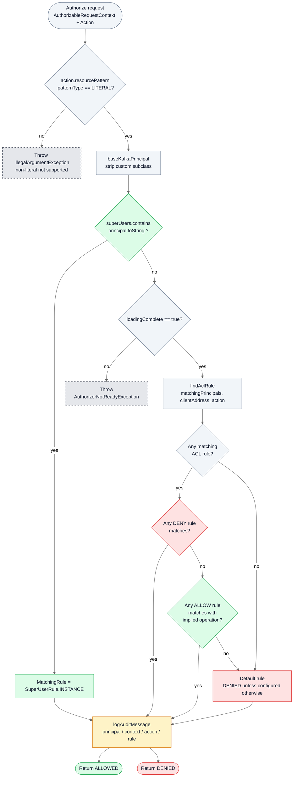
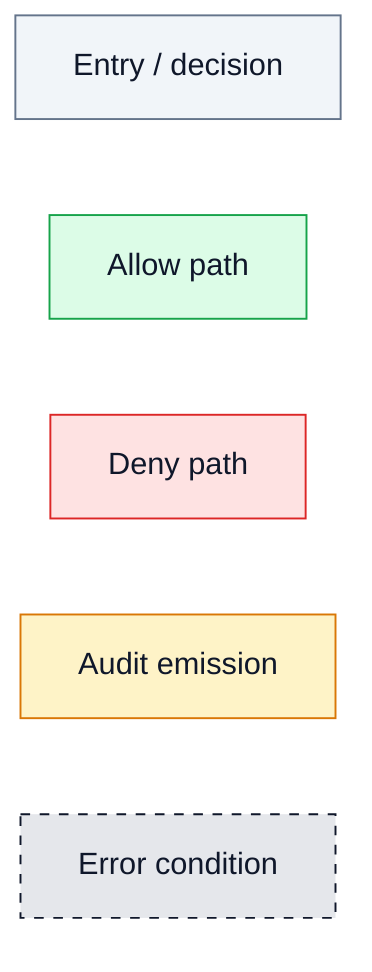

<!--
  Licensed to the Apache Software Foundation (ASF) under one or more
  contributor license agreements. See the NOTICE file distributed with
  this work for additional information regarding copyright ownership.
  The ASF licenses this file to You under the Apache License, Version 2.0
  (the "License"); you may not use this file except in compliance with
  the License. You may obtain a copy of the License at

     http://www.apache.org/licenses/LICENSE-2.0

  Unless required by applicable law or agreed to in writing, software
  distributed under the License is distributed on an "AS IS" BASIS,
  WITHOUT WARRANTIES OR CONDITIONS OF ANY KIND, either express or implied.
  See the License for the specific language governing permissions and
  limitations under the License.
-->

# Authorization Decision Flow — StandardAuthorizer.authorize

`StandardAuthorizerData.authorize` is the in-broker authorization code path that every KRaft-mode Kafka broker traverses before admitting or rejecting a client action, and its design embodies several positive-security invariants — copy-on-write ACL snapshots, DENY-over-ALLOW precedence, mandatory audit emission, a fail-closed readiness gate, and literal-only resource-pattern enforcement. This diagram grounds each branch of that decision tree in verified source citations from `metadata/src/main/java/org/apache/kafka/metadata/authorizer/StandardAuthorizerData.java`, so that operators and future auditors can verify the invariants visually and ensure the observed behavior has not regressed. The audit proposes no changes to this code path; the diagram is presented as an evidence artifact for the `../accepted-mitigations.md` catalog and as supporting context for `../findings/10-public-api-developer-misuse.md` where default-allow versus default-deny configuration posture is discussed.

**Diagram: Authorization Decision Flow** — super-user bypass, loadingComplete gate, DENY-over-ALLOW matching, audit emission.

## Primary Diagram — StandardAuthorizer.authorize Decision Tree

## Legend

The legend below mirrors the color classes applied in the primary diagram. Every node in the decision tree is colored according to which branch it represents, so a reviewer can visually scan for the allow path, the deny path, and the audit emission without reading every label.

| Color | Meaning |
|-------|---------|
| Grey (solid border) | Entry or decision point — the `authorize` entrypoint, the literal-pattern gate, the principal extraction, the loadingComplete gate, the ACL lookup, and the matching-rule check |
| Green | Allow path — includes the super-user bypass, a matching ALLOW rule with implied operation, and the final `ALLOWED` terminal |
| Red | Deny path — includes any matching DENY rule, the default rule (configured DENIED unless explicitly overridden), and the final `DENIED` terminal |
| Amber | Audit log emission — always reached before the result is returned; no decision path exits without emitting an audit record |
| Grey dashed | Exceptional error path — non-literal resource pattern (`IllegalArgumentException`) or ACL state not yet loaded (`AuthorizerNotReadyException`); these never reach the audit step and never produce a standard `AuthorizationResult` |

## Key Observations

The following observations are grounded in verified source citations. Each observation describes an invariant that the diagram preserves visually so a reviewer can confirm it has not been regressed.

- `authorize` rejects any resource pattern that is not `LITERAL` by throwing `IllegalArgumentException` (`Source: metadata/src/main/java/org/apache/kafka/metadata/authorizer/StandardAuthorizerData.java:L230-L232`). Wildcard and prefix patterns are not supported at the authorize-call boundary as a defensive measure — callers must resolve patterns to literals before invoking the authorizer.
- Super-user bypass is evaluated before any ACL lookup and before the readiness gate: if `superUsers.contains(principal.toString())` matches, the rule is `SuperUserRule.INSTANCE` (`Source: metadata/src/main/java/org/apache/kafka/metadata/authorizer/StandardAuthorizerData.java:L237-L238`). This is intentional — super-users are, by definition, exempt from ACL evaluation.
- The `loadingComplete` readiness gate throws `AuthorizerNotReadyException` if the ACL state has not finished loading from the metadata log (`Source: metadata/src/main/java/org/apache/kafka/metadata/authorizer/StandardAuthorizerData.java:L239-L240`). This prevents the authorizer from fail-open behavior during broker startup — an unready authorizer explicitly rejects rather than admits.
- DENY-over-ALLOW precedence is documented in the method-level javadoc as a design contract: "If any DENY ACLs match, the operation is denied, no matter how many ALLOW ACLs match. If neither ALLOW nor DENY ACLs match, we return the default result." (`Source: metadata/src/main/java/org/apache/kafka/metadata/authorizer/StandardAuthorizerData.java:L221-L225`). The diagram encodes this precedence by routing the `MatchCheck` yes-branch through `DenyScan` before `AllowScan`.
- Audit message emission via `logAuditMessage` happens on every decision path prior to returning the result (`Source: metadata/src/main/java/org/apache/kafka/metadata/authorizer/StandardAuthorizerData.java:L248-L249`). Audit is mandatory, not optional — including for super-user bypass, DENY decisions, ALLOW decisions, and default-rule fallbacks. The only paths that skip audit are the two exceptional error paths (non-literal pattern and authorizer-not-ready), and those never return a standard `AuthorizationResult`.
- `matchingPrincipals` always includes the session principal plus the `WILDCARD_KAFKA_PRINCIPAL` sentinel so that ACLs granted to `User:*` are evaluated against every session (`Source: metadata/src/main/java/org/apache/kafka/metadata/authorizer/StandardAuthorizerData.java:L463-L469`). This means a wildcard ALLOW rule is observable to all non-super-user sessions, and a wildcard DENY rule blocks all non-super-user sessions — a property that operators must understand before configuring `User:*` ACLs.

**[Accepted Mitigation]** — Four existing positive-security controls converge in this code path: (1) literal-only resource-pattern enforcement at the authorize boundary prevents accidentally broad matches; (2) DENY-over-ALLOW precedence is a contractual invariant documented in the javadoc and visible in the matching-rule traversal; (3) the `loadingComplete` gate is a fail-closed readiness invariant; (4) mandatory audit-log emission covers every normal-return path. These four invariants are cataloged in `../accepted-mitigations.md` and are referenced here as evidence that the `StandardAuthorizer` is a model of positive-security design. The audit proposes no code changes; this diagram exists so that the invariants remain visible and are not regressed in a future refactor.

## Sources

Every citation below points at `metadata/src/main/java/org/apache/kafka/metadata/authorizer/StandardAuthorizerData.java` and names the exact line range verified during the audit reconnaissance.

- `metadata/src/main/java/org/apache/kafka/metadata/authorizer/StandardAuthorizerData.java:L53-L54` — `AuthorizationResult.ALLOWED` / `AuthorizationResult.DENIED` imports (result types returned by the authorize method)
- `metadata/src/main/java/org/apache/kafka/metadata/authorizer/StandardAuthorizerData.java:L92` — `final boolean loadingComplete` readiness field
- `metadata/src/main/java/org/apache/kafka/metadata/authorizer/StandardAuthorizerData.java:L97` — `private final Set<String> superUsers` super-user registry
- `metadata/src/main/java/org/apache/kafka/metadata/authorizer/StandardAuthorizerData.java:L221-L225` — DENY-over-ALLOW design contract documented in the method-level javadoc comment
- `metadata/src/main/java/org/apache/kafka/metadata/authorizer/StandardAuthorizerData.java:L226-L250` — `public AuthorizationResult authorize(AuthorizableRequestContext, Action)` method body
- `metadata/src/main/java/org/apache/kafka/metadata/authorizer/StandardAuthorizerData.java:L230-L232` — `patternType() != LITERAL` guard throwing `IllegalArgumentException`
- `metadata/src/main/java/org/apache/kafka/metadata/authorizer/StandardAuthorizerData.java:L237-L238` — `superUsers.contains(principal.toString())` → `rule = SuperUserRule.INSTANCE`
- `metadata/src/main/java/org/apache/kafka/metadata/authorizer/StandardAuthorizerData.java:L239-L240` — `else if (!loadingComplete)` → `throw new AuthorizerNotReadyException()`
- `metadata/src/main/java/org/apache/kafka/metadata/authorizer/StandardAuthorizerData.java:L248-L249` — `logAuditMessage(principal, requestContext, action, rule)` and `return rule.result()` (mandatory audit emission before returning the result)
- `metadata/src/main/java/org/apache/kafka/metadata/authorizer/StandardAuthorizerData.java:L445-L470` — `findResult`, `baseKafkaPrincipal`, and `matchingPrincipals` helpers that feed the `findAclRule` node in the diagram
- `metadata/src/main/java/org/apache/kafka/metadata/authorizer/StandardAuthorizerData.java:L463-L469` — `matchingPrincipals` body returning `Set.of(basePrincipal, WILDCARD_KAFKA_PRINCIPAL)` — the wildcard-inclusion invariant

## Audit Only Rule and Performance Considerations Bridge

This diagram is a visual artifact produced under the following user-supplied governing rule, reproduced verbatim with the spelling `perofrmace` preserved:

> This run should serve as a dry run for potential changes, research, or documentation. DO NOT modify, create, or delete any existing code in the codebase. Avoid executing any code in the code base, this should be a static analysis. Every deliverable MUST include a markdown file summarizing security vulnerabilities, potential exploits, bugs in the codebase, perofrmace considerations, and remediation recommendations. Verify the NO CHANGES clause by confirming no changes to existing codebase featured in the git differential. Markdown files explicitly related to the analysis performed in this run are permitted.

**Performance Considerations.** `StandardAuthorizer.authorize` is on the hot path of every client request reaching `KafkaApis`; its latency directly constrains broker throughput. This diagram documents the decision structure (super-user bypass → literal-pattern gate → `loadingComplete` gate → DENY scan → ALLOW scan → audit emission), not the performance characteristics of each stage. The rule-mandated `perofrmace considerations` deliverable topic is satisfied in the per-category findings under [`../findings/`](../findings/). Performance anchors relevant to this decision flow:

- Authorization lookup cost — Finding 09 (`../findings/09-information-leakage.md`) Section 8 discusses the per-request cost of `AclCache` navigation and the audit-log emission overhead.
- Copy-on-write `StandardAuthorizerData` — see [`../accepted-mitigations.md`](../accepted-mitigations.md) (M9). The `AclCache` uses `ImmutableNavigableSet`/`ImmutableMap` for lock-free reads at the cost of higher write amortization on ACL mutation. Replacing these with a mutable concurrent collection "for performance" would regress M9; any such proposal is explicitly out of scope for this audit under the Audit Only rule.
- `AclControlManager.MAX_RECORDS_PER_USER_OP` — see [`../accepted-mitigations.md`](../accepted-mitigations.md) (M11): bounds the per-operation record volume so mutation cost is capped, preserving controller throughput under pathological admin workloads.
- Super-user bypass ordering — Finding 10 (`../findings/10-public-api-developer-misuse.md`) Section 8 notes that evaluating `superUsers.contains(principal.toString())` before the ACL lookup keeps the hot path short for super-user sessions at the cost of strict least-privilege semantics.

**Change Posture.** Consistent with the Audit Only rule, this diagram adds to `docs/security-audit/` only. No pre-existing Kafka source, test, build, documentation, or comment file is modified. The [`../no-change-verification.md`](../no-change-verification.md) artifact carries the git-diff evidence that confirms this invariant.

## Cross-References

- [Category 10 — Public API developer misuse](../findings/10-public-api-developer-misuse.md) — default-allow versus default-deny configuration posture, including `allow.everyone.if.no.acl.found` and super-user semantics
- [Accepted Mitigations](../accepted-mitigations.md) — DENY-over-ALLOW precedence, literal-only patterns, `loadingComplete` gate, and mandatory audit emission as four positive-security controls
- [Threat Model Overview](./threat-model-overview.md) — the system-level view in which `StandardAuthorizer` sits inside the KRaft controller and the per-broker authorizer instance
- [Audit README](../README.md) — top-level navigation index for the `docs/security-audit/` tree
