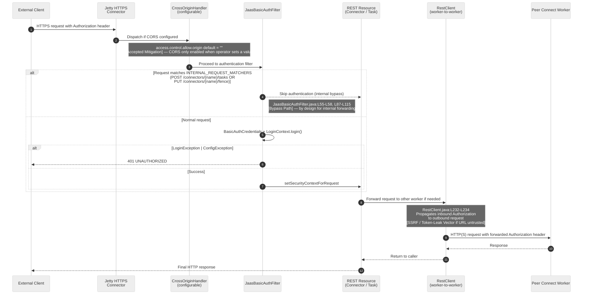
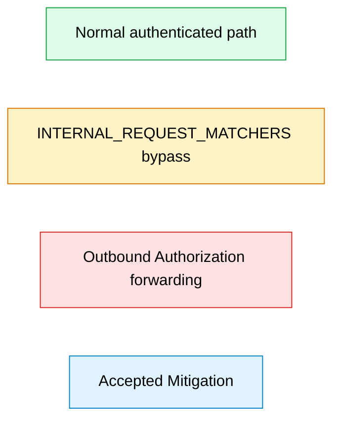

<!--
 Licensed to the Apache Software Foundation (ASF) under one or more
 contributor license agreements.  See the NOTICE file distributed with
 this work for additional information regarding copyright ownership.
 The ASF licenses this file to You under the Apache License, Version 2.0
 (the "License"); you may not use this file except in compliance with
 the License.  You may obtain a copy of the License at

      http://www.apache.org/licenses/LICENSE-2.0

 Unless required by applicable law or agreed to in writing, software
 distributed under the License is distributed on an "AS IS" BASIS,
 WITHOUT WARRANTIES OR CONDITIONS OF ANY KIND, either express or implied.
 See the License for the specific language governing permissions and
 limitations under the License.
-->

# Connect REST Trust Boundary — Inbound Auth + Outbound Forwarding

This diagram is a trust-boundary view of Kafka Connect's REST surface, covering the three
primary components responsible for inbound request authentication and outbound request
forwarding: `org.apache.kafka.connect.runtime.rest.RestServer` (Jetty wiring and
`CrossOriginHandler` instantiation), `org.apache.kafka.connect.rest.basic.auth.extension.JaasBasicAuthFilter`
(the built-in Basic-auth REST extension distributed with Connect), and
`org.apache.kafka.connect.runtime.rest.RestClient` (the worker-to-worker forwarding helper).
The diagram is a static, code-grounded snapshot and proposes no changes to any Kafka
source file; it exists purely to make the current trust-boundary behavior legible to
operators and auditors.

**Diagram: Connect REST Trust Boundary** — inbound request authentication,
`INTERNAL_REQUEST_MATCHERS` bypass, and outbound `Authorization` propagation.

## Sequence

## Legend

The color conventions below distinguish the four flow categories depicted in the
sequence diagram. The small flowchart immediately beneath the table renders the
same conventions as discrete, stand-alone nodes so that a reader can cross-reference
the visual palette without re-scanning the full sequence.

| Color  | Meaning                                                  | Applies to                                                                 |
|--------|----------------------------------------------------------|----------------------------------------------------------------------------|
| Green  | Normal authenticated flow (production-safe)              | `BasicAuthCredentials` + `LoginContext.login()` success path into the REST resource |
| Amber  | Internal-request bypass (by design, worth operator awareness) | `INTERNAL_REQUEST_MATCHERS` match: `POST /connectors/{name}/tasks` + `PUT /connectors/{name}/fence` |
| Red    | Outbound Authorization-header forwarding (potential SSRF / token leak) | `RestClient.addHeadersToRequest` re-attaching the inbound header to an outbound URL |
| Blue   | Accepted mitigation (positive-security posture)          | Empty `access.control.allow.origin` default — `CrossOriginHandler` is not installed unless operator sets a value |

## Key Observations

- **[Accepted Mitigation]** — The `access.control.allow.origin` Connect REST configuration
  key is declared as `ACCESS_CONTROL_ALLOW_ORIGIN_CONFIG = "access.control.allow.origin"`
  with a default value of the empty string (`ACCESS_CONTROL_ALLOW_ORIGIN_DEFAULT = ""`).
  When the operator does not override this default, no `CrossOriginHandler` is attached
  and cross-origin browser requests are not serviced by the Connect REST layer. This is
  a secure-by-default posture and is cataloged in the `../accepted-mitigations.md`
  companion artifact. Source:
  `connect/runtime/src/main/java/org/apache/kafka/connect/runtime/rest/RestServerConfig.java:L70,L76`.
- **[Accepted Mitigation]** — `CrossOriginHandler` is only instantiated when
  `config.allowedOrigins()` returns a non-blank value. The `RestServer.initializeResources`
  path guards the handler installation with `if (!Utils.isBlank(allowedOrigins))` and
  only then configures the allowed origin patterns, allowed methods, and preflight
  delivery before inserting the handler into the servlet context. Source:
  `connect/runtime/src/main/java/org/apache/kafka/connect/runtime/rest/RestServer.java:L274-L286`.
- **[Bypass Path]** — `JaasBasicAuthFilter.INTERNAL_REQUEST_MATCHERS` is a two-element
  `Set<RequestMatcher>` containing one `POST` matcher for `/connectors/{name}/tasks` and
  one `PUT` matcher for `/connectors/{name}/fence`. When an inbound request matches
  either pattern, the filter short-circuits and returns without invoking the JAAS
  `LoginContext.login()` path. This bypass exists to permit leader-to-follower task
  propagation and zombie-fencing traffic inside the Connect worker cluster and
  therefore assumes network-layer trust between workers. Source:
  `connect/basic-auth-extension/src/main/java/org/apache/kafka/connect/rest/basic/auth/extension/JaasBasicAuthFilter.java:L55-L58`.
- **[Bypass Path]** — The bypass is selected in the first statement of
  `filter(ContainerRequestContext)` via `isInternalRequest(requestContext)`; a match
  logs a trace-level message and returns before any authentication work occurs.
  The helper iterates `INTERNAL_REQUEST_MATCHERS` and returns `true` on the first
  matching predicate. Sources:
  `connect/basic-auth-extension/src/main/java/org/apache/kafka/connect/rest/basic/auth/extension/JaasBasicAuthFilter.java:L87-L111`
  and `JaasBasicAuthFilter.java:L113-L115`.
- **[SSRF Vector]** — `RestClient` forwards an inbound caller's `Authorization`
  header onto the outbound Jetty `Request` object via `addHeadersToRequest`, which
  reads `headers.getHeaderString(HttpHeaders.AUTHORIZATION)` and, when non-null,
  re-adds it to the outbound request headers. If the outbound URL is derived from
  operator configuration or cluster-state data that an attacker can influence, the
  caller's credentials may be transmitted to an unintended peer. Source:
  `connect/runtime/src/main/java/org/apache/kafka/connect/runtime/rest/RestClient.java:L232-L234`.
- The default Basic-auth `LoginModule` shipped with `JaasBasicAuthFilter`
  (`PropertyFileLoginModule`) is documented by its own Javadoc as not suitable for
  production use. Operators relying on the built-in Basic-auth extension must
  configure a production-grade `LoginModule` instead. Cross-reference:
  `../findings/10-public-api-developer-misuse.md`.

No code change is proposed in this audit. The observations above are recorded as
read-only evidence to support the findings in
`../findings/06-network-subprocess-access.md` and
`../findings/07-external-function-callback-misuse.md`.

## Sources

- `connect/runtime/src/main/java/org/apache/kafka/connect/runtime/rest/RestServer.java:L274-L286` — `CrossOriginHandler` instantiation gated by non-blank `allowedOrigins`.
- `connect/runtime/src/main/java/org/apache/kafka/connect/runtime/rest/RestServerConfig.java:L70` — `ACCESS_CONTROL_ALLOW_ORIGIN_CONFIG = "access.control.allow.origin"`.
- `connect/runtime/src/main/java/org/apache/kafka/connect/runtime/rest/RestServerConfig.java:L76` — `ACCESS_CONTROL_ALLOW_ORIGIN_DEFAULT = ""`.
- `connect/basic-auth-extension/src/main/java/org/apache/kafka/connect/rest/basic/auth/extension/JaasBasicAuthFilter.java:L55-L58` — `INTERNAL_REQUEST_MATCHERS` definition (POST `/connectors/{name}/tasks` + PUT `/connectors/{name}/fence`).
- `connect/basic-auth-extension/src/main/java/org/apache/kafka/connect/rest/basic/auth/extension/JaasBasicAuthFilter.java:L87-L111` — `filter(ContainerRequestContext)` method with the bypass check at L88.
- `connect/basic-auth-extension/src/main/java/org/apache/kafka/connect/rest/basic/auth/extension/JaasBasicAuthFilter.java:L113-L115` — `isInternalRequest` helper that iterates `INTERNAL_REQUEST_MATCHERS`.
- `connect/runtime/src/main/java/org/apache/kafka/connect/runtime/rest/RestClient.java:L232-L234` — inbound `Authorization` header propagation to the outbound Jetty `Request`.

## Cross-References

- [Category 06 — Network and subprocess access](../findings/06-network-subprocess-access.md)
- [Category 07 — External function and callback misuse](../findings/07-external-function-callback-misuse.md)
- [Category 10 — Public API developer misuse](../findings/10-public-api-developer-misuse.md) (for `PropertyFileLoginModule` default)
- [Accepted Mitigations](../accepted-mitigations.md) (for the secure CORS default)
- [Audit README](../README.md)
