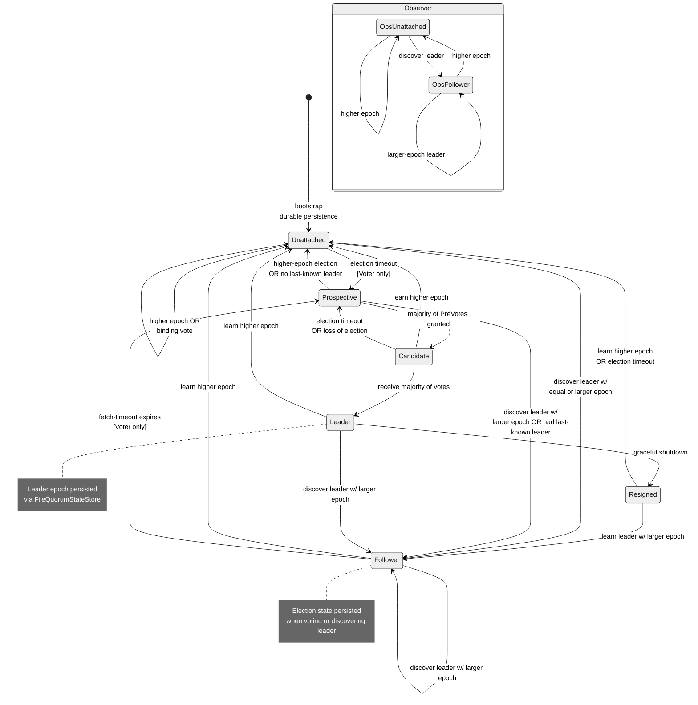
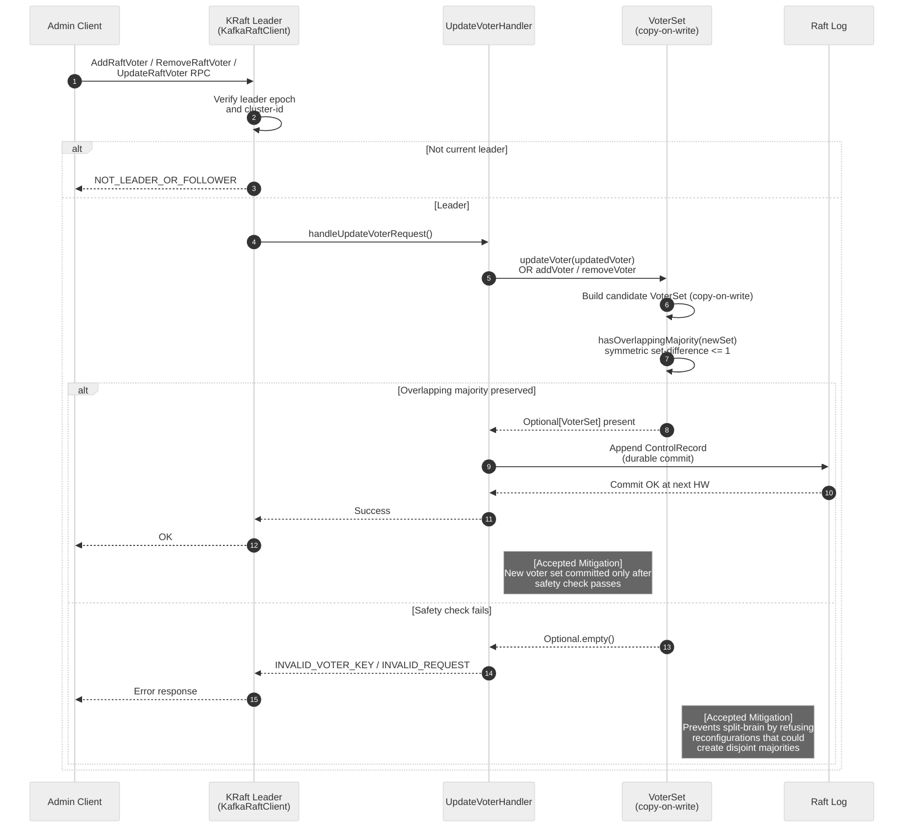

<!--
  Licensed to the Apache Software Foundation (ASF) under one or more
  contributor license agreements. See the NOTICE file distributed with
  this work for additional information regarding copyright ownership.
  The ASF licenses this file to You under the Apache License, Version 2.0
  (the "License"); you may not use this file except in compliance with
  the License. You may obtain a copy of the License at

     http://www.apache.org/licenses/LICENSE-2.0

  Unless required by applicable law or agreed to in writing, software
  distributed under the License is distributed on an "AS IS" BASIS,
  WITHOUT WARRANTIES OR CONDITIONS OF ANY KIND, either express or implied.
  See the License for the specific language governing permissions and
  limitations under the License.
-->

# KRaft Quorum Safety — State Machine and Reconfiguration Invariants

This document visualizes two consensus-layer accepted-mitigation surfaces in Apache Kafka 4.2.0-SNAPSHOT: the KRaft voter-and-observer state machine encoded in `raft/src/main/java/org/apache/kafka/raft/QuorumState.java`, and the overlapping-majority invariant enforced by `VoterSet.hasOverlappingMajority` at `raft/src/main/java/org/apache/kafka/raft/VoterSet.java` during `AddRaftVoter` / `RemoveRaftVoter` / `UpdateRaftVoter` RPC handling. Both surfaces are positive-security controls already implemented in the repository — the audit proposes no code change; these diagrams catalog what is already in place so downstream reviewers can verify the invariants by file and line. Kafka 4.2 is KRaft-only, so ZooKeeper mode is intentionally not depicted.

**Scope:** **Diagram A — KRaft Voter State Machine**; **Diagram B — Voter-Set Reconfiguration Safety (hasOverlappingMajority)**.

## Diagram A — KRaft Voter State Machine

### Legend (State Machine)

| Marker | Meaning |
|---|---|
| Solid arrow `-->` | State transition occurring in-process within `QuorumState`; transitions listed in the class-level javadoc (`raft/src/main/java/org/apache/kafka/raft/QuorumState.java:L40-L80`) |
| `note right of ...` block | Durable persistence touchpoint — election state is written through `FileQuorumStateStore` so the transition survives restart and epoch monotonicity is preserved |
| `[Voter only]` | Transition occurs only when the replica is a member of the current voter set (not an observer / non-voting learner) |
| `state Observer { ... }` nested block | Reduced state machine for non-voting replicas: only `ObsUnattached` and `ObsFollower` are reachable (`QuorumState.java:L71-L81`) |
| `[*]` | Mermaid start-state marker (bootstrap from persisted election state via `FileQuorumStateStore`) |

## Diagram B — Voter-Set Reconfiguration Safety

### Legend (Reconfiguration Safety)

| Marker | Meaning |
|---|---|
| `alt` / `else` / `end` blocks | Conditional paths evaluated by `KafkaRaftClient` and `UpdateVoterHandler`; branching is driven by leader-epoch verification (outer) and the overlapping-majority check (inner) |
| `Note right of ... : [Accepted Mitigation]` | Positive-security enforcement already in place in the audit snapshot — cataloged in [`../accepted-mitigations.md`](../accepted-mitigations.md); these notes are the visual equivalent of a green "mitigation" highlight |
| `autonumber` | Each message is numbered so reviewers can reference specific steps unambiguously |
| Rejection path (`INVALID_VOTER_KEY / INVALID_REQUEST`) | Red path — reconfiguration is refused when `hasOverlappingMajority` returns `false`, preventing disjoint-majority split-brain scenarios |
| Success path (`Append ControlRecord` → `Commit OK at next HW`) | Durable commit to the Raft log only after the safety check passes; the new voter set becomes effective at the next high watermark |

## Key Observations

- `QuorumState` encodes six voter states (`Resigned`, `Unattached`, `Prospective`, `Candidate`, `Leader`, `Follower`) and a reduced observer state machine with only `Unattached` and `Follower`. Every transition is enumerated in the class-level javadoc (`Source: raft/src/main/java/org/apache/kafka/raft/QuorumState.java:L40-L80`); the javadoc is the single source of truth for which transitions are legal.
- The `Prospective` state implements KIP-853 pre-vote: a voter must collect a majority of PreVotes before promoting to `Candidate`, preventing disruption of an otherwise-stable quorum by a partitioned or recently restarted peer (`Source: QuorumState.java:L49-L54`). Pre-vote is a more recent addition than the original KRaft design and is why Diagram A shows `Prospective` as a distinct state rather than folding it into `Candidate`.
- `VoterSet` is declared `public final class` — structurally immutable (`Source: raft/src/main/java/org/apache/kafka/raft/VoterSet.java:L48`). All voter mutations return a **new** `VoterSet` via `addVoter` (L199), `removeVoter` (L221), `updateVoter` (L242), and `updateVoterIgnoringDirectoryId` (L263); the existing instance is never mutated in place, which is the copy-on-write property labeled on the `VSet` participant in Diagram B.
- `VoterSet.hasOverlappingMajority(VoterSet that)` enforces the overlapping-majority invariant using a symmetric set-difference bounded by one: if either direction of `Utils.diff(HashSet::new, ..., ...)` has size greater than 1, the check fails and the reconfiguration is rejected (`Source: VoterSet.java:L319-L325`). A single-voter delta is the maximum allowed change per reconfiguration, ensuring the new quorum overlaps with the previous one and no disjoint majority can form.
- `UpdateVoterHandler.handleUpdateVoterRequest` is the leader-side entry point (`Source: raft/src/main/java/org/apache/kafka/raft/internals/UpdateVoterHandler.java:L75`, on `UpdateVoterHandler.java:L57`); it validates cluster-id, leader-epoch, and supports-version before delegating to the private `updateVoters` helper (L237-L244) which routes to `VoterSet.updateVoter` or `VoterSet.updateVoterIgnoringDirectoryId` based on `kraftVersion.isReconfigSupported()`.
- Leader-epoch monotonicity combined with durable persistence via `FileQuorumStateStore` (`Source: raft/src/main/java/org/apache/kafka/raft/FileQuorumStateStore.java`) ensures that even under partial restarts a voter cannot regress to an earlier epoch; this is the persistence anchor referenced by the `note right of Leader` and `note right of Follower` annotations in Diagram A, and by the "durable commit" step in Diagram B.

**[Accepted Mitigation]** Both the explicit state-machine transition graph in Diagram A AND the overlapping-majority check in Diagram B are positive-security controls already enforced by the codebase. They appear as entries in [`../accepted-mitigations.md`](../accepted-mitigations.md) and must not be regressed in future refactors. Because this is an audit-only engagement, no code change is proposed; the diagrams exist to make these invariants reviewer-visible.

## Sources

- `raft/src/main/java/org/apache/kafka/raft/QuorumState.java:L40-L80` — class-level javadoc documenting the voter and observer state transitions rendered in Diagram A
- `raft/src/main/java/org/apache/kafka/raft/VoterSet.java:L48` — `public final class VoterSet` (structural immutability)
- `raft/src/main/java/org/apache/kafka/raft/VoterSet.java:L199` — `public Optional<VoterSet> addVoter(VoterNode voter)`
- `raft/src/main/java/org/apache/kafka/raft/VoterSet.java:L221` — `public Optional<VoterSet> removeVoter(ReplicaKey voterKey)`
- `raft/src/main/java/org/apache/kafka/raft/VoterSet.java:L242` — `public Optional<VoterSet> updateVoter(VoterNode voter)`
- `raft/src/main/java/org/apache/kafka/raft/VoterSet.java:L263` — `public Optional<VoterSet> updateVoterIgnoringDirectoryId(VoterNode voter)`
- `raft/src/main/java/org/apache/kafka/raft/VoterSet.java:L319-L325` — `hasOverlappingMajority(VoterSet that)` implementation (symmetric set-difference bounded by 1)
- `raft/src/main/java/org/apache/kafka/raft/internals/UpdateVoterHandler.java:L57` — `public final class UpdateVoterHandler`
- `raft/src/main/java/org/apache/kafka/raft/internals/UpdateVoterHandler.java:L75` — `handleUpdateVoterRequest` entry point
- `raft/src/main/java/org/apache/kafka/raft/internals/UpdateVoterHandler.java:L237-L244` — private `updateVoters` helper delegating to `VoterSet.updateVoter` / `VoterSet.updateVoterIgnoringDirectoryId` based on `kraftVersion.isReconfigSupported()`
- `raft/src/main/java/org/apache/kafka/raft/KafkaRaftClient.java` — central client hosting `QuorumState` and the RPC dispatch surface for `AddRaftVoter` (handler at L2244), `RemoveRaftVoter` (L2383), and `UpdateRaftVoter` (L2466) in the 4.2 tree
- `raft/src/main/java/org/apache/kafka/raft/FileQuorumStateStore.java` — durable persistence of election state (QuorumStateData JSON format); the file-backed anchor for leader-epoch monotonicity

## Audit Only Rule and Performance Considerations Bridge

This diagram is a visual artifact produced under the following user-supplied governing rule, reproduced verbatim with the spelling `perofrmace` preserved:

> This run should serve as a dry run for potential changes, research, or documentation. DO NOT modify, create, or delete any existing code in the codebase. Avoid executing any code in the code base, this should be a static analysis. Every deliverable MUST include a markdown file summarizing security vulnerabilities, potential exploits, bugs in the codebase, perofrmace considerations, and remediation recommendations. Verify the NO CHANGES clause by confirming no changes to existing codebase featured in the git differential. Markdown files explicitly related to the analysis performed in this run are permitted.

**Performance Considerations.** The KRaft quorum is on the durability-critical path of every metadata mutation; any reconfiguration safety check that blocks the quorum is a first-order throughput concern. This diagram documents the safety invariants (`VoterSet.hasOverlappingMajority`, leader-epoch monotonicity, copy-on-write `VoterSet`, durable persistence via `FileQuorumStateStore`) but not their hot-path cost. The rule-mandated `perofrmace considerations` deliverable topic is satisfied in the per-category findings under [`../findings/`](../findings/). Performance anchors relevant to this quorum-safety view:

- KRaft FETCH and VOTE RPC cost — Finding 06 (`../findings/06-network-subprocess-access.md`) Section 8: the REPLICATION listener carries the intra-quorum RPC traffic and is exempt from broker-wide connection caps (the exemption is a throughput-preservation decision also cataloged as M4 in [`../accepted-mitigations.md`](../accepted-mitigations.md)).
- Copy-on-write `VoterSet` amortization — Finding 04 (`../findings/04-module-system-builtin-abuse.md`) Section 8 notes that voter-set mutations return a new immutable `VoterSet`; amortization per reconfiguration is bounded by the configured `controller.quorum.voters` cardinality and is negligible in steady state because reconfigurations are rare (single-voter delta per commit).
- Durable state persistence — Finding 08 (`../findings/08-deserialization-attacks.md`) Section 8: `FileQuorumStateStore` JSON serialization latency and the `fsync` cost on every leader-epoch transition.
- Overlapping-majority check — the `Utils.diff(HashSet::new, ...)` evaluation in `hasOverlappingMajority` (VoterSet.java:L319-L325) is O(n) in the voter-set cardinality with a bound of 1 on the set-difference size; for realistic deployments (3, 5, or 7 voters) this is effectively constant and does not gate controller throughput.

**Change Posture.** Consistent with the Audit Only rule, this diagram adds to `docs/security-audit/` only. No pre-existing Kafka source, test, build, documentation, or comment file is modified. The [`../no-change-verification.md`](../no-change-verification.md) artifact carries the git-diff evidence that confirms this invariant.

## Cross-References

- [Category 06 — Network and subprocess access](../findings/06-network-subprocess-access.md) — KRaft RPC surface context for `AddRaftVoter` / `RemoveRaftVoter` / `UpdateRaftVoter`
- [Accepted Mitigations](../accepted-mitigations.md) — overlapping majority, leader-epoch monotonicity, durable-transition enforcement, `VoterSet` immutability
- [Authorization Decision Flow](./authorization-decision-flow.md) — corresponding accepted-mitigation diagram for the KRaft `StandardAuthorizer`
- [Threat Model Overview](./threat-model-overview.md) — whole-system trust-zone context placing the KRaft controller boundary in the larger deployment model
- [Audit README](../README.md) — top-level navigation index for the security-audit tree
