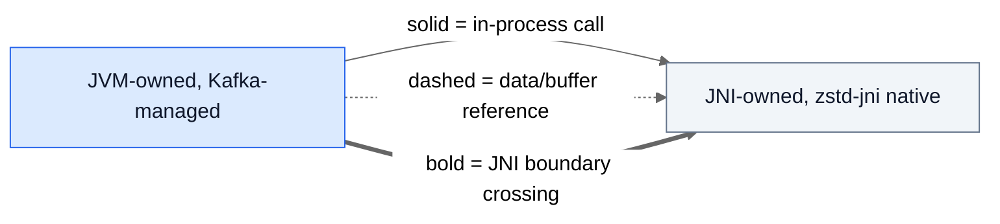

<!--
 Licensed to the Apache Software Foundation (ASF) under one or more
 contributor license agreements. See the NOTICE file distributed with
 this work for additional information regarding copyright ownership.
 The ASF licenses this file to You under the Apache License, Version 2.0
 (the "License"); you may not use this file except in compliance with
 the License. You may obtain a copy of the License at

    http://www.apache.org/licenses/LICENSE-2.0

 Unless required by applicable law or agreed to in writing, software
 distributed under the License is distributed on an "AS IS" BASIS,
 WITHOUT WARRANTIES OR CONDITIONS OF ANY KIND, either express or implied.
 See the License for the specific language governing permissions and
 limitations under the License.
-->

# Native Compression Boundary — JVM ↔ JNI Trust Surface

This document renders the JVM-to-native trust surface for Apache Kafka 4.2.0-SNAPSHOT's Zstandard compression wrapper. It shows how Kafka's `ZstdCompression` bridges Java-heap pooled buffers (`BufferSupplier`, `ChunkedBytesStream`) to the native `zstd-jni 1.5.6-10` library, and where JNI calls cross the trust boundary into `libzstd` C code. The diagram supports **Category 02 — Low-level code safety** and catalogs one accepted mitigation: the explicit Kafka-owned `BufferSupplier` that bounds native-side buffer allocation.

**Scope**: **Diagram: Native Compression Boundary** — JVM-side buffer ownership bridging zstd-jni native pools.

## Native Compression Boundary Diagram

```mermaid
%%{init: {'theme':'neutral'}}%%
%% Title: Native Compression Boundary — JVM ↔ JNI Trust Surface
flowchart LR
    subgraph JVM["Kafka JVM — trusted (Java heap)"]
        Producer[Producer / Fetch pipeline]
        BufferSupplier["BufferSupplier<br/>(Kafka-owned, pooled)"]
        ChunkedBytesStream["ChunkedBytesStream<br/>16 KB bounded chunks"]
        ZstdCompression["ZstdCompression.wrapForInput<br/>ZstdCompression.wrapForOutput"]
    end

    subgraph JNI["zstd-jni 1.5.6-10 — native (off-heap)"]
        ZstdInput["ZstdInputStreamNoFinalizer"]
        ZstdOutput["ZstdOutputStreamNoFinalizer<br/>(uses RecyclingBufferPool.INSTANCE)"]
        NativeZstd["libzstd (native C)<br/>decompression / compression"]
    end

    Producer -->|"wrap call"| ZstdCompression
    ZstdCompression -->|"decompression buffer from Kafka-owned pool"| BufferSupplier
    BufferSupplier -.->|"supplies ByteBuffer (capacity)"| ChunkedBytesStream
    ZstdCompression -->|"wraps input stream"| ZstdInput
    ZstdCompression -->|"wraps output stream"| ZstdOutput
    ZstdInput ==>|"JNI call boundary"| NativeZstd
    ZstdOutput ==>|"JNI call boundary"| NativeZstd
    ChunkedBytesStream -.->|"reads in 16 KB chunks"| ZstdInput

    classDef jvm fill:#DBEAFE,stroke:#2563EB,color:#0F172A
    classDef jni fill:#F1F5F9,stroke:#64748B,color:#0F172A
    classDef boundary stroke-dasharray:5 5
    class Producer,BufferSupplier,ChunkedBytesStream,ZstdCompression jvm
    class ZstdInput,ZstdOutput,NativeZstd jni
```

## Legend

| Visual Convention | Meaning |
| --- | --- |
| Blue box | Kafka JVM-owned component (trusted Java heap) |
| Grey box | zstd-jni native component (off-heap, bridged via JNI) |
| Solid arrow (`-->`) | In-process Java call (no boundary crossing) |
| Dashed arrow (`-.->`) | Buffer or data reference passing (capacity supplied, chunk size bounded) |
| Bold arrow (`==>`) | JNI boundary crossing (trust-boundary — native code executes) |
| `[JVM-owned]` | Plain-text marker: Kafka-managed, Java-heap allocated |
| `[JNI-owned]` | Plain-text marker: zstd-jni native, off-heap |
| `[Accepted Mitigation]` | Plain-text marker: existing positive-security control |

## Key Observations

- **[JVM-owned]** Kafka supplies its own `BufferSupplier` (capacity-bounded, reusable) via an anonymous `BufferPool` implementation rather than delegating to the native `com.github.luben.zstd.RecyclingBufferPool`. This explicitly avoids locking and soft references, as documented by the in-source comment block within `wrapForZstdInput` (`Source: clients/src/main/java/org/apache/kafka/common/compress/ZstdCompression.java:L66-L91`).
- **[JVM-owned]** `ChunkedBytesStream` enforces a 16 KB chunk ceiling on decompression reads; the corresponding `16 * 1024` constant is applied to the wrap-output `BufferedOutputStream` wrapper around `ZstdOutputStreamNoFinalizer` (`Source: clients/src/main/java/org/apache/kafka/common/compress/ZstdCompression.java:L59`), bounding per-stream native buffer allocation.
- **[JVM-owned → JNI-owned]** `ZstdCompression.wrapForInput` wraps `ZstdInputStreamNoFinalizer` with the chunked stream; the `BufferPool` allocator callbacks bridge to `decompressionBufferSupplier.get(capacity)` on allocate and `decompressionBufferSupplier.release(buffer)` on release, keeping every decompression buffer under Kafka's pooled-lifecycle control (`Source: clients/src/main/java/org/apache/kafka/common/compress/ZstdCompression.java:L66-L91`).
- **[JNI-owned]** `ZstdCompression.wrapForOutput` uses zstd-jni's native `RecyclingBufferPool.INSTANCE` with an explicit 16 KB buffered wrapper, preserving compression throughput while keeping the per-stream footprint bounded at the native boundary (`Source: clients/src/main/java/org/apache/kafka/common/compress/ZstdCompression.java:L59`).
- **[JVM-owned]** The import inventory at the top of the file records the three Kafka-owned helpers and the zstd-jni class that collectively define the trust surface: `BufferSupplier`, `ChunkedBytesStream`, and `RecyclingBufferPool` (`Source: clients/src/main/java/org/apache/kafka/common/compress/ZstdCompression.java:L22`, `L25`, `L28`).
- **[JNI-owned]** Both stream wrappers use the `NoFinalizer` variants of the zstd-jni streams. Relying on explicit `close()` rather than JVM finalization avoids indefinite retention of off-heap native buffers that would otherwise depend on GC timing — a subtle but meaningful resource-management property at the JNI boundary.

**[Accepted Mitigation]** The explicit Kafka-owned `BufferSupplier` override is a positive-security design decision: it constrains the native-side memory footprint at the JVM/JNI trust boundary, provides deterministic buffer lifecycle management (no soft references, no cross-session reuse), and defends against compression-bomb decompression allocation growth. Combined with the 16 KB chunk ceiling on `ChunkedBytesStream`, these controls form a defense-in-depth pair for Category 02 (low-level code safety) and are catalogued in `../accepted-mitigations.md`. Any future refactor that removes the `BufferSupplier` injection or raises the chunk ceiling without re-vetting could regress this posture.

## Sources

- `clients/src/main/java/org/apache/kafka/common/compress/ZstdCompression.java:L22` — `BufferSupplier` import
- `clients/src/main/java/org/apache/kafka/common/compress/ZstdCompression.java:L25` — `ChunkedBytesStream` import
- `clients/src/main/java/org/apache/kafka/common/compress/ZstdCompression.java:L28` — `RecyclingBufferPool` import from `com.github.luben.zstd`
- `clients/src/main/java/org/apache/kafka/common/compress/ZstdCompression.java:L59` — 16 KB chunk constant used in `wrapForOutput`
- `clients/src/main/java/org/apache/kafka/common/compress/ZstdCompression.java:L66-L91` — `wrapForInput` and `wrapForZstdInput` with `BufferSupplier` allocator callbacks
- `gradle/dependencies.gradle` — zstd-jni 1.5.6-10 version pinning (verified in `../dependency-inventory.md`)

## Cross-References

- [Category 02 — Low-level code safety](../findings/02-low-level-code-safety.md) — primary finding using this diagram
- [Accepted Mitigations](../accepted-mitigations.md) — catalog of positive-security controls including the `BufferSupplier` override pattern
- [Dependency Inventory](../dependency-inventory.md) — zstd-jni 1.5.6-10 version pinning
- [Audit README](../README.md) — audit navigation index
