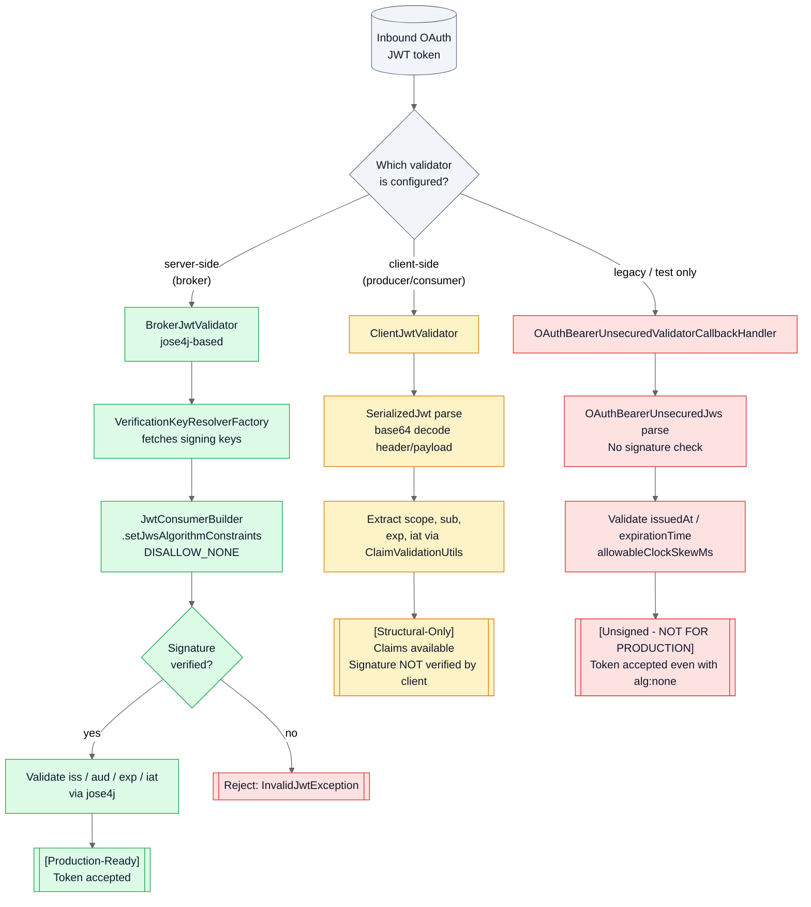
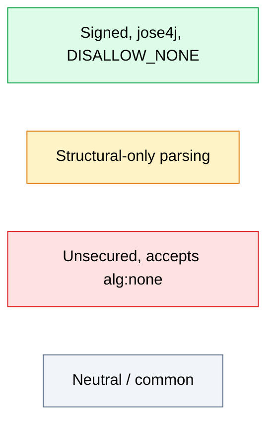

<!--
  Licensed to the Apache Software Foundation (ASF) under one or more
  contributor license agreements. See the NOTICE file distributed with
  this work for additional information regarding copyright ownership.
  The ASF licenses this file to You under the Apache License, Version 2.0
  (the "License"); you may not use this file except in compliance with
  the License. You may obtain a copy of the License at

     http://www.apache.org/licenses/LICENSE-2.0

  Unless required by applicable law or agreed to in writing, software
  distributed under the License is distributed on an "AS IS" BASIS,
  WITHOUT WARRANTIES OR CONDITIONS OF ANY KIND, either express or implied.
  See the License for the specific language governing permissions and
  limitations under the License.
-->

# OAuth JWT Validation Paths — Broker vs Client vs Unsecured

Apache Kafka ships three distinct OAuth/OIDC JWT validator implementations in the
`org.apache.kafka.common.security.oauthbearer` package, each with different trust
assumptions and security guarantees. The broker-side `BrokerJwtValidator` performs
full cryptographic verification against the OAuth/OIDC provider's JWKS using the
jose4j library and explicitly rejects tokens signed with `alg:none` via
`DISALLOW_NONE`. The client-side `ClientJwtValidator` performs only structural parsing
and claim extraction — it intentionally does not verify the signature, because the
broker is the authoritative validator in a Kafka deployment. The legacy
`OAuthBearerUnsecuredValidatorCallbackHandler` (in the `internals.unsecured` sub-package)
accepts unsigned JWTs and only validates clock-skew-bounded `issuedAt` and
`expirationTime` claims; it is a test-only / demonstration facility that must never
be wired into a production listener. This diagram maps the three code paths side by
side so that operators and auditors can see at a glance which implementation is
appropriate for which position in the security perimeter. The audit proposes no
changes to any of these code paths; the diagram is presented as evidence for the
`../accepted-mitigations.md` catalog (DISALLOW_NONE enforcement) and as supporting
context for `../findings/07-external-function-callback-misuse.md`,
`../findings/08-deserialization-attacks.md`, and
`../findings/10-public-api-developer-misuse.md`.

**Diagram: OAuth JWT Validation Paths** — three validator paths with contrasting
trust assumptions: signed-and-verified (broker), structural-only (client), and
unsigned (legacy / test-only).

## Primary Diagram — Three JWT Validator Paths

## Legend

The color conventions below mirror the severity encoding used throughout the
`docs/security-audit/` tree. The compact Mermaid chart immediately beneath renders
the same four classes as standalone nodes so a reader can cross-reference the visual
palette without re-scanning the full diagram.

| Color | Meaning |
|-------|---------|
| Green | Signed with jose4j and `DISALLOW_NONE` — production-safe. Tokens with `alg: none` are rejected before signature verification; tokens that fail signature verification raise `InvalidJwtException`; only fully verified tokens proceed to the claim-check step and terminate at the `[Production-Ready]` accept state. |
| Amber | Structural-only parsing — lightweight, does not verify signatures. Appropriate for client callers (producer / consumer / admin client) where the broker is the authoritative validator; not a standalone authentication mechanism. |
| Red | Unsecured (accepts `alg:none`) — legacy / test-only. Parses `OAuthBearerUnsecuredJws` without any signature check, relying solely on clock-skew-bounded `issuedAt` / `expirationTime` validation. NEVER for production listeners. |
| Grey | Common / neutral entry nodes — the inbound token and the validator-selection decision point that branches into one of the three paths. |

## Key Observations

The following observations are grounded in verified source citations. Each
observation describes an invariant that the diagram preserves visually so a reviewer
can confirm it has not been regressed.

- `BrokerJwtValidator` imports `org.jose4j.jwa.AlgorithmConstraints.DISALLOW_NONE`
  and explicitly applies it via `.setJwsAlgorithmConstraints(DISALLOW_NONE)` when
  building the jose4j `JwtConsumer`. `DISALLOW_NONE` is jose4j's pre-defined policy
  that permits any algorithm **except** `none`, and it is evaluated **before**
  signature verification — so a token asserting `alg: none` is rejected without
  ever reaching the key-resolver step
  (`Source: clients/src/main/java/org/apache/kafka/common/security/oauthbearer/BrokerJwtValidator.java:L52,L131`).
- `BrokerJwtValidator` composes a jose4j `JwtConsumer` using `JwtConsumerBuilder`
  and a `CloseableVerificationKeyResolver` supplied by `VerificationKeyResolverFactory`
  (typically a JWKS endpoint fetcher). The builder chain additionally requires
  `setRequireExpirationTime()` and `setRequireIssuedAt()`, so any token missing the
  `exp` or `iat` claim is rejected alongside any token that fails signature
  verification
  (`Source: clients/src/main/java/org/apache/kafka/common/security/oauthbearer/BrokerJwtValidator.java:L84,L102-L134`).
- `ClientJwtValidator.validate` constructs a `SerializedJwt`, base64-decodes the
  payload via `OAuthBearerUnsecuredJws.toMap`, and extracts `scope`, `sub`, `exp`,
  and `iat` claims via `ClaimValidationUtils` — but it does **not** verify the JWT
  signature. This is intentional: the broker is the authoritative validator in
  Kafka's OAuth deployment model, and the client-side validator exists only to
  surface claims locally and fail fast on malformed tokens before they are sent to
  the broker
  (`Source: clients/src/main/java/org/apache/kafka/common/security/oauthbearer/ClientJwtValidator.java:L61,L96-L125`).
- `OAuthBearerUnsecuredValidatorCallbackHandler.handleCallback` parses the inbound
  token value as `OAuthBearerUnsecuredJws` without any signature check and then
  only invokes `OAuthBearerValidationUtils.validateIssuedAt`,
  `validateExpirationTime`, `validateTimeConsistency`, and `validateScope` —
  all of which are clock-skew and claim-structure checks. The handler does not
  reject `alg:none` tokens and has no concept of a signing key. It is documented in
  the Kafka codebase as a facility for unit testing and demonstration, and it
  remains in the tree for backward compatibility with test harnesses; it must
  never be wired into a production SASL listener
  (`Source: clients/src/main/java/org/apache/kafka/common/security/oauthbearer/internals/unsecured/OAuthBearerUnsecuredValidatorCallbackHandler.java:L161-L204`).

**[Accepted Mitigation]** — The `DISALLOW_NONE` enforcement in `BrokerJwtValidator`
is a positive-security control already in place and cataloged in
`../accepted-mitigations.md`. The invariant is that any PR touching
`BrokerJwtValidator.configure` must preserve the
`.setJwsAlgorithmConstraints(DISALLOW_NONE)` call in the builder chain; removing it
would reintroduce `alg:none` acceptance in the broker-side validator. The audit does
**NOT** recommend any change to this code path.

**[Category 10 — Public API Developer Misuse]** — The continued availability of
`OAuthBearerUnsecuredValidatorCallbackHandler` for configuration by class-name in
the SASL listener properties is a developer-misuse risk documented in
`../findings/10-public-api-developer-misuse.md`. An operator who copies an example
from an internal test fixture into a production `server.properties` (for example,
by setting `listener.name.sasl_ssl.oauthbearer.sasl.server.callback.handler.class`
to `OAuthBearerUnsecuredValidatorCallbackHandler`) will silently disable signature
verification on that listener. The audit does not propose removing the unsecured
handler — that would break test harnesses and constitute a breaking API change —
but it flags the handler's production-wire-ability as a configuration hazard worth
documenting for operators.

## Sources

Every citation below names the exact line range verified during the audit
reconnaissance against the Apache Kafka 4.2.0-SNAPSHOT repository snapshot.

- `clients/src/main/java/org/apache/kafka/common/security/oauthbearer/BrokerJwtValidator.java:L27-L34` — jose4j imports used by the broker-side validator (`JwtClaims`, `MalformedClaimException`, `NumericDate`, `ReservedClaimNames`, `InvalidJwtException`, `JwtConsumer`, `JwtConsumerBuilder`, `JwtContext`).
- `clients/src/main/java/org/apache/kafka/common/security/oauthbearer/BrokerJwtValidator.java:L52` — `import static org.jose4j.jwa.AlgorithmConstraints.DISALLOW_NONE;` — the static import that makes the `DISALLOW_NONE` constant available for the builder chain.
- `clients/src/main/java/org/apache/kafka/common/security/oauthbearer/BrokerJwtValidator.java:L84` — `private final Optional<CloseableVerificationKeyResolver> verificationKeyResolverOpt;` — the broker's handle to the signing-key resolver (typically a JWKS fetcher).
- `clients/src/main/java/org/apache/kafka/common/security/oauthbearer/BrokerJwtValidator.java:L102-L104` — package-visible testing constructor (`BrokerJwtValidator(CloseableVerificationKeyResolver)`) that seeds `verificationKeyResolverOpt` with a caller-supplied resolver instead of the default JWKS factory.
- `clients/src/main/java/org/apache/kafka/common/security/oauthbearer/BrokerJwtValidator.java:L107-L138` — `configure(Map, String, List<AppConfigurationEntry>)` method body; the `JwtConsumerBuilder` assignment at L130-L135 contains `.setJwsAlgorithmConstraints(DISALLOW_NONE)` at L131, `.setRequireExpirationTime()` at L132, `.setRequireIssuedAt()` at L133, `.setVerificationKeyResolver(verificationKeyResolver)` at L134, and `.build()` at L135.
- `clients/src/main/java/org/apache/kafka/common/security/oauthbearer/ClientJwtValidator.java:L61` — `public class ClientJwtValidator implements JwtValidator` — the client-side validator class declaration.
- `clients/src/main/java/org/apache/kafka/common/security/oauthbearer/ClientJwtValidator.java:L96-L125` — the `validate(String accessToken)` method body, which performs `SerializedJwt` construction, payload base64 decoding via `OAuthBearerUnsecuredJws.toMap`, and claim extraction via `ClaimValidationUtils` without any signature verification.
- `clients/src/main/java/org/apache/kafka/common/security/oauthbearer/internals/unsecured/OAuthBearerUnsecuredValidatorCallbackHandler.java:L154-L177` — the `handleCallback(OAuthBearerValidatorCallback)` body, which constructs `OAuthBearerUnsecuredJws` without any signature check and only runs clock-skew-bounded `issuedAt` / `expirationTime` / `timeConsistency` / `scope` validation.
- `clients/src/main/java/org/apache/kafka/common/security/oauthbearer/internals/unsecured/OAuthBearerUnsecuredValidatorCallbackHandler.java:L194-L207` — the `allowableClockSkewMs()` helper that parses the `unsecuredValidatorAllowableClockSkewMs` JAAS option (rejecting negative values with `OAuthBearerConfigException`).

## Cross-References

- [Category 07 — External function and callback misuse](../findings/07-external-function-callback-misuse.md) — consolidated finding covering the `OAuthBearerValidatorCallbackHandler` SASL-extension acceptance model, the unsecured callback handler, and other pluggable callback surfaces.
- [Category 08 — Deserialization attacks](../findings/08-deserialization-attacks.md) — consolidated finding covering JWT parsing (including the jose4j-based broker path and the base64-plus-JSON client path), Jackson feature flags, and related (de)serialization surfaces.
- [Category 10 — Public API developer misuse](../findings/10-public-api-developer-misuse.md) — consolidated finding covering configuration-by-class-name hazards, including the ability to wire `OAuthBearerUnsecuredValidatorCallbackHandler` into a production listener.
- [Accepted Mitigations](../accepted-mitigations.md) — catalog of positive-security controls already in place, including the `DISALLOW_NONE` enforcement in `BrokerJwtValidator`.
- [Audit README](../README.md) — top-level navigation index for the `docs/security-audit/` tree.
