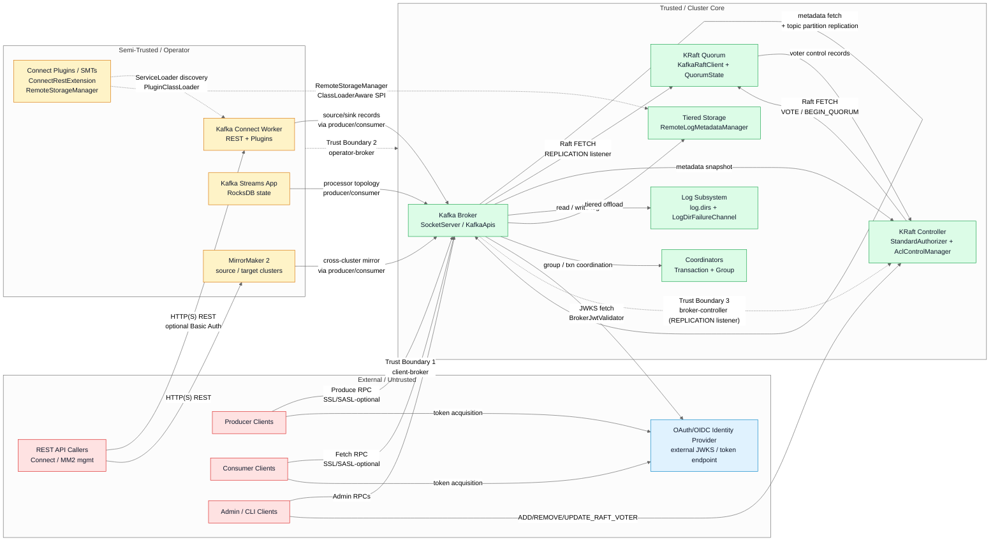
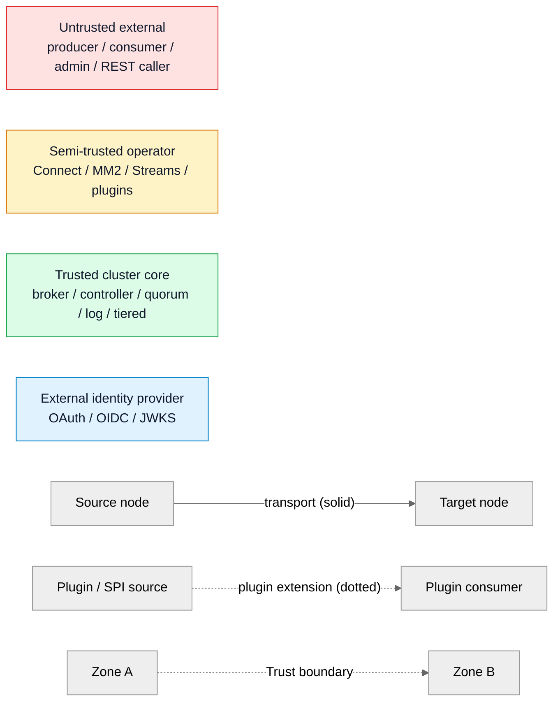

<!--
  Licensed to the Apache Software Foundation (ASF) under one or more
  contributor license agreements. See the NOTICE file distributed with
  this work for additional information regarding copyright ownership.
  The ASF licenses this file to You under the Apache License, Version 2.0
  (the "License"); you may not use this file except in compliance with
  the License. You may obtain a copy of the License at

     http://www.apache.org/licenses/LICENSE-2.0

  Unless required by applicable law or agreed to in writing, software
  distributed under the License is distributed on an "AS IS" BASIS,
  WITHOUT WARRANTIES OR CONDITIONS OF ANY KIND, either express or implied.
  See the License for the specific language governing permissions and
  limitations under the License.
-->

# Threat Model Overview — Kafka 4.2 Trust Zones and Data Flow

This document is the single top-level threat model for the Apache Kafka 4.2.0-SNAPSHOT monorepo as it exists at the audit snapshot; it serves as the visual anchor that every finding and every sibling diagram in the `docs/security-audit/` tree references. Kafka 4.2 is KRaft-only, so the model depicts brokers, KRaft controllers, operator-plane components (Connect, MirrorMaker 2, Streams), plus an external OAuth/OIDC identity provider, partitioned into three coarse trust zones: external-untrusted, semi-trusted-operator, and trusted-cluster-core. Per the user-specified Visual Architecture Documentation rule, the diagram encodes three edge conventions — transport (solid), trust-boundary (dashed), and plugin/extension (dotted) — each paired with a descriptive label so a reviewer can locate every RPC surface, every service-loader hand-off, and every principal-translation point in one view. The audit modifies no architecture; therefore only a current-state view is produced (no before/after pair).

**Diagram: Threat Model Overview** — producers, consumers, brokers, KRaft controllers, Connect workers, MirrorMaker 2, OAuth/OIDC provider, admin clients; single current-state view.

## Primary Diagram — Kafka 4.2 Trust Zones

## Legend

The legend below is a standalone rendering of the four trust-zone colors and the three edge styles used in the primary diagram.

| Marker | Meaning |
|---|---|
| Red fill (`#FEE2E2`, stroke `#DC2626`) | External / untrusted actor (producer, consumer, admin, REST caller) |
| Amber fill (`#FEF3C7`, stroke `#D97706`) | Semi-trusted operator (Connect worker, MirrorMaker 2, Streams app, plugins) |
| Green fill (`#DCFCE7`, stroke `#16A34A`) | Trusted cluster core (broker, KRaft controller, quorum, log subsystem, tiered storage, coordinators) |
| Blue fill (`#E0F2FE`, stroke `#0284C7`) | External identity provider (OAuth / OIDC / JWKS) |
| Solid arrow `-->` | Data or RPC transport (SSL/SASL-governed at the protocol layer) |
| Dotted arrow `-.->` | Plugin / ServiceLoader extension point |
| Dashed arrow `-.->` with "Trust boundary" label | Trust-boundary crossing (principal translation, AuthN/AuthZ required) |

## Key Observations

- Kafka 4.2 is KRaft-only — ZooKeeper is not part of the threat model in this audit.
- There are three coarse trust zones: external/untrusted, semi-trusted-operator, and trusted-cluster-core. Every trust-boundary crossing relies on SSL/SASL (transport + authentication) and, for broker-side decisions, on `StandardAuthorizer.authorize` (see [`./authorization-decision-flow.md`](./authorization-decision-flow.md)).
- The REPLICATION listener is exempt from broker-wide connection caps and is used for intra-cluster replication (`Source: core/src/main/scala/kafka/network/ConnectionQuotas.scala`, i.e. the `ConnectionQuotas` class declared inside `core/src/main/scala/kafka/network/SocketServer.scala:L1285-L1487` in the 4.2 tree; the `protectedListener` predicate at L1486-L1487 short-circuits the broker-wide cap for the configured inter-broker listener) — this is both a performance decision and an accepted-mitigation (cataloged in [`../accepted-mitigations.md`](../accepted-mitigations.md)).
- Operator-plane components (Connect, MM2, Streams) consume the same producer/consumer API as external clients; they are only "semi-trusted" because their plugins execute user-supplied code via `ServiceLoader` discovery and `PluginClassLoader` isolation (see [`./connect-rest-trust-boundary.md`](./connect-rest-trust-boundary.md) and `../findings/04-module-system-builtin-abuse.md`).
- External OAuth/OIDC providers are shown as a distinct zone because both brokers (JWKS fetch) and clients (token acquisition) cross a trust boundary to reach them; broker-side validation uses `BrokerJwtValidator` with `DISALLOW_NONE` (see [`./oauth-jwt-validation-paths.md`](./oauth-jwt-validation-paths.md)).
- Admin reconfiguration of the voter set flows through the controller and is gated by `VoterSet.hasOverlappingMajority` (see [`./kraft-quorum-safety.md`](./kraft-quorum-safety.md)).
- `[Accepted Mitigations]` summary: This diagram is complemented by four dedicated mitigation and attack-surface diagrams (authorization decision flow, KRaft quorum safety, Connect REST trust boundary, OAuth JWT validation paths) plus the native-compression boundary and the attack-surface map — all referenced below.

## Sources

The citations below are the code anchors that ground every edge and every zone in the primary diagram. File paths are given relative to the repository root; where a cited class lives inside a larger file in the 4.2 tree, the line range is annotated for auditor convenience.

- `core/src/main/scala/kafka/network/SocketServer.scala` — inbound transport surface (SSL/SASL negotiated); also hosts the `ConnectionQuotas` class (L1285-L1487 in the 4.2 tree).
- `core/src/main/scala/kafka/network/ConnectionQuotas.scala` — per-IP / per-listener / broker-wide caps + REPLICATION (inter-broker) listener exemption. In Kafka 4.2 this class is physically located inside `SocketServer.scala` at the line range noted above; the `protectedListener` predicate (L1486-L1487) encodes the exemption.
- `raft/src/main/java/org/apache/kafka/raft/KafkaRaftClient.java` — KRaft Raft client (VOTE / BEGIN_QUORUM_EPOCH / END_QUORUM_EPOCH / FETCH / ADD_RAFT_VOTER / REMOVE_RAFT_VOTER / UPDATE_RAFT_VOTER RPC surface).
- `raft/src/main/java/org/apache/kafka/raft/QuorumState.java` — quorum state machine (Resigned / Unattached / Prospective / Candidate / Leader / Follower transitions documented in the Javadoc at L36-L83).
- `raft/src/main/java/org/apache/kafka/raft/VoterSet.java` — voter-set invariants (`public final class VoterSet` at L48; `addVoter` at L199, `removeVoter` at L221, `hasOverlappingMajority` at L319).
- `metadata/src/main/java/org/apache/kafka/metadata/authorizer/StandardAuthorizerData.java` — authorization decision data structure (`loadingComplete` at L92, `superUsers` at L97).
- `storage/api/src/main/java/org/apache/kafka/server/log/remote/storage/RemoteStorageManager.java`, `RemoteLogMetadataManager.java` — Tiered Storage plugin surfaces (ClassLoaderAware SPI).
- `connect/runtime/src/main/java/org/apache/kafka/connect/runtime/rest/RestServer.java` — Connect REST (Jetty `CrossOriginHandler` at import L45, embedded control plane).
- `connect/runtime/src/main/java/org/apache/kafka/connect/runtime/isolation/PluginClassLoader.java`, `DelegatingClassLoader.java` — plugin isolation (child-first `URLClassLoader` at L41 / L47).
- `connect/mirror/src/main/java/org/apache/kafka/connect/mirror/MirrorMakerConfig.java` — MirrorMaker 2 (`public final class MirrorMakerConfig extends AbstractConfig` at L60).
- `clients/src/main/java/org/apache/kafka/common/security/oauthbearer/BrokerJwtValidator.java`, `ClientJwtValidator.java` — OAuth validation (broker-side import of `DISALLOW_NONE` at L52 of `BrokerJwtValidator.java`; `ClientJwtValidator` at L61 performs structural-only validation, see Javadoc at L49-L58).

## Audit Only Rule and Performance Considerations Bridge

This diagram is a visual artifact produced under the following user-supplied governing rule, reproduced verbatim with the spelling `perofrmace` preserved:

> This run should serve as a dry run for potential changes, research, or documentation. DO NOT modify, create, or delete any existing code in the codebase. Avoid executing any code in the code base, this should be a static analysis. Every deliverable MUST include a markdown file summarizing security vulnerabilities, potential exploits, bugs in the codebase, perofrmace considerations, and remediation recommendations. Verify the NO CHANGES clause by confirming no changes to existing codebase featured in the git differential. Markdown files explicitly related to the analysis performed in this run are permitted.

**Performance Considerations.** This diagram is a current-state visualization of Kafka 4.2 trust zones and data flow; it modifies no architecture, proposes no redesign, and adds no runtime cost. The rule-mandated `perofrmace considerations` deliverable topic is satisfied in the per-category findings under [`../findings/`](../findings/). Each finding file carries an 11-section template in which `## 8. Performance Considerations` documents the hot-path and throughput implications of the corresponding attack surface. Specific performance anchors relevant to this trust-model view:

- Client-broker boundary throughput — see Finding 03 (`../findings/03-resource-limit-evasion.md`) Section 8: per-IP/per-listener connection caps, percentage-based request throttling, REPLICATION listener exemption as a throughput-preservation decision.
- Intra-cluster replication hot path — see Finding 02 (`../findings/02-low-level-code-safety.md`) Section 8: native `zstd-jni`, `lz4-java`, `snappy-java` decompression throughput on the fetch and produce paths, `BufferSupplier` amortization.
- Operator-plane REST hot path — see Finding 06 (`../findings/06-network-subprocess-access.md`) Section 8: Jetty `GzipHandler` and `CrossOriginHandler` request-decoding cost for the Connect worker and MirrorMaker 2 REST.
- External identity provider (OAuth/OIDC) boundary — see Finding 08 (`../findings/08-deserialization-attacks.md`) Section 8: jose4j JWT-parse and signature-verify latency on every SASL handshake.
- Authorization decision cost at the broker-controller boundary — see Finding 09 (`../findings/09-information-leakage.md`) Section 8 and the `StandardAuthorizerData` copy-on-write discussion in [`../accepted-mitigations.md`](../accepted-mitigations.md) (M9).

**Change Posture.** Consistent with the Audit Only rule, this diagram adds to `docs/security-audit/` only. No pre-existing Kafka source, test, build, documentation, or comment file is modified. The [`../no-change-verification.md`](../no-change-verification.md) artifact carries the git-diff evidence that confirms this invariant.

## Cross-References

- [Attack Surface Map](./attack-surface-map.md) — matrix overlay of ten categories on these modules
- [Authorization Decision Flow](./authorization-decision-flow.md) — broker-side AuthZ at the client-broker boundary
- [KRaft Quorum Safety](./kraft-quorum-safety.md) — broker-controller boundary invariants
- [Connect REST Trust Boundary](./connect-rest-trust-boundary.md) — REST-API boundary detail
- [OAuth JWT Validation Paths](./oauth-jwt-validation-paths.md) — identity-provider boundary detail
- [Native Compression Boundary](./native-compression-boundary.md) — JVM/JNI internal trust boundary
- [Accepted Mitigations](../accepted-mitigations.md)
- [Audit README](../README.md)
