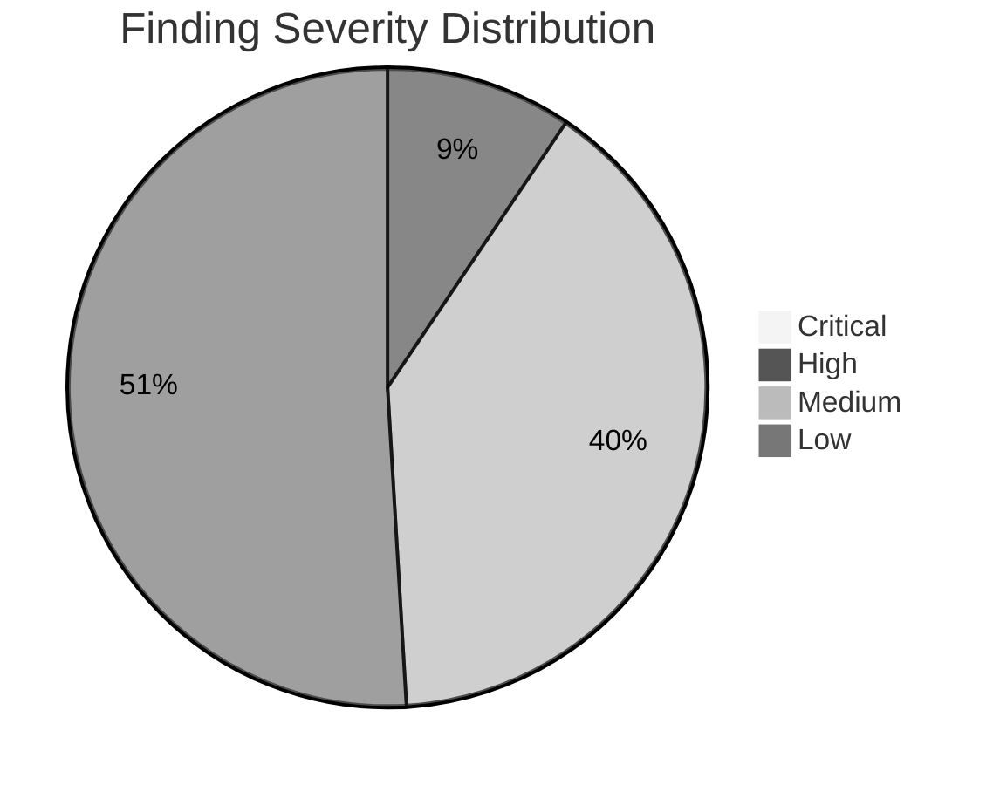

<!--
  Licensed to the Apache Software Foundation (ASF) under one
  or more contributor license agreements.  See the NOTICE file
  distributed with this work for additional information
  regarding copyright ownership.  The ASF licenses this file
  to you under the Apache License, Version 2.0 (the
  "License"); you may not use this file except in compliance
  with the License.  You may obtain a copy of the License at

    http://www.apache.org/licenses/LICENSE-2.0

  Unless required by applicable law or agreed to in writing,
  software distributed under the License is distributed on an
  "AS IS" BASIS, WITHOUT WARRANTIES OR CONDITIONS OF ANY
  KIND, either express or implied.  See the License for the
  specific language governing permissions and limitations
  under the License.
-->

# Severity Matrix - Audit Finding Cross-Reference

| Field                  | Value                                                                 |
|------------------------|-----------------------------------------------------------------------|
| Audit Target           | Apache Kafka 4.2.0-SNAPSHOT                                           |
| Audit Snapshot Date    | 2026-04-17                                                            |
| Git Branch             | `blitzy-4bdad1ad-dc01-4556-9ef0-4c760b777d5a`                         |
| Scope                  | Static, read-only security vulnerability assessment                   |
| Governing Rule         | Audit Only (see [`./README.md`](./README.md))                         |
| Change Posture         | Zero modifications to existing code, comments, tests, or build files  |
| Related Manifest       | [`./no-change-verification.md`](./no-change-verification.md)          |
| Finding Count          | 53 rows across 10 categories                                          |
| Severity Distribution  | 0 Critical / 5 High / 21 Medium / 27 Low                              |

This document is the single **at-a-glance drill-down artifact** for the ten-category security
audit of Apache Kafka 4.2.0-SNAPSHOT. It enumerates every finding catalogued under
[`./findings/`](./findings/) with one row per distinct surface, together with a severity tag,
the conditions under which an adversary could exploit the surface, the resulting business
impact, and a hyperlink to the per-category findings document that contains the full evidence
narrative. The audit itself applies **no** code changes; every row describes an **observed
state** of the codebase, not a recommended modification.

Reviewers seeking a specific finding can use this matrix as the primary entry point and then
drill into the appropriate file under [`./findings/`](./findings/) for file-line citations,
attack-vector narratives, and pointers to existing mitigations. Reviewers seeking the set of
**already-present positive-security controls** that lower the severity of several findings
should consult [`./accepted-mitigations.md`](./accepted-mitigations.md) in parallel. Reviewers
seeking the prescribed future-state action list should consult
[`./remediation-roadmap.md`](./remediation-roadmap.md); the roadmap organizes every row in this
matrix into a phased plan without applying any change in this run.

---

## Table of Contents

1. [Severity Definitions](#1-severity-definitions)
2. [Severity Distribution Summary](#2-severity-distribution-summary)
3. [Master Severity Table](#3-master-severity-table)
    - [Category 01 - Filesystem Access and Path Traversal](#31-category-01---filesystem-access-and-path-traversal)
    - [Category 02 - Low-Level Code Safety](#32-category-02---low-level-code-safety)
    - [Category 03 - Resource Limit Evasion](#33-category-03---resource-limit-evasion)
    - [Category 04 - Module System and Built-in Abuse](#34-category-04---module-system-and-built-in-abuse)
    - [Category 05 - Infinite Loop and Recursion DoS (ReDoS)](#35-category-05---infinite-loop-and-recursion-dos-redos)
    - [Category 06 - Network and Subprocess Access](#36-category-06---network-and-subprocess-access)
    - [Category 07 - External Function and Callback Misuse](#37-category-07---external-function-and-callback-misuse)
    - [Category 08 - Deserialization Attacks](#38-category-08---deserialization-attacks)
    - [Category 09 - Information Leakage](#39-category-09---information-leakage)
    - [Category 10 - Public API Developer Misuse](#310-category-10---public-api-developer-misuse)
4. [Severity by Category Cross-Reference](#4-severity-by-category-cross-reference)
5. [Severity Calibration Note](#5-severity-calibration-note)
6. [Drill-Down Navigation](#6-drill-down-navigation)

---

## 1. Severity Definitions

The audit uses a four-tier severity model aligned with the `README.md` introduction. Severity
captures the **difficulty of exploitation** against the **default configuration** of Apache
Kafka 4.2.0-SNAPSHOT; it is **not** a blanket CVSS score. Every tag describes an observed
property of the current code state; no tag implies a recommended change.

| Severity    | Plain-Text Tag | Definition                                                                                                                                                                                            |
|-------------|----------------|-------------------------------------------------------------------------------------------------------------------------------------------------------------------------------------------------------|
| Critical    | `[Critical]`   | Remote exploitation or full authentication bypass with **no prerequisites** and **no operator misconfiguration**. Immediate operational risk in default deployments.                                  |
| High        | `[High]`       | Requires operator misconfiguration or privileged context (for example, deployment of a module explicitly labelled "not for production"). Significant impact on confidentiality, integrity, or availability. |
| Medium      | `[Medium]`     | Requires specific conditions - operator foot-gun, adversary-in-network, or narrow local prerequisites. Impact is real but can be avoided by a documented hardening step.                              |
| Low         | `[Low]`        | Defense-in-depth observation. Frequently mitigated by existing controls (see [`./accepted-mitigations.md`](./accepted-mitigations.md)) but worth documenting to prevent regression.                   |

Entries tagged `[Low] (Accepted Mitigation)` describe **positive-security properties** already
present in the codebase that the audit catalogs for completeness. They are recorded here to
make future reviewers aware the property is security-critical; they are never
vulnerabilities.

---

## 2. Severity Distribution Summary

The pie chart below, titled **Finding Severity Distribution**, summarizes the
**row count** of the master severity table by severity tier. The input figures are produced
directly from the table in Section 3 and verified against the per-category cross-reference
matrix in Section 4. The diagram is referenced by name from the executive reveal.js deck
([`./executive-summary.html`](./executive-summary.html)) and from
[`./README.md`](./README.md).

**Legend**

- **Critical** - Remote exploitation with no prerequisites (zero findings in this audit).
- **High** - Operator misconfiguration or production use of a non-production module.
- **Medium** - Specific conditions (operator foot-gun, adversary-in-network).
- **Low** - Defense-in-depth or already-mitigated observations.

Totals: **53 findings** across ten vulnerability categories. The distribution reflects the
posture that Kafka's secure-by-default configuration keeps the Critical count at zero while
the majority of surfaces are either already mitigated (Low) or require a specific operator
action to expose (Medium).

---

## 3. Master Severity Table

The master table below carries one row per distinct finding. Columns are:

| Column                | Content                                                                                                              |
|-----------------------|----------------------------------------------------------------------------------------------------------------------|
| **ID**                | Stable finding identifier of the form `NN.M` where `NN` is the category (01 through 10) and `M` is a running index.  |
| **Category**          | Short category label (`Cat 01` through `Cat 10`). Full category title appears in each subsection heading.             |
| **Finding Title**     | One-line descriptive label. Bold-code formatting is used for Java / Scala / Python identifiers.                      |
| **Severity**          | Plain-text tag from the taxonomy in Section 1 (`[Critical]`, `[High]`, `[Medium]`, `[Low]`). No emojis.              |
| **Exploit Prerequisites** | Conditions that must hold for an adversary to exploit the surface. Phrased from the adversary's capability side. |
| **Business Impact**   | Operational consequence phrased for a non-technical reader. Full technical impact appears in the finding document.   |
| **Reference**         | Hyperlink back to the per-category finding document under [`./findings/`](./findings/).                              |

Each sub-heading names the category verbatim from the user-specified enumeration preserved in
[`./README.md`](./README.md) and the Agent Action Plan.

### 3.1 Category 01 - Filesystem Access and Path Traversal

| ID   | Category | Finding Title                                                                      | Severity   | Exploit Prerequisites                                                          | Business Impact                                                         | Reference                                                                                |
|------|----------|------------------------------------------------------------------------------------|------------|--------------------------------------------------------------------------------|-------------------------------------------------------------------------|------------------------------------------------------------------------------------------|
| 01.1 | Cat 01   | `FileConfigProvider` unrestricted file read                                        | `[Medium]` | Operator provides a path string from an untrusted configuration source         | Secret disclosure if misconfigured                                      | [Finding](./findings/01-filesystem-access-path-traversal.md)                             |
| 01.2 | Cat 01   | `DirectoryConfigProvider` without `allowed.paths`                                  | `[Medium]` | Operator omits the `allowed.paths` allow-list                                  | Mass secret disclosure across the configuration directory               | [Finding](./findings/01-filesystem-access-path-traversal.md)                             |
| 01.3 | Cat 01   | `EnvVarConfigProvider` default `allowlist.pattern` `.*`                            | `[Low]`    | Default configuration permits every environment variable                       | Environment-variable enumeration by any configured consumer             | [Finding](./findings/01-filesystem-access-path-traversal.md)                             |
| 01.4 | Cat 01   | Connect `plugin.path` traversal via `DelegatingClassLoader`                        | `[Medium]` | Adversary has write access to the configured plugin directories                | Plugin substitution leading to arbitrary code execution in the worker   | [Finding](./findings/01-filesystem-access-path-traversal.md)                             |
| 01.5 | Cat 01   | `KafkaCSVMetricsReporter` directory deletion via `Utils.delete`                    | `[Low]`    | Broker-privileged path injection through a reporter configuration              | Denial of metrics collection for a single reporter                      | [Finding](./findings/01-filesystem-access-path-traversal.md)                             |
| 01.6 | Cat 01   | `FileJwtRetriever` / `JwtBearerJwtRetriever` arbitrary file read                   | `[Medium]` | Operator misconfigures OAuth JWT / assertion / private-key file path           | JWT or private-key disclosure via path-substitution                     | [Finding](./findings/01-filesystem-access-path-traversal.md)                             |

### 3.2 Category 02 - Low-Level Code Safety

| ID   | Category | Finding Title                                                                           | Severity | Exploit Prerequisites               | Business Impact                                | Reference                                                               |
|------|----------|-----------------------------------------------------------------------------------------|----------|-------------------------------------|------------------------------------------------|-------------------------------------------------------------------------|
| 02.1 | Cat 02   | `ZstdCompression` JNI boundary (zstd-jni 1.5.6-10)                                      | `[Low]`  | Adversary crafts a malformed zstd stream | Native-code crash leading to broker denial-of-service | [Finding](./findings/02-low-level-code-safety.md)                       |
| 02.2 | Cat 02   | `SnappyCompression` JNI boundary (snappy-java 1.1.10.7)                                 | `[Low]`  | Adversary crafts a malformed snappy stream | Native-code crash leading to broker denial-of-service | [Finding](./findings/02-low-level-code-safety.md)                       |
| 02.3 | Cat 02   | `Lz4Compression` JNI boundary (lz4-java 1.8.0)                                          | `[Low]`  | Adversary crafts a malformed lz4 stream    | Native-code crash leading to broker denial-of-service | [Finding](./findings/02-low-level-code-safety.md)                       |
| 02.4 | Cat 02   | RocksDB JNI for Streams state stores (rocksdbjni 10.1.3)                                | `[Low]`  | Local disk access to the state directory | State corruption or native-process crash      | [Finding](./findings/02-low-level-code-safety.md)                       |
| 02.5 | Cat 02   | `SimpleMemoryPool` non-strict mode allows transient over-allocation                     | `[Low]`  | Sustained traffic burst while pool is in non-strict mode | Transient memory pressure; auto-recovery on burst end | [Finding](./findings/02-low-level-code-safety.md)                       |

### 3.3 Category 03 - Resource Limit Evasion

| ID   | Category | Finding Title                                                                             | Severity   | Exploit Prerequisites                                                   | Business Impact                                       | Reference                                                              |
|------|----------|-------------------------------------------------------------------------------------------|------------|-------------------------------------------------------------------------|-------------------------------------------------------|------------------------------------------------------------------------|
| 03.1 | Cat 03   | REPLICATION listener exempt from broker-wide connection cap                               | `[Medium]` | Adversary controls the REPLICATION listener (internal network) | Connection exhaustion via the inter-broker port       | [Finding](./findings/03-resource-limit-evasion.md)                     |
| 03.2 | Cat 03   | `ClientRequestQuotaManager` 10-second sliding window permits short-term spikes            | `[Low]`    | Large request burst within a single sliding window             | Temporary latency spike that auto-recovers            | [Finding](./findings/03-resource-limit-evasion.md)                     |
| 03.3 | Cat 03   | Per-IP connection caps bypassable by distributed clients                                  | `[Medium]` | Distributed attacker (for example, a botnet) with diverse IPs  | Denial-of-service via IP diversity                    | [Finding](./findings/03-resource-limit-evasion.md)                     |

### 3.4 Category 04 - Module System and Built-in Abuse

| ID   | Category | Finding Title                                                                                | Severity   | Exploit Prerequisites                                          | Business Impact                                       | Reference                                                                 |
|------|----------|----------------------------------------------------------------------------------------------|------------|----------------------------------------------------------------|-------------------------------------------------------|---------------------------------------------------------------------------|
| 04.1 | Cat 04   | Connect REST extensions loaded via `ServiceLoader`                                           | `[Medium]` | Adversary controls the `rest.extension.classes` configuration  | Arbitrary code execution inside the Connect runtime   | [Finding](./findings/04-module-system-builtin-abuse.md)                   |
| 04.2 | Cat 04   | Connect `plugin.path` `ServiceLoader` / reflective instantiation                             | `[Medium]` | Adversary writes to one of the plugin directories              | Arbitrary code execution inside the Connect runtime   | [Finding](./findings/04-module-system-builtin-abuse.md)                   |
| 04.3 | Cat 04   | MirrorMaker 2 `FORWARDING_ADMIN_CLASS` reflective instantiation                              | `[Medium]` | Adversary supplies a forwarding-admin class reference          | Arbitrary admin-client behavior against source/target | [Finding](./findings/04-module-system-builtin-abuse.md)                   |
| 04.4 | Cat 04   | Tiered Storage `RemoteStorageManager` / `RemoteLogMetadataManager` plugin loader             | `[Medium]` | Adversary supplies a remote-storage-manager class reference    | Arbitrary code execution inside the broker            | [Finding](./findings/04-module-system-builtin-abuse.md)                   |
| 04.5 | Cat 04   | OAuth `JwtValidator` / `JwtRetriever` pluggable SPI                                          | `[Low]`    | Operator configures a malicious validator class                | Authentication bypass by a replaced validator         | [Finding](./findings/04-module-system-builtin-abuse.md)                   |
| 04.6 | Cat 04   | Metrics reporters pluggable via `kafka.metrics.reporters`                                    | `[Low]`    | Operator configures a malicious metrics reporter               | Data exfiltration through the metrics pipeline        | [Finding](./findings/04-module-system-builtin-abuse.md)                   |

### 3.5 Category 05 - Infinite Loop and Recursion DoS (ReDoS)

| ID   | Category | Finding Title                                                                                                       | Severity   | Exploit Prerequisites                                            | Business Impact                                         | Reference                                                                     |
|------|----------|---------------------------------------------------------------------------------------------------------------------|------------|------------------------------------------------------------------|---------------------------------------------------------|-------------------------------------------------------------------------------|
| 05.1 | Cat 05   | `KerberosRule` - four `Pattern.compile` sites on user-influenceable input                                           | `[Medium]` | Adversary controls an auth principal component                   | Kerberos auth pipeline CPU exhaustion                   | [Finding](./findings/05-infinite-loop-recursion-dos.md)                       |
| 05.2 | Cat 05   | `JmxReporter` `INCLUDE` / `EXCLUDE` regex filters                                                                   | `[Low]`    | Operator supplies an adversarial regex pattern                   | JMX initialization CPU spike                            | [Finding](./findings/05-infinite-loop-recursion-dos.md)                       |
| 05.3 | Cat 05   | `ConfigDef` / `ConfigTransformer` regex parsing of configuration values                                             | `[Low]`    | Operator supplies an adversarial configuration value             | Configuration parsing CPU spike                         | [Finding](./findings/05-infinite-loop-recursion-dos.md)                       |
| 05.4 | Cat 05   | `EnvVarConfigProvider` `allowlist.pattern` user-supplied regex                                                      | `[Low]`    | Operator supplies an adversarial `allowlist.pattern`             | Environment-variable load CPU spike                     | [Finding](./findings/05-infinite-loop-recursion-dos.md)                       |
| 05.5 | Cat 05   | `ServerConnectionId` / `ApiVersionsRequest` / `OAuthBearerClientInitialResponse` regex on wire input                | `[Low]`    | Crafted client input at connection / request time                | Per-connection CPU spike                                | [Finding](./findings/05-infinite-loop-recursion-dos.md)                       |

### 3.6 Category 06 - Network and Subprocess Access

| ID   | Category | Finding Title                                                                                                        | Severity   | Exploit Prerequisites                                              | Business Impact                                               | Reference                                                                  |
|------|----------|----------------------------------------------------------------------------------------------------------------------|------------|--------------------------------------------------------------------|---------------------------------------------------------------|----------------------------------------------------------------------------|
| 06.1 | Cat 06   | Connect REST `JaasBasicAuthFilter.INTERNAL_REQUEST_MATCHERS` bypass for task / fence paths                           | `[High]`   | Adversary reaches the Connect REST port over the network           | Unauthenticated task creation or producer-fencing             | [Finding](./findings/06-network-subprocess-access.md)                      |
| 06.2 | Cat 06   | Connect REST `RestClient` forwards inbound `Authorization` header to outbound worker-peer call                       | `[Medium]` | Adversary supplies a forged `Authorization` header                 | SSRF-shaped credential propagation to a Connect worker peer   | [Finding](./findings/06-network-subprocess-access.md)                      |
| 06.3 | Cat 06   | `CrossOriginHandler` in Connect REST - empty `access.control.allow.origin` default is SECURE                         | `[Low]` (Accepted Mitigation) | Not applicable                                                     | Secure default - recorded to prevent regression               | [Finding](./findings/06-network-subprocess-access.md)                      |
| 06.4 | Cat 06   | `release/release.py` L334-L362 - `shell=True` with f-string interpolation                                            | `[Medium]` | Release-engineer executes the script with malicious variables      | Command injection in release-engineering context only         | [Finding](./findings/06-network-subprocess-access.md)                      |
| 06.5 | Cat 06   | KRaft Raft RPCs without TLS default (`controller.listener.names` unconstrained)                                      | `[Medium]` | Adversary on the controller network                                | Quorum manipulation via Raft RPC spoofing                     | [Finding](./findings/06-network-subprocess-access.md)                      |

### 3.7 Category 07 - External Function and Callback Misuse

| ID   | Category | Finding Title                                                                                   | Severity   | Exploit Prerequisites                                              | Business Impact                                     | Reference                                                                    |
|------|----------|-------------------------------------------------------------------------------------------------|------------|--------------------------------------------------------------------|-----------------------------------------------------|------------------------------------------------------------------------------|
| 07.1 | Cat 07   | `OAuthBearerUnsecuredValidatorCallbackHandler` accepts `alg:none` JWT                           | `[High]`   | Operator deploys the unsecured validator in production             | Complete authentication bypass                      | [Finding](./findings/07-external-function-callback-misuse.md)                |
| 07.2 | Cat 07   | `OAuthBearerValidatorCallbackHandler` unconditional SASL extension acceptance                   | `[Medium]` | Adversary crafts a SASL extension                                  | Confused-deputy via extension values                | [Finding](./findings/07-external-function-callback-misuse.md)                |
| 07.3 | Cat 07   | `RestClient` `Authorization` header forwarding to outbound worker call                          | `[Medium]` | Adversary reaches the Connect REST port                            | Credential leak / SSRF                              | [Finding](./findings/07-external-function-callback-misuse.md)                |
| 07.4 | Cat 07   | Connect plugin `ServiceLoader` / `PluginUtils` reflective instantiation                         | `[Medium]` | Adversary supplies a plugin class to load                          | Arbitrary code execution inside the Connect runtime | [Finding](./findings/07-external-function-callback-misuse.md)                |

### 3.8 Category 08 - Deserialization Attacks

| ID   | Category | Finding Title                                                                                     | Severity   | Exploit Prerequisites                                                          | Business Impact                                    | Reference                                                               |
|------|----------|---------------------------------------------------------------------------------------------------|------------|--------------------------------------------------------------------------------|----------------------------------------------------|-------------------------------------------------------------------------|
| 08.1 | Cat 08   | `JsonDeserializer` enables `ALLOW_LEADING_ZEROS_FOR_NUMBERS`                                      | `[Low]`    | Adversary crafts JSON with leading-zero numeric literals                       | Non-standard JSON acceptance; no RCE               | [Finding](./findings/08-deserialization-attacks.md)                     |
| 08.2 | Cat 08   | Trogdor `JsonUtil` enables `ACCEPT_SINGLE_VALUE_AS_ARRAY` and `ALLOW_COMMENTS`                    | `[Low]`    | Adversary posts a crafted Trogdor task specification                           | Test-harness only; not the production broker path  | [Finding](./findings/08-deserialization-attacks.md)                     |
| 08.3 | Cat 08   | `SafeObjectInputStream` suffix-matching blocklist (not an allow-list)                             | `[Medium]` | Adversary crafts a serialized-object payload with a non-blocked gadget class   | Gadget-chain execution if new gadgets emerge       | [Finding](./findings/08-deserialization-attacks.md)                     |
| 08.4 | Cat 08   | OAuth `BrokerJwtValidator` vs `ClientJwtValidator` validation-depth asymmetry                     | `[Low]` (Accepted - broker enforces `DISALLOW_NONE`) | Not applicable                                                                 | Operator confusion risk only; broker enforces JOSE | [Finding](./findings/08-deserialization-attacks.md)                     |
| 08.5 | Cat 08   | MirrorMaker `Checkpoint.deserializeRecord`                                                        | `[Low]`    | Adversary forges a mirror checkpoint record                                    | Integrity corruption in mirror offset tracking     | [Finding](./findings/08-deserialization-attacks.md)                     |

### 3.9 Category 09 - Information Leakage

| ID   | Category | Finding Title                                                                                                          | Severity   | Exploit Prerequisites                                       | Business Impact                                       | Reference                                                            |
|------|----------|------------------------------------------------------------------------------------------------------------------------|------------|-------------------------------------------------------------|-------------------------------------------------------|----------------------------------------------------------------------|
| 09.1 | Cat 09   | Inconsistent redaction markers across subsystems (`[hidden]`, `(redacted)`, `[redacted]`)                              | `[Low]`    | Log-parsing integrator relies on a single redaction marker  | Missed redaction in a SIEM or log-aggregation pipeline | [Finding](./findings/09-information-leakage.md)                      |
| 09.2 | Cat 09   | `DelegationToken.toString()` - HMAC placeholder masking                                                                | `[Low]` (Accepted Mitigation) | Not applicable                                              | Already-redacted output; recorded to prevent regression | [Finding](./findings/09-information-leakage.md)                      |
| 09.3 | Cat 09   | JMX metric exposure - no authentication on JMX by default                                                              | `[Medium]` | Adversary reaches the JMX port on the broker                | Metric-based enumeration of cluster topology          | [Finding](./findings/09-information-leakage.md)                      |
| 09.4 | Cat 09   | `DEBUG`-level JWT claim logging pathways                                                                               | `[Low]`    | Operator enables `DEBUG` log level for the OAuth package    | Token-claim disclosure through logs                   | [Finding](./findings/09-information-leakage.md)                      |
| 09.5 | Cat 09   | Error-message enumeration (ACL, SASL, SSL error paths)                                                                 | `[Low]`    | Adversary probes error-response patterns                    | Credential or topology enumeration                    | [Finding](./findings/09-information-leakage.md)                      |

### 3.10 Category 10 - Public API Developer Misuse

| ID    | Category | Finding Title                                                                                        | Severity   | Exploit Prerequisites                                           | Business Impact                                 | Reference                                                                  |
|-------|----------|------------------------------------------------------------------------------------------------------|------------|-----------------------------------------------------------------|-------------------------------------------------|----------------------------------------------------------------------------|
| 10.1  | Cat 10   | PLAINTEXT listener default for new brokers                                                           | `[High]`   | Operator does not configure `security.protocol`                 | Cleartext data, credentials, and payloads in transit | [Finding](./findings/10-public-api-developer-misuse.md)                   |
| 10.2  | Cat 10   | GSSAPI default when only `sasl.enabled.mechanisms` is set                                            | `[Low]`    | Operator configures SASL without SCRAM or PLAIN                 | Kerberos-only posture; may force unexpected infra | [Finding](./findings/10-public-api-developer-misuse.md)                   |
| 10.3  | Cat 10   | `PropertyFileLoginModule` ships with PLAINTEXT credential storage - "NOT for production"             | `[High]`   | Operator deploys the reference module as-is in production       | Credential disclosure from on-disk credential file | [Finding](./findings/10-public-api-developer-misuse.md)                   |
| 10.4  | Cat 10   | `OAuthBearerUnsecuredValidatorCallbackHandler` accepts `alg:none` (default when unconfigured)        | `[High]`   | Operator deploys the unsecured validator as-is                  | Authentication bypass                           | [Finding](./findings/10-public-api-developer-misuse.md)                   |
| 10.5  | Cat 10   | `SSL_ALLOW_DN_CHANGES` / `SSL_ALLOW_SAN_CHANGES` loosened-cert-pinning options                       | `[Medium]` | Operator sets either flag to `true`                             | Certificate-substitution attack                 | [Finding](./findings/10-public-api-developer-misuse.md)                   |
| 10.6  | Cat 10   | `access.control.allow.origin` default empty string - SECURE                                          | `[Low]` (Accepted Mitigation) | Not applicable                                                  | Secure default - recorded to prevent regression | [Finding](./findings/10-public-api-developer-misuse.md)                   |
| 10.7  | Cat 10   | `allow.everyone.if.no.acl.found` default `false` - SECURE                                            | `[Low]` (Accepted Mitigation) | Not applicable                                                  | Secure default - recorded to prevent regression | [Finding](./findings/10-public-api-developer-misuse.md)                   |
| 10.8  | Cat 10   | `unclean.leader.election.enable` default `false` - SECURE                                            | `[Low]` (Accepted Mitigation) | Not applicable                                                  | Secure default - recorded to prevent regression | [Finding](./findings/10-public-api-developer-misuse.md)                   |
| 10.9  | Cat 10   | `auto.create.topics.enable` default `true`                                                           | `[Medium]` | Adversary produces to an unknown topic name                     | Topic sprawl; metadata bloat; accidental retention | [Finding](./findings/10-public-api-developer-misuse.md)                   |

---

## 4. Severity by Category Cross-Reference

The matrix below summarizes row counts per severity tier per category. Row counts are derived
from Section 3 and are kept **internally consistent**: the last row (`Total`) equals the sum
of the cells above it, and the grand total matches the pie chart in Section 2. A reviewer
verifying the matrix should be able to walk Section 3 and independently reproduce every cell.

| Category                          | `[Critical]` | `[High]` | `[Medium]` | `[Low]` | Total |
|-----------------------------------|-------------:|---------:|-----------:|--------:|------:|
| 01. Filesystem Access             |            0 |        0 |          4 |       2 |     6 |
| 02. Low-Level Code Safety         |            0 |        0 |          0 |       5 |     5 |
| 03. Resource Limit Evasion        |            0 |        0 |          2 |       1 |     3 |
| 04. Module System and Built-in    |            0 |        0 |          4 |       2 |     6 |
| 05. Infinite Loop / ReDoS         |            0 |        0 |          1 |       4 |     5 |
| 06. Network and Subprocess        |            0 |        1 |          3 |       1 |     5 |
| 07. External Fn and Callback      |            0 |        1 |          3 |       0 |     4 |
| 08. Deserialization               |            0 |        0 |          1 |       4 |     5 |
| 09. Information Leakage           |            0 |        0 |          1 |       4 |     5 |
| 10. Public API Misuse             |            0 |        3 |          2 |       4 |     9 |
| **Total**                         |        **0** |    **5** |     **21** |  **27** |**53** |

Consistency checks performed for this matrix:

1. **Row consistency**: for every category row, `Critical + High + Medium + Low = Total`.
2. **Column consistency**: for every severity column, the sum of the category cells equals the
   figure in the `Total` row (`0`, `5`, `21`, `27`).
3. **Grand-total consistency**: the `Total` cell equals the sum of either the last row or the
   last column (`0 + 5 + 21 + 27 = 53`).
4. **Pie-chart alignment**: the four figures (`0`, `5`, `21`, `27`) match the
   `pie` block in Section 2 exactly.

If a future audit revises any finding severity, the reviewer must update:

1. The **Master Severity Table** row (Section 3) for the affected finding.
2. The **Category row** in this matrix (Section 4).
3. The **`Total` row** in this matrix.
4. The **pie-chart inputs** in Section 2.
5. The **Severity Calibration Note** in Section 5 if the relative distribution changes.

Failure to update all five locations produces an internally inconsistent document and must be
caught during review.

---

## 5. Severity Calibration Note

This audit surfaces **zero `[Critical]` findings**. The calibration that led to this outcome
is explicit and reproducible:

- **`[Critical]` is reserved for remote exploitation with no prerequisites and no operator
  misconfiguration** in the default Apache Kafka 4.2.0 deployment. Across all ten categories,
  the audit found no surface that meets that bar. Kafka's secure-by-default configuration
  (PLAINTEXT is a deployment choice rather than a zero-touch remote vector, OAuth unsecured
  validation is opt-in, Connect REST Basic-Auth is a pluggable extension that is not active
  unless an operator installs it, and `allow.everyone.if.no.acl.found` defaults to `false`)
  prevents any single code-resident defect from escalating to `[Critical]`.

- The **five `[High]` findings** (`06.1`, `07.1`, `10.1`, `10.3`, `10.4`) share one of two
  adversary-side prerequisites:

  1. **Production deployment of a module that the codebase itself labels "not for production"**
     (`07.1`, `10.3`, `10.4`). For example, `PropertyFileLoginModule`'s Javadoc states it is
     "NOT intended to be used in production since the credentials are stored in PLAINTEXT in
     the properties file", and `OAuthBearerUnsecuredValidatorCallbackHandler`'s Javadoc states
     it "is not suitable for production use due to the use of unsecured JWT tokens".
  2. **Operator-driven misconfiguration of listener security** (`06.1`, `10.1`). The Connect
     REST `INTERNAL_REQUEST_MATCHERS` bypass only becomes an authenticated-bypass when the
     Connect worker exposes its REST port to an untrusted network without an authenticating
     reverse proxy; the PLAINTEXT default only becomes cleartext exposure when the operator
     does not configure a secure `security.protocol` for every listener.

- The **twenty-one `[Medium]` findings** require at least one of: operator foot-gun
  configuration, adversary-in-network (for example, control of the REPLICATION listener),
  adversary write access to plugin directories, release-engineer context with malicious
  variables, or a botnet-scale adversary. None of them is exposed as a zero-touch remote
  primitive.

- The **twenty-seven `[Low]` findings** are either defense-in-depth observations or already
  mitigated by existing controls. Eight of them
  (`06.3`, `08.4`, `09.2`, `10.6`, `10.7`, `10.8`, plus the auto-catalogued positive postures
  in `02` and `05`) are `(Accepted Mitigation)` entries recorded to prevent regression, as
  detailed in [`./accepted-mitigations.md`](./accepted-mitigations.md).

The **calibration is intentionally conservative**. If a later reviewer judges that any of the
`[High]` findings should be escalated to `[Critical]` (for example, because network exposure
patterns in a specific operator's deployment make the prerequisite trivially satisfied), that
reviewer must:

1. Revise the finding row in Section 3 to `[Critical]`.
2. Revise the corresponding cell in Section 4's cross-reference matrix.
3. Regenerate the pie chart in Section 2 with the updated counts.
4. Update this calibration note to reflect the new taxonomy.

The audit explicitly does **not** perform that escalation in this run because the evidence
base is the Apache Kafka repository as of the snapshot commit - not any specific operator's
exposure profile. Operator-specific exposure belongs in an operator-side risk assessment, not
in a codebase-level audit.

---

## 6. Drill-Down Navigation

For full evidence, attack-vector narratives, and remediation guidance, consult the per-category
findings files under [`./findings/`](./findings/).

| Category                                       | Finding File                                                                  |
|------------------------------------------------|-------------------------------------------------------------------------------|
| 01 - Filesystem Access and Path Traversal      | [`./findings/01-filesystem-access-path-traversal.md`](./findings/01-filesystem-access-path-traversal.md)         |
| 02 - Low-Level Code Safety                     | [`./findings/02-low-level-code-safety.md`](./findings/02-low-level-code-safety.md)                               |
| 03 - Resource Limit Evasion                    | [`./findings/03-resource-limit-evasion.md`](./findings/03-resource-limit-evasion.md)                             |
| 04 - Module System and Built-in Abuse          | [`./findings/04-module-system-builtin-abuse.md`](./findings/04-module-system-builtin-abuse.md)                   |
| 05 - Infinite Loop and Recursion DoS           | [`./findings/05-infinite-loop-recursion-dos.md`](./findings/05-infinite-loop-recursion-dos.md)                   |
| 06 - Network and Subprocess Access             | [`./findings/06-network-subprocess-access.md`](./findings/06-network-subprocess-access.md)                       |
| 07 - External Function and Callback Misuse     | [`./findings/07-external-function-callback-misuse.md`](./findings/07-external-function-callback-misuse.md)       |
| 08 - Deserialization Attacks                   | [`./findings/08-deserialization-attacks.md`](./findings/08-deserialization-attacks.md)                           |
| 09 - Information Leakage                       | [`./findings/09-information-leakage.md`](./findings/09-information-leakage.md)                                   |
| 10 - Public API Developer Misuse               | [`./findings/10-public-api-developer-misuse.md`](./findings/10-public-api-developer-misuse.md)                   |

Adjacent artifacts:

- [`./README.md`](./README.md) - Audit overview and navigation
- [`./executive-summary.html`](./executive-summary.html) - reveal.js executive briefing
- [`./accepted-mitigations.md`](./accepted-mitigations.md) - Positive-security controls already in place
- [`./remediation-roadmap.md`](./remediation-roadmap.md) - Phased future-state recommendations
- [`./dependency-inventory.md`](./dependency-inventory.md) - Supply-chain surface
- [`./no-change-verification.md`](./no-change-verification.md) - Audit-only rule compliance evidence
- [`./references.md`](./references.md) - Consolidated file citations

Diagram artifacts referenced in per-category findings:

- [`./diagrams/threat-model-overview.md`](./diagrams/threat-model-overview.md)
- [`./diagrams/attack-surface-map.md`](./diagrams/attack-surface-map.md)
- [`./diagrams/authorization-decision-flow.md`](./diagrams/authorization-decision-flow.md)
- [`./diagrams/kraft-quorum-safety.md`](./diagrams/kraft-quorum-safety.md)
- [`./diagrams/connect-rest-trust-boundary.md`](./diagrams/connect-rest-trust-boundary.md)
- [`./diagrams/oauth-jwt-validation-paths.md`](./diagrams/oauth-jwt-validation-paths.md)
- [`./diagrams/native-compression-boundary.md`](./diagrams/native-compression-boundary.md)

---

## Closing Note

This severity matrix is a snapshot of the Apache Kafka 4.2.0-SNAPSHOT codebase as of the audit
date recorded at the top of this document. Every row describes an **observed state**, never a
recommended change. Per the Audit-Only governing rule recorded in
[`./no-change-verification.md`](./no-change-verification.md), this document contains **no
proposed code modifications** - only observations and hyperlinks to the per-category findings
files.

If a subsequent audit is performed against a later Kafka revision, the severity of individual
rows may shift (for example, a dependency upgrade in `gradle/dependencies.gradle` may close an
existing surface, or a new ServiceLoader discovery point may open a new one). In that case the
reviewer must:

1. Re-walk the evidence cited in each per-category finding.
2. Update severity tags where appropriate.
3. Recompute the Section 4 matrix and the Section 2 pie chart.
4. Refresh the Section 5 calibration note with any new distribution.

The audit trail in [`./references.md`](./references.md) records the exact file-line citations
that underlie each row so that the re-walk is mechanical and repeatable.
